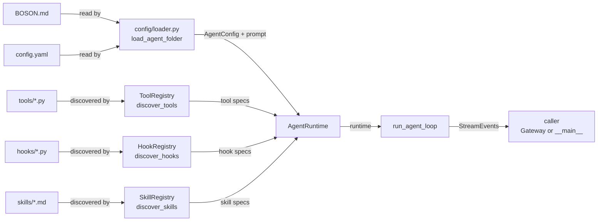

# Basement Core — Deep Walkthrough

This sub-page carries the full code walkthrough for the Basement package. The index page (`[[read]]`) summarises the key claims; read this page when you want to understand the mechanism in detail.

---

## What Basement Owns

Basement is the **turn executor**. Its job is to take one user message and one `AgentRuntime` bundle, run the think-act-observe loop, and yield `StreamEvent` objects back to whoever called it. It does not hold session state between turns. It does not decide whether to run. It just runs.

The package's internal layout follows the LOD two-axis model:

```
packages/basement/basement/
├── config/       loader.py            — agent folder → AgentConfig + system prompt
├── llm/          base.py, registry.py — provider protocol + Anthropic/OpenAI/Google
├── context/      manager.py, conversation_api.py — message history + hook API
├── tools/        decorator.py, registry.py, executor.py — @tool, discovery, execution
├── hooks/        events.py, registry.py, runner.py — @hook, discovery, event firing
├── loop/         agent_loop.py        — THE orchestrator (187 lines)
├── recovery/     tool_call_recovery.py
├── schemas/      config_schema.py, runtime.py, tool_schema.py, message_schema.py
├── metatool/     router.py, tools.py  — ToolRouter + use_tool/use_skill
├── permissions/  checker.py, loader.py
├── skills/       registry.py, injector.py
└── mcp/          client.py, manager.py
```

Every file above is under 201 lines (LOD Rule 1 actual max). The axis-1 core (`config/` through `loop/`) is designated "unchanging" — it is the v0.1 core. The axis-2 plugins (`metatool/`, `permissions/`, `skills/`, `mcp/`) are v0.2 additions that compose on top without modifying core logic.

---

## Excerpt 1 — `run_agent_loop`: The Think-Act-Observe Cycle

```python
# packages/basement/basement/loop/agent_loop.py, lines 55-186

async def run_agent_loop(
    runtime: AgentRuntime,
    user_input: str,
) -> AsyncIterator[StreamEvent]:
    """Main agent loop. Yields StreamEvents for the caller to render.

    Safety: max_turns enforced. If exceeded, yield warning and stop.
    """
    ctx = runtime.context_manager
    api = runtime.conversation_api
    hooks = runtime.hook_registry

    # 1. Add user message (with system-reminders if any)
    # Skip if gateway pipeline already appended the message (v0.6)
    if not getattr(runtime, "skip_user_append", False):
        reminders = ctx.pop_pending_reminders()
        content = user_input
        if reminders:
            reminder_text = "\n".join(
                f"<system-reminder>{r}</system-reminder>" for r in reminders
            )
            content = f"{user_input}\n{reminder_text}"
        ctx.add_message("user", content)

    # 2. Fire ON_TURN_START
    await fire_event(
        hooks,
        HookEvent.ON_TURN_START,
        _make_context(api, HookEvent.ON_TURN_START),
    )

    turn_count = 0
    while turn_count < runtime.config.max_turns:
        turn_count += 1

        # 3. Fire PRE_LLM_CALL
        await fire_event(
            hooks,
            HookEvent.PRE_LLM_CALL,
            _make_context(api, HookEvent.PRE_LLM_CALL),
        )

        # 4. Stream LLM response
        tool_uses: list[dict] = []
        text_parts: list[str] = []

        # When ToolRouter enabled: only expose meta-tools (use_tool, use_skill)
        if runtime.tool_router:
            exposed = getattr(runtime, "exposed_meta_tools", {"use_tool", "use_skill"})
            tools = [
                s for s in runtime.tool_registry.get_all_specs()
                if s.name in exposed
            ] or None
        else:
            tools = runtime.tool_registry.get_all_specs() or None

        async for event in runtime.provider.stream(
            messages=ctx.get_messages(),
            system=ctx.get_system_prompt(),
            tools=tools,
        ):
            if isinstance(event, TextDelta):
                text_parts.append(event.text)
                yield event
            elif isinstance(event, ToolUseStart):
                tool_uses.append(
                    {"id": event.id, "name": event.name, "input_json": ""}
                )
                yield event
            elif isinstance(event, InputJsonDelta):
                if tool_uses:
                    tool_uses[-1]["input_json"] += event.partial_json
            elif isinstance(event, ToolUseEnd):
                pass
            elif isinstance(event, MessageEnd):
                yield event

        # 5. If tool_use: execute tools
        if tool_uses:
            # ... build assistant message blocks, then:
            await _execute_tool_uses(runtime, tool_uses, hooks, api, ctx)
            continue  # loop back to LLM call

        # 6. Text-only response — done
        if text_parts:
            text = "".join(text_parts)
            ctx.add_message("assistant", text)

        await fire_event(hooks, HookEvent.POST_LLM_CALL, ...)
        break

    # 7-8. Fire ON_TURN_END + flush pending mutations (AD1)
    await fire_event(hooks, HookEvent.ON_TURN_END, ...)
    await api.flush_pending()
```

The loop is a `while turn_count < max_turns` that breaks only on a text-only response. A tool-use response hits `continue` and re-enters the LLM call. This is how tool chaining works: the LLM calls tool A, gets a result, calls tool B, gets a result, and eventually produces a text response that breaks the loop.

> **Notice:** `ToolUseStart` events are yielded to the caller (`yield event` on line 124), not just consumed internally. This allows the Gateway to see which tool is being called and emit filler text or log it — before the tool actually executes. The tool execution happens after the full stream is consumed, not inline.

> **Notice:** `skip_user_append` (line 69) is a v0.6 flag the Gateway sets when it has already appended the user message to the shared history. Without this flag, the agent loop would append the message a second time, creating a duplicate. This is an explicit protocol between Gateway and agent loop — LOD Rule 5 (explicit over implicit).

**Connection to universal pattern:** This function is the complete implementation of Layer 2, steps 1–5 of the turn pseudocode. The `while` loop handles step 3c (tool chaining). The final `flush_pending()` implements AD1 (deferred mutation timing).

---

## Excerpt 2 — `_execute_tool_uses`: Hooks, Permissions, Error Handling

```python
# packages/basement/basement/loop/agent_loop.py, lines 189-258

async def _execute_tool_uses(runtime, tool_uses, hooks, api, ctx):
    """Execute tool_use blocks with hooks, permissions, and ON_ERROR support."""
    for tu in tool_uses:
        tool_input = json.loads(tu["input_json"]) if tu["input_json"] else {}

        # 5a. Fire PRE_TOOL_CALL
        hook_ctx = _make_context(
            api, HookEvent.PRE_TOOL_CALL,
            tool_name=tu["name"], tool_input=tool_input,
        )
        await fire_event(hooks, HookEvent.PRE_TOOL_CALL, hook_ctx)

        # 5b. Execute tool (ToolRouter or direct)
        try:
            if runtime.tool_router and tu["name"] not in ("use_tool", "use_skill"):
                result = await runtime.tool_router.dispatch(tu["name"], tool_input)
            elif runtime.tool_router and tu["name"] in ("use_tool", "use_skill"):
                result = await execute_tool(
                    runtime.tool_registry, tu["name"], tool_input
                )
            else:
                # v0.1 fallback path — permissions still enforced
                if runtime.permissions:
                    runtime.permissions.check_tool(tu["name"])
                result = await execute_tool(
                    runtime.tool_registry, tu["name"], tool_input
                )
        except PermissionDeniedError as e:
            result = ToolResultBlock(
                tool_use_id=tu["id"],
                content=f"Permission denied: {e}",
                is_error=True,
            )
        except Exception as e:
            error_ctx = _make_context(
                api, HookEvent.ON_ERROR,
                tool_name=tu["name"], tool_input=tool_input, error=e,
            )
            await fire_event(hooks, HookEvent.ON_ERROR, error_ctx)
            result = ToolResultBlock(
                tool_use_id=tu["id"],
                content=f"Tool error: {type(e).__name__}: {e}",
                is_error=True,
            )

        result.tool_use_id = tu["id"]

        # 5c. Fire POST_TOOL_CALL
        hook_ctx = _make_context(
            api, HookEvent.POST_TOOL_CALL,
            tool_name=tu["name"], tool_input=tool_input, tool_result=result,
        )
        await fire_event(hooks, HookEvent.POST_TOOL_CALL, hook_ctx)

        # 5d. Add tool result to context
        ctx.add_message("user", [result])
```

The execution path has three branches: ToolRouter dispatch (for meta-tool-enabled agents where the LLM calls `use_tool` to invoke native tools), direct meta-tool execution (the `use_tool`/`use_skill` functions themselves live in the registry and execute directly), and the v0.1 fallback (direct execution with permission check). Permission errors and tool exceptions both produce a `ToolResultBlock` with `is_error=True` — the LLM sees the error as a tool result and can decide how to recover.

> **Notice:** `ON_ERROR` fires on *any* exception from tool execution, not just permission errors. The hook receives the exception object. A `@supervisor_hook` can inspect it and inject a `system-reminder` via `ctx.conversation.inject_system_reminder(...)` before the loop retries. The LLM then sees the injected guidance as context for its next attempt.

---

## Excerpt 3 — `@tool` Decorator: Schema Generation

```python
# packages/basement/basement/tools/decorator.py, lines 18-112

TYPE_MAP: dict[type, dict] = {
    str: {"type": "string"},
    int: {"type": "integer"},
    float: {"type": "number"},
    bool: {"type": "boolean"},
}

def tool(fn: Callable | None = None, *, name: str | None = None) -> Callable:
    def decorator(func: Callable) -> Callable:
        if not func.__doc__:
            raise ValueError(
                f"Tool '{func.__name__}' must have a docstring (used as description)"
            )

        spec = ToolSpec(
            name=name or func.__name__,
            description=func.__doc__.strip(),
            input_schema=_generate_schema(func),
            handler=func,
        )
        func.__tool_spec__ = spec
        return func

    if fn is not None:
        return decorator(fn)
    return decorator


def _generate_schema(func: Callable) -> dict:
    """Generate JSON Schema from function type hints."""
    sig = inspect.signature(func)
    properties: dict[str, dict] = {}
    required: list[str] = []

    for param_name, param in sig.parameters.items():
        if param_name in ("self", "cls"):
            continue

        annotation = param.annotation
        if annotation is inspect.Parameter.empty:
            properties[param_name] = {"type": "string"}
        else:
            properties[param_name] = _type_to_schema(annotation)

        if param.default is inspect.Parameter.empty:
            required.append(param_name)

    return {
        "type": "object",
        "properties": properties,
        "required": required,
    }


def _type_to_schema(annotation: type) -> dict:
    """Map Python type hint to JSON Schema type."""
    if annotation in TYPE_MAP:
        return dict(TYPE_MAP[annotation])

    origin = get_origin(annotation)
    args = get_args(annotation)

    # list[X] -> {"type": "array", "items": ...}
    if origin is list:
        if args:
            return {"type": "array", "items": _type_to_schema(args[0])}
        return {"type": "array"}

    # Optional[X] = Union[X, None]
    if origin is Union:
        non_none = [a for a in args if a is not type(None)]
        if len(non_none) == 1:
            return _type_to_schema(non_none[0])

    return {"type": "string"}
```

The schema generation is entirely driven by `inspect.signature` — no runtime introspection of arguments, no AST parsing. Parameters with defaults are excluded from `required`. Parameters without type hints fall back to `{"type": "string"}`.

> **Notice:** The decorator supports both `@tool` (bare) and `@tool(name="custom_name")` syntax through a single function. When `fn is not None` it means the decorator was applied without parentheses (Python passes the function directly). When `fn is None`, parentheses were used and `decorator` is returned for the second application. This is the standard "decorator with optional arguments" pattern in Python.

**Concrete example:** The `calculate` tool in `agents/demo/tools/calculate.py` would produce this `ToolSpec`:

```python
# What @tool generates for:
# @tool
# def calculate(expression: str) -> str:
#     """Evaluate a math expression. Example: '2 + 3 * 4' returns '14'."""

ToolSpec(
    name="calculate",
    description="Evaluate a math expression. Example: '2 + 3 * 4' returns '14'.",
    input_schema={
        "type": "object",
        "properties": {
            "expression": {"type": "string"}
        },
        "required": ["expression"]
    },
    handler=<function calculate at 0x...>
)
```

This is exactly the format Anthropic's API expects in the `tools` parameter.

---

## Excerpt 4 — `AgentRuntime`: The Component Bundle (AD3)

From `packages/basement/README.md` (lines 706-723):

```python
# packages/basement/README.md, lines 706-723 (API reference)
runtime = AgentRuntime(
    config=config,           # AgentConfig (LLM settings, max_turns, etc.)
    provider=provider,       # LLMProvider (Anthropic/OpenAI/Google)
    tool_registry=tool_reg,  # ToolRegistry (all discovered @tool functions)
    hook_registry=hook_reg,  # HookRegistry (all discovered @hook functions)
    context_manager=ctx,     # ContextManager (message history)
    conversation_api=api,    # ConversationAPI (hook-facing mutation API)
    system_prompt=prompt,    # str from BOSON.md
    skill_registry=skill_reg,# SkillRegistry (.md files in skills/)
    mcp_manager=mcp_mgr,     # MCPManager (external tool servers, optional)
    tool_router=router,      # ToolRouter (meta-tool dispatch, optional)
    permissions=checker,     # PermissionChecker (allow/deny rules, optional)
)
```

`AgentRuntime` is a dataclass — all fields public, no methods, no hidden state. The design decision (AD3) is explicit: bundle all components in one object so `run_agent_loop(runtime, input)` has a clean two-argument signature. Adding a new component means adding a field to the dataclass, not changing every call site.

> **Notice:** `context_manager` and `conversation_api` are separate objects. `ContextManager` owns the raw message list and exposes `add_message`, `get_messages`. `ConversationAPI` is the hook-facing interface — it wraps `ContextManager` and adds the deferred mutation queue (AD1). Hooks receive `ConversationAPI`, not `ContextManager`, so they can only interact with history through the safe, mutation-timed interface.

---

## How Basement's Pieces Connect



Every path from developer-authored file to running agent goes through `load_agent_folder` and the discovery methods. There is no other entry point. This is what "convention over configuration" means in practice: the conventions are enforced in a single function, not scattered across the codebase.
