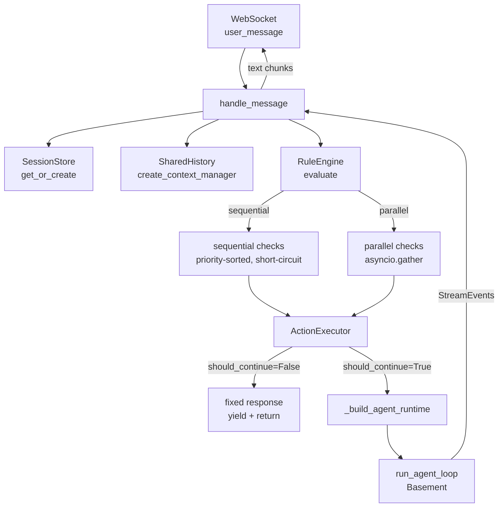

# Gateway Core — Deep Walkthrough

This sub-page carries the full code walkthrough for the Gateway package. The index page (`[[read]]`) summarises the key claims.

---

## What Gateway Owns

Gateway is the **conversation owner**. It holds session state across turns, evaluates rules before the agent sees a message, and manages the WebSocket server. Unlike Basement (which processes exactly one turn and forgets everything), Gateway accumulates the full message history and is responsible for decisions that span the entire conversation: stage transitions, compaction, interrupt handling.

The package layout:

```
packages/gateway/gateway/
├── core.py              — GatewayCore: the per-turn orchestrator
├── rules/
│   ├── check.py         — @check decorator
│   └── engine.py        — RuleEngine: sequential + parallel evaluation
├── router/
│   └── executor.py      — ActionExecutor: dispatches actions
├── session/
│   ├── store.py         — SessionStore: per-session state map
│   └── history.py       — SharedHistory: direct-reference adapter
├── stage/
│   ├── machine.py       — StageMachine: transition logic
│   └── context.py       — build_stage_injection helper
├── compact/
│   └── pipeline.py      — AsyncCompactPipeline: background summarisation
├── interrupt/
│   ├── detector.py      — PartialDetector: barge-in detection
│   └── handler.py       — InterruptHandler: cancellation
├── server/
│   └── websocket.py     — GatewayWebSocketServer
└── schemas/
    ├── config.py        — GatewayConfig, CompactConfig
    ├── session.py       — SessionState dataclass
    └── actions.py       — Continue, Respond, Inject, Filter, Compact, PreTool, StageTransition
```

Gateway depends on Basement (`basement` in `pyproject.toml` dependencies). Basement does not depend on Gateway. The dependency is one-directional.

---

## Excerpt 1 — `GatewayCore.setup()`: Discovery at Startup

```python
# packages/gateway/gateway/core.py, lines 65-88

async def setup(self) -> None:
    """Load agent config, build pipeline, discover tools/hooks/skills."""
    self._agent_config, self._system_prompt = load_agent_folder(self._agent_dir)
    if self._config.compact.enabled:
        self._compact_pipeline = AsyncCompactPipeline(self._config.compact)
    self._tool_registry = ToolRegistry()
    self._tool_registry.discover_tools(self._agent_dir / "tools")
    self._hook_registry = HookRegistry()
    self._hook_registry.discover_hooks(self._agent_dir / "hooks")
    self._skill_registry = SkillRegistry()
    self._skill_registry.discover_skills(self._agent_dir / "skills")
    self._action_executor = ActionExecutor(self._compact_pipeline, self._tool_registry)

    # v0.6-lina: Create ToolRouter to hide native tools from LLM API
    if self._agent_config.enable_tool_router:
        from basement.metatool.router import ToolRouter
        from basement.metatool.tools import create_use_tool
        self._tool_router = ToolRouter()
        self._tool_router.register_native(self._tool_registry)
        use_tool_spec = create_use_tool(self._tool_router)
        self._tool_registry.register(use_tool_spec)

    logger.info("GatewayCore setup: agent_dir=%s", self._agent_dir)
```

`setup()` is called once at server start, not per message. The tool/hook/skill registries are built once and reused across all sessions. The per-session part (ContextManager, ConversationAPI) is rebuilt on every turn inside `_build_agent_runtime` — see Excerpt 4.

> **Notice:** When `enable_tool_router` is True, `setup()` immediately registers `use_tool_spec` into the ToolRegistry after setting up the router. This means the ToolRegistry now contains *both* native tools (registered by `discover_tools`) *and* the `use_tool` meta-tool. The ToolRouter holds references to all native tools; the LLM only ever sees `use_tool`. The native tools are effectively hidden from the LLM's perspective even though they live in the same registry.

---

## Excerpt 2 — `GatewayCore.handle_message()`: The Per-Turn Orchestration Flow

```python
# packages/gateway/gateway/core.py, lines 108-255 (condensed to show structure)

async def handle_message(self, session_id: str, content: str) -> AsyncIterator[str]:
    """Per-turn flow: rules → executor → agent loop. Yields text chunks."""
    session = self._get_or_create_session(session_id)

    # v0.4: Reset cancellation flag at turn start
    InterruptHandler.reset_cancellation(session)

    # Create SharedHistory adapter (direct reference, not copy)
    shared_history = SharedHistory(session)

    # Apply any pending compact from previous turn
    if self._compact_pipeline is not None:
        self._compact_pipeline.apply_pending(session, shared_history)

    # Add user message (or skip if pipeline already appended it)
    pipeline_appended = getattr(session, "_pipeline_appended", False)
    if not pipeline_appended:
        if self._stage_machine and session.active_stage is None:
            stage = self._set_initial_stage(session)
            if stage:
                injection = build_stage_injection(stage)
                session.messages.append(Message(
                    role="user",
                    content=f"<system-reminder>{injection}</system-reminder>\n{content}",
                ))
            else:
                session.messages.append(Message(role="user", content=content))
        else:
            session.messages.append(Message(role="user", content=content))

    # Run rule engine
    if self._rule_engine is not None:
        actions = await self._rule_engine.evaluate(
            session.messages, content, session
        )
    else:
        actions = [Continue()]

    # Execute actions
    result = await self._action_executor.execute(actions, session)

    # Execute pending stage transition from rules
    if result.pending_transition:
        skill_fillers = await self._apply_stage_transition(
            session, result.pending_transition
        )
        for sf in skill_fillers:
            yield f"\n{sf}\n"

    # Fixed response — skip agent
    if not result.should_continue:
        yield result.response or ""
        return

    # Check cancellation before LLM
    if session.cancellation_flag.is_set:
        return

    # Build runtime and run agent loop
    runtime = self._build_agent_runtime(session, shared_history)
    if pipeline_appended:
        runtime.skip_user_append = True

    # Filter tools by current stage (ToolRouter stage gating)
    if runtime.tool_router and session.active_stage and self._stage_machine:
        stage_def = self._stage_machine.get_stage(session.active_stage)
        if stage_def and stage_def.tools is not None:
            runtime.tool_router.set_allowed_tools(stage_def.tools)
        exposed = set()
        if stage_def:
            if stage_def.tools:
                exposed.add("use_tool")
            if getattr(stage_def, "skills", None):
                exposed.add("use_skill")
        runtime.exposed_meta_tools = exposed

    async for event in run_agent_loop(runtime, content):
        if isinstance(event, TextDelta):
            # buffer initial text to catch echoed <system-reminder> tags
            yield event.text
        elif isinstance(event, ToolUseStart):
            # emit filler text while tool executes
            ...
```

This is the complete per-turn pipeline. The order of operations is strict: cancellation reset → compact application → user message append → rule evaluation → action execution → (conditional) agent loop. None of these steps are reorderable without breaking correctness.

> **Notice:** The stage gating at lines 181–194 runs on every turn, not just at stage entry. `runtime.tool_router.set_allowed_tools(stage_def.tools)` filters which native tools are reachable via `use_tool`. This means if the stage changes mid-conversation, the tool access changes immediately on the next turn without any restart. The ToolRouter is stateful; `set_allowed_tools` mutates it in place.

**Connection to universal pattern:** This function is the complete implementation of Layer 1, steps 1–6 of the conversation pseudocode. The `if not result.should_continue: return` is the "if action is terminal, stop" branch. Everything after it is the handoff to Layer 2.

---

## Excerpt 3 — `RuleEngine`: Sequential + Parallel Evaluation

```python
# packages/gateway/gateway/rules/engine.py, lines 22-106

class RuleEngine:
    """Runs rule checks and collects resulting actions.

    Sequential checks run in priority order; the first non-CONTINUE result
    short-circuits the rest of the sequential pipeline.
    Parallel checks all run concurrently; all non-CONTINUE results are collected.
    """

    def __init__(self, checks: list, fail_open: bool = True) -> None:
        self._fail_open = fail_open
        self._sequential: list = sorted(
            [c for c in checks if c.__check_mode__ == "sequential"],
            key=lambda c: c.__check_priority__,
        )
        self._parallel: list = sorted(
            [c for c in checks if c.__check_mode__ == "parallel"],
            key=lambda c: c.__check_priority__,
        )

    async def evaluate(
        self,
        messages: list,
        user_message: Any,
        session: Any,
    ) -> list[Action]:
        collected: list[Action] = []

        # --- sequential phase ---
        for check_fn in self._sequential:
            actions = await self._run_check(check_fn, messages, user_message, session)
            non_continue = [a for a in actions if a.type not in ("continue", "pass")]
            if non_continue:
                collected.extend(non_continue)
                break  # Short-circuit: stop sequential pipeline

        # --- parallel phase ---
        if self._parallel:
            results = await asyncio.gather(
                *[
                    self._run_check(fn, messages, user_message, session)
                    for fn in self._parallel
                ],
                return_exceptions=False,
            )
            for actions in results:
                non_continue = [a for a in actions if a.type not in ("continue", "pass")]
                collected.extend(non_continue)

        return collected if collected else [Continue()]

    async def _run_check(self, check_fn, messages, user_message, session) -> list[Action]:
        try:
            if inspect.iscoroutinefunction(check_fn):
                result = await check_fn(messages, user_message, session)
            else:
                result = check_fn(messages, user_message, session)

            if isinstance(result, Action):
                return [result]
            if isinstance(result, list):
                return result
            return [Continue()]
        except Exception as exc:
            if self._fail_open:
                logger.warning(
                    "Check '%s' raised an exception (fail_open=True): %s",
                    getattr(check_fn, "__check_name__", repr(check_fn)),
                    exc,
                    exc_info=True,
                )
                return [Continue()]
            raise
```

The sorting happens at `__init__` time, not at `evaluate` time. This means priority ordering is computed once at startup. `evaluate` just iterates the already-sorted list.

The two phases (sequential + parallel) run independently and their results are merged in `collected`. Sequential short-circuit does not affect parallel checks — parallel checks always run, even if a sequential check returned a non-CONTINUE action. The ActionExecutor receives the merged list and resolves conflicts.

> **Notice:** The sequential phase can produce at most one non-CONTINUE action (because of `break`). The parallel phase can produce N non-CONTINUE actions (one per check, all run). This means if a sequential check returns `Respond("blocked")` and a parallel check returns `Inject("context...")`, both land in `collected`. The ActionExecutor's job is to figure out the right thing to do with that combination — typically `Respond` takes precedence.

> **Notice:** `fail_open=True` is the default. A buggy rule check will log a warning and return `Continue()`, not crash the server. This is correct for production: a misconfigured intent classifier should not take down the entire conversation. Set `fail_open=False` only in test environments where you want hard failures.

---

## Excerpt 4 — `_build_agent_runtime()` and `SharedHistory`

```python
# packages/gateway/gateway/core.py, lines 384-414

def _build_agent_runtime(
    self, session: SessionState, shared_history: SharedHistory
) -> AgentRuntime:
    """Build an AgentRuntime for this session turn."""
    ctx = shared_history.create_context_manager()
    api = shared_history.create_conversation_api(ctx)

    provider = get_provider(self._agent_config.llm)
    permissions = load_permissions(self._agent_config)

    # Register use_skill per session (needs per-session ConversationAPI)
    if self._skill_registry and self._skill_registry.get_all():
        from basement.skills.injector import create_use_skill
        use_skill_spec = create_use_skill(
            self._skill_registry, api, self._hook_registry, permissions
        )
        self._tool_registry._tools[use_skill_spec.name] = use_skill_spec

    return AgentRuntime(
        config=self._agent_config,
        provider=provider,
        tool_registry=self._tool_registry,
        hook_registry=self._hook_registry,
        context_manager=ctx,
        conversation_api=api,
        system_prompt=self._system_prompt,
        skill_registry=self._skill_registry,
        permissions=permissions,
        tool_router=self._tool_router,
    )
```

And from `packages/gateway/README.md` (lines 514-520), the SharedHistory mechanism:

```python
# packages/gateway/README.md, lines 514-520 (API documentation showing implementation)
class SharedHistory:
    def create_context_manager(self) -> ContextManager:
        ctx = ContextManager(system_prompt=self._session.system_prompt)
        # INTENTIONAL: direct assignment, not a copy
        ctx._messages = self._session.messages
        return ctx
```

`ctx._messages = self._session.messages` is a reference assignment in Python — both variables point to the same list object in memory. When Gateway appends to `session.messages`, the `ctx._messages` list is the same object, so the agent loop's `get_messages()` call returns the updated list without any synchronisation. When the agent loop appends via `ctx.add_message(...)`, the Gateway's `session.messages` list is updated too.

> **Notice:** `use_skill_spec` is re-registered into the live `self._tool_registry._tools` dict on every turn. This is necessary because `use_skill` closes over the per-turn `ConversationAPI` instance — it needs the current turn's `api` to inject skill prompts into the right context. Reregistering per-turn ensures the closure is fresh. The `_tools` dict is mutated in place (bypassing the `register` method's duplicate-name check).

**Connection to universal pattern:** `_build_agent_runtime` is the bridge from Layer 1 to Layer 2. It packages the shared state (via `SharedHistory`) into an `AgentRuntime` that Basement's `run_agent_loop` can consume without knowing it is inside a Gateway.

---

## Excerpt 5 — Demo Gateway Rule Layers: Concrete `@check` Examples

### Layer 01 — Guard (`spam_filter.py`)

```python
# agents/demo-gateway/layers/01-guard/rules/spam_filter.py, lines 1-29

SPAM_WORDS = {"spam", "buy now", "click here", "free money"}
GREETING_WORDS = {"hi", "hello", "hey"}

@check("spam_filter", mode="sequential", priority=10)
def spam_filter(messages, user_message, session):
    """Filter spam messages. Demonstrates Filter action + SignalQueue."""
    lower = user_message.strip().lower()
    for spam in SPAM_WORDS:
        if spam in lower:
            return Filter(reason=f"spam:{spam}")
    return Pass()

@check("greeting_responder", mode="sequential", priority=20)
def greeting_responder(messages, user_message, session):
    """Auto-respond to simple greetings. Demonstrates Respond action."""
    lower = user_message.strip().lower()
    if lower in GREETING_WORDS and len(messages) == 0:
        return Respond(text="Hello! I'm a demo assistant. Ask me to calculate, check weather, search docs, or get time!")
    return Pass()
```

`spam_filter` has priority 10 (runs first). If it returns `Filter(...)`, the sequential pipeline short-circuits — `greeting_responder` never runs. If `spam_filter` returns `Pass()`, `greeting_responder` runs next. `Filter` is a terminal action that drops the message with no response to the client. `Respond` is a terminal action that sends a fixed string and skips the agent loop.

> **Notice:** `greeting_responder` checks `len(messages) == 0` — it only auto-greets on the very first message of a session. After that, "hello" goes through to the agent. This is stateful logic implemented without any explicit state variable: the message list length is the state.

### Layer 03 — Orchestrator (`stage_manager.py`)

```python
# agents/demo-gateway/layers/03-orchestrator/rules/stage_manager.py, lines 1-50

@check("turn_counter", mode="sequential", priority=1)
def count_turns(messages, user_message, session):
    """Track turn count per session. Demonstrates stateful rule."""
    if not hasattr(session, "turn_count"):
        session.turn_count = 0
    session.turn_count += 1
    return Pass()

@check("auto_stage_transition", mode="sequential", priority=10)
def auto_transition(messages, user_message, session):
    """Transition stages based on ctx.data intent from Layer 02."""
    intent = getattr(session, "data", {}).get("intent")
    active = getattr(session, "active_stage", None)

    if intent == "closing" and active != "closing":
        return StageTransition("closing")

    if active == "welcome" and session.turn_count > 1:
        return StageTransition("main")

    return Pass()

@check("compact_trigger", mode="sequential", priority=20)
def trigger_compact(messages, user_message, session):
    """Trigger compact when message count is high."""
    if len(messages) > 30:
        return Compact()
    return Continue()
```

`turn_counter` has priority 1 — it runs before every other check in layer 03, unconditionally, and always returns `Pass()`. It uses `session` as an arbitrary attribute store: `session.turn_count` is not a pre-defined field of `SessionState`, it is added dynamically. This is the "stateful rule via session attributes" pattern.

`auto_transition` reads `session.data["intent"]` which was set by a parallel check in layer 02. This is the inter-layer communication mechanism: one layer writes to `session.data`, a later layer reads it.

> **Notice:** `StageTransition("main")` returns a transition request, but does not execute the transition immediately. The `ActionExecutor` receives it and sets `result.pending_transition`. `GatewayCore.handle_message` then calls `_apply_stage_transition` which runs the actual `StageMachine.transition` logic. The rule itself is pure — it only *requests* a transition, it does not perform one.

---

## How Gateway's Pieces Connect



The flow is linear with one branch: either the ActionExecutor terminates the turn (fixed response) or it passes through to the agent loop. The agent loop is always the last step when it runs — nothing happens after it except flushing buffered text.
