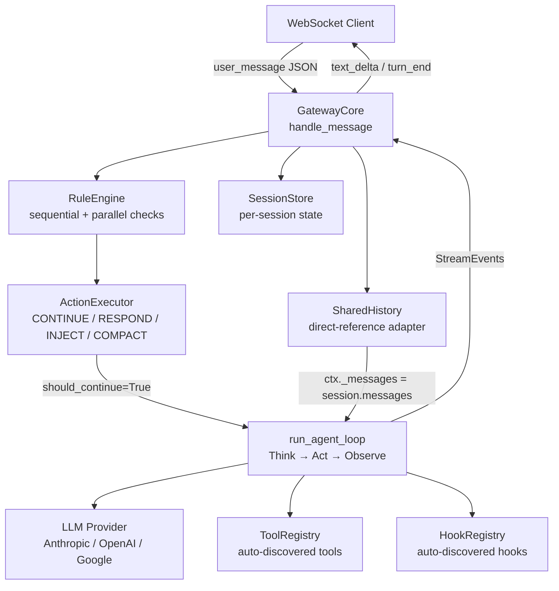
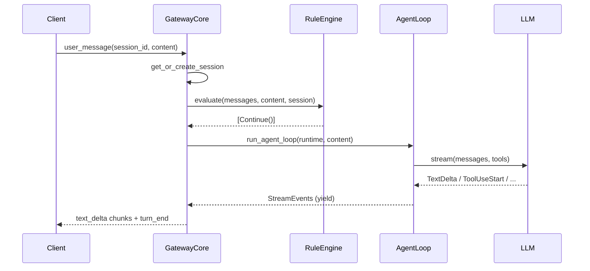

# Ch-01: Framework Orientation and Two-Package Architecture

## Overview

> **Core Question:** Why does Boson split into exactly two packages — `basement` and `gateway` — and what does that boundary force you to think about every time you build an agent?

This chapter is about the **architectural skeleton** of the Boson Agent Framework before you write a single tool or rule. The split between Basement (core) and Gateway (orchestrator) is not a packaging accident — it encodes a theory about what an LLM agent fundamentally is: a machine that runs one turn at a time, and a separate machine that decides what counts as a turn and whether to let the agent run at all. Understanding that theory lets you read any part of the codebase without being surprised.

By the end of this chapter you should be able to: (1) draw the two-package boundary from memory and explain what each side owns; (2) navigate a real agent folder and predict which file controls which behaviour; (3) explain why "just drop a file in `tools/`" actually works without touching any import or config file; (4) articulate the LOD principles as design constraints, not style preferences; (5) run either entry point (`python -m basement` or `python -m gateway`) after a two-line install.

The chapter works through three things in sequence: a **universal pattern** for how the two-layer shape emerges from the structure of LLM APIs; **per-implementation walkthroughs** that anchor every claim in real file:line excerpts; and a **synthesis table** that maps what is invariant across agent implementations vs. what each agent customises freely.

---

## Key Concepts

### 1. The Universal Pattern — Why Two Layers Are Inevitable

Any LLM agent framework must answer two questions that sit at different time scales:

**Per-turn question:** Given a message and a list of tools, what should the LLM do?

**Per-conversation question:** Which session is this message from, should the agent even see it, what stage is the conversation in, and when should history be summarised?

These two questions have fundamentally different answers and fundamentally different correctness requirements. The per-turn question is answered by the LLM — it is probabilistic, flexible, and opaque. The per-conversation question should be answered deterministically, before the LLM is involved: blocking spam does not need Claude's opinion.

The Boson framework makes this split **concrete and enforced** by putting each concern in a separate Python package with a separate entry point.

#### Pseudocode: The Universal Two-Layer Shape

```
# Layer 1: Conversation Owner (Gateway)
on user_message(session_id, content):
    1. look up / create session state
    2. run deterministic rule checks (sequential)
    3. run parallel rule checks (concurrent)
    4. if any rule returns a non-CONTINUE action:
         execute action (block / respond / inject / compact)
         if action is terminal: send fixed response, stop
    5. build a fresh per-turn runtime from session state
    6. hand off to Layer 2

# Layer 2: Turn Executor (Basement)
on turn(runtime, user_input):
    1. append user message to context
    2. fire ON_TURN_START hooks
    3. loop until text-only response or max_turns exceeded:
         a. fire PRE_LLM_CALL hooks
         b. stream LLM response
         c. for each tool_use in response:
              fire PRE_TOOL_CALL → execute tool → fire POST_TOOL_CALL
              append tool result to context
              continue loop
         d. if text-only: fire POST_LLM_CALL, break
    4. fire ON_TURN_END, flush deferred mutations
    5. yield all StreamEvents back to caller
```

#### Why This Pattern Is Inevitable

The LLM API enforces it. Every API (Anthropic, OpenAI, Google) is **stateless and turn-scoped**: it receives a list of messages and returns a response. The API has no concept of a session. Someone has to hold the message list between turns — that is the Gateway. Someone has to call the API in a streaming loop and handle tool calls — that is Basement. You cannot merge these responsibilities without either (a) making Basement stateful across turns, which breaks the stateless-provider model, or (b) making Gateway do tool execution, which couples your routing logic to every tool implementation.

The split is also forced by the correctness asymmetry. Deterministic rules (spam filter: contains "buy now"?) must run **before** the LLM sees the message — running them after is too late. Probabilistic decisions (which tool should I call?) must run **inside** the LLM turn — making them deterministic breaks the agent's reasoning. The two-layer shape is where these two execution models stop interfering with each other.

#### Mental Model

This is LIKE a REPL for conversations. The Gateway is the shell — it reads input, decides whether to pass it to the interpreter, and manages the session. Basement is the interpreter — it takes one expression (one user message), evaluates it (the think-act-observe loop), and returns output. The shell can reject input, preload context, or summarise history. The interpreter only knows about the current evaluation.

#### Structural Diagram





---

### 2. Basement — The Core Package

[[excerpts/basement-core]]

The full walkthrough with code excerpts from `agent_loop.py`, `decorator.py`, `loader.py`, `registry.py`, and `packages/basement/README.md` lives in the sub-page above. Key claims this walkthrough proves:

- `run_agent_loop` is 187 lines implementing the complete think-act-observe cycle with hook firing and deferred mutation flushing.
- The `@tool` decorator is 113 lines, entirely pure and deterministic — it reads type annotations and builds a JSON Schema dict with no side effects.
- `ToolRegistry.discover_tools` uses `importlib.util.spec_from_file_location` to dynamically import any `.py` file dropped in `tools/`, then scans for `__tool_spec__` attributes — zero registration required.
- `load_agent_folder` is the entry-point glue: `BOSON.md` is required, `config.yaml` is optional (full defaults apply if absent).

**Connection to universal pattern:** Basement implements Layer 2 exactly. It owns steps 1–5 of the turn pseudocode above and surfaces results as `AsyncIterator[StreamEvent]` — a clean interface the Gateway can consume without knowing anything about the LLM or tools.

---

### 3. Gateway — The Orchestration Package

[[excerpts/gateway-core]]

The full walkthrough with code excerpts from `core.py`, `rules/engine.py`, `packages/gateway/README.md`, and the demo-gateway examples lives in the sub-page above. Key claims this walkthrough proves:

- `GatewayCore.handle_message` is the per-turn orchestrator: it sequences session lookup → rule evaluation → action execution → optional agent loop call.
- `RuleEngine` sorts checks into sequential (priority-ordered, short-circuit on first non-CONTINUE) and parallel (all run via `asyncio.gather`) phases at construction time.
- `SharedHistory.create_context_manager` sets `ctx._messages = self._session.messages` — a **direct reference assignment**, not a copy. This is the mechanism that keeps Gateway and Basement in sync with zero synchronisation overhead.
- The `GatewayCore.setup()` method calls `ToolRegistry.discover_tools`, `HookRegistry.discover_hooks`, and `SkillRegistry.discover_skills` — auto-discovery runs at gateway startup, not at message time.

**Connection to universal pattern:** Gateway implements Layer 1 exactly. It owns steps 1–6 of the conversation pseudocode and delegates to Layer 2 only when `result.should_continue` is True.

---

### 4. Agent Folder Convention — The Developer-Facing Interface

[[excerpts/agent-folder]]

The full walkthrough covering `BOSON.md`, `config.yaml`, the demo agent, and `stage_config.py` lives in the sub-page above. Key claims:

- Every agent folder has one required file (`BOSON.md`) and four optional subdirectories (`tools/`, `hooks/`, `skills/`, `config.yaml`).
- The `config.yaml` schema covers LLM settings, `max_turns`, MCP server configs, permissions, and `enable_tool_router` — all optional with sensible defaults.
- A gateway agent adds a `layers/` tree and a `stage_config.py`. The Lina production agent has 8 stages, 16 tools across stages, 5 skills, and 3 rule layers — all expressed as plain Python dicts and `@check`-decorated functions.

**Connection to universal pattern:** The agent folder is the developer API for both layers simultaneously. Files in `tools/` and `hooks/` are discovered by Basement's registries. Files in `layers/` are discovered by the Gateway's rule pipeline. Neither layer requires you to touch imports or registration code.

---

### 5. Zero-Registration Auto-Discovery — The Mechanism

This concept is important enough to anchor with both the loader and registry code directly. The full sequence, traced through real files:

**Step 1: Entry point calls `load_agent_folder`**

```python
# packages/basement/basement/config/loader.py, lines 31-47
def load_agent_folder(path: Path) -> tuple[AgentConfig, str]:
    """Load config and system prompt from an agent folder.

    Returns (AgentConfig, system_prompt_text).
    Raises ConfigError if BOSON.md is missing.
    """
    path = Path(path).resolve()
    if not path.is_dir():
        raise ConfigError(f"Agent folder not found: {path}")

    config = load_config(path / "config.yaml")
    config.agent_dir = path

    boson = load_boson(path / "BOSON.md")

    logger.info("Loaded agent folder: %s", path)
    return config, boson
```

The loader makes `config.yaml` optional by design — `load_config` returns `AgentConfig()` defaults when the file is absent (line 57: `return AgentConfig()`).

**Step 2: Registry discovers tools via `importlib`**

```python
# packages/basement/basement/tools/registry.py, lines 50-70
def discover_tools(self, tools_dir: Path) -> int:
    """Import all .py files in tools_dir, find @tool functions.

    Returns count of discovered tools.
    """
    if not tools_dir.exists():
        return 0

    count = 0
    for py_file in sorted(tools_dir.glob("*.py")):
        if py_file.name.startswith("_"):
            continue
        try:
            module = _import_module_from_path(py_file)
            for obj in vars(module).values():
                if hasattr(obj, "__tool_spec__"):
                    self.register(obj.__tool_spec__)
                    count += 1
        except Exception as e:
            logger.error("Failed to load tool from %s: %s", py_file, e)
            continue

    return count
```

The mechanism: glob every non-underscore `.py` file, dynamically import it with `importlib.util.spec_from_file_location`, scan every name in the module's `__dict__` for the `__tool_spec__` sentinel attribute, and register it. The `@tool` decorator plants the sentinel: `func.__tool_spec__ = spec` (decorator.py line 53). Drop a file, the sentinel is set, the registry finds it.

> **Notice:** The registry silently skips files that fail to import (`logger.error` + `continue`). This is a deliberate fail-open: a broken tool file does not crash the agent startup. You will see an error in logs but the other tools still load.

**Step 3: `@tool` decorator generates the JSON Schema**

```python
# packages/basement/basement/tools/decorator.py, lines 41-58
def decorator(func: Callable) -> Callable:
    if not func.__doc__:
        raise ValueError(
            f"Tool '{func.__name__}' must have a docstring (used as description)"
        )

    spec = ToolSpec(
        name=name or func.__name__,
        description=func.__doc__.strip(),
        input_schema=_generate_schema(func),
        handler=func,
    )
    func.__tool_spec__ = spec
    return func
```

The decorator enforces two contracts: docstring required (it becomes the LLM-visible description), type hints required (they become the JSON Schema). If you omit the docstring, you get a `ValueError` at import time — not a silent failure at call time. This is LOD Pattern 6 (deterministic logic sealed) in action: the schema is fixed at decoration time and never changes.

> **Notice:** The `@tool` decorator is *pure* — it has no side effects, no global state, no registration. It just attaches a `ToolSpec` to the function object. The registry performs the registration separately. This separation means you can use `@tool` in test files without accidentally populating a global registry.

**Connection to universal pattern:** Auto-discovery is what makes the agent folder convention work without boilerplate. It is the mechanism that lets Layer 2 (Basement) consume developer-authored tools without any coupling between the framework and the tool author. The agent folder is a filesystem-encoded configuration: presence of a file is equivalent to a registration call, absence is equivalent to no registration.

---

### 6. LLM-Oriented Design (LOD) Principles

LOD is the design philosophy that governs every file in Boson. It is stated explicitly in `packages/basement/README.md` (lines 880-891):

```
1. Max 800 LOC/file — Small files fit in context windows (actual max: 201 LOC)
2. One responsibility per file — Clear, focused code
3. Pure functions over methods — Easy to reason about
4. Flat over deep — No inheritance hierarchies (just protocols)
5. Explicit over implicit — No magic imports or global state
6. Deterministic logic sealed — Schemas, config, tools don't change
7. Probabilistic logic flexible — Providers and agent loop are extensible
```

These are not style guidelines — they are constraints imposed by the substrate. An LLM reading the codebase to understand or modify it needs each file to fit in a context window (rule 1), to have one entry point for reasoning (rule 2), and to have no hidden global state that could change the meaning of a function in ways not visible in the file (rule 5).

Rules 6 and 7 map directly to the two-layer architecture: the sealed, deterministic layer is Basement's tool decorator, schema definitions, and config loader. The flexible, probabilistic layer is the LLM provider and the agent loop. The Gateway's rule engine sits in the middle — rules are code (deterministic) but they can call LLMs (flexible). That is why `check_type: "deterministic" | "llm"` is a first-class annotation on every rule.

The architecture decisions (AD1–AD4) documented in the README are also LOD consequences:

- **AD1 (Mutation Timing):** Append operations are immediate (safe mid-turn); destructive operations (remove, replace) are deferred to turn boundary via `flush_pending`. This is required because the LLM is streaming — you cannot remove a message while the LLM is mid-response referencing it.
- **AD3 (AgentRuntime Dataclass):** All runtime components bundled in one object. This keeps function signatures simple (`run_agent_loop(runtime, input)`) while making the dependency graph explicit and testable.

---

### 7. Installation and Entry Points

Both packages use standard `pyproject.toml` with `setuptools`. The Python requirement is `>=3.11` on both packages — this is not arbitrary: the framework uses `match` statements, `X | Y` union type syntax, and `asyncio.TaskGroup` features that require 3.11.

```bash
# Install both packages in editable mode
pip install -e packages/basement
pip install -e packages/gateway

# Run standalone Basement agent (no WebSocket, REPL loop)
python -m basement agents/demo

# Run Gateway agent (WebSocket on :8765 by default)
python -m gateway agents/test-lina-gateway

# Open the browser UI (for gateway agents with ui.html)
open agents/test-lina-gateway/ui.html
```

The `python -m basement <agent_dir>` entry point:
1. Calls `load_agent_folder(agent_dir)` to get config + system prompt
2. Discovers tools, hooks, skills from subdirectories
3. Starts a REPL: reads `stdin`, calls `run_agent_loop`, prints streamed text

The `python -m gateway <agent_dir>` entry point:
1. Calls `GatewayCore.setup()` which internally calls `load_agent_folder`
2. Discovers tools/hooks/skills AND rule layers
3. Starts the WebSocket server (default `:8765`)
4. Routes each incoming JSON message to `GatewayCore.handle_message`

Neither entry point requires you to write Python beyond the agent folder contents. The framework is self-bootstrapping from the filesystem.

---

### 8. Cross-Implementation Synthesis

| Implementation | Mechanism | Key Difference | Why |
|---|---|---|---|
| `demo` (standalone) | `python -m basement agents/demo` — REPL loop, no Gateway | No session management, no rules | Simplest possible path; proves Basement works without Gateway |
| `demo-gateway` | `python -m gateway agents/demo-gateway` — 3 layers, 3 stages | Adds rule layers over the same `agents/demo` agent | Shows Gateway is additive: agent code unchanged |
| `test-lina-gateway` | Same Gateway, but 8 stages, 16 tools, 4 rule layers | Production scale; stage_config.py drives per-stage tool access | Same two-package architecture; complexity lives in config, not framework code |
| Basement standalone (programmatic) | Import `run_agent_loop` directly, skip `__main__` | No REPL; caller streams events | Gateway uses this path: it builds `AgentRuntime` and calls `run_agent_loop` |

**What is invariant (required by the substrate):**

Every agent in this framework, regardless of complexity, follows the same lifecycle: `load_agent_folder` → discover tools/hooks/skills → build `AgentRuntime` → call `run_agent_loop`. This is forced by the LLM API's turn-scoped, stateless interface. You cannot skip it.

Every tool must have a `@tool` decorator with a docstring and type hints. This is forced by the LLM API's JSON Schema requirement for tool definitions. The LLM will not call a tool it has not been given a schema for.

`BOSON.md` is always required. The LLM is stateless — without a system prompt it has no identity, no instructions, and no knowledge of which tools to use.

**What is variant (free design choice):**

- Whether to use Gateway at all (standalone Basement is fully functional for single-session, non-WebSocket use cases)
- How many rule layers and what each checks
- Which LLM provider and model
- Whether to enable `ToolRouter` (hides native tools, exposes only `use_tool`/`use_skill`)
- Stage machine configuration (zero stages = no StageMachine; eight stages = full sales flow)
- Async compaction threshold, model, and keep-recent window

The two-package boundary is the only invariant architectural constraint. Everything inside each package is configurable through the agent folder and `config.yaml`.

---

## Questions

These questions are styled for the blend tactic — some demand precise recall, some demand application, and at least one is open-ended enough to generate disagreement.

1. **Recall + locate:** `run_agent_loop` fires hooks at five distinct points in a single turn. Name all five hook events in the order they fire. Which one fires *after* tool execution completes but *before* the loop decides whether to call the LLM again? (Anchor: `agent_loop.py` lines 79–186.)

2. **Application:** You are building a medical-triage agent. You decide spam filtering and PII detection should block messages before the LLM sees them, but intent classification (which requires understanding nuance) should run after basic blocking. Which layer and which rule `mode` do you use for each, and why does sequential short-circuit matter for the blocking rules?

3. **Mechanism:** The `SharedHistory` adapter sets `ctx._messages = self._session.messages` — a direct reference, not a copy. What concrete failure would occur if this were a copy (`ctx._messages = list(self._session.messages)`) instead? Trace through what the Gateway appends, what the agent loop appends, and what each side would then see.

4. **Design tradeoff:** The `@tool` decorator raises `ValueError` immediately at import time if a docstring is missing, rather than failing silently at call time. The `discover_tools` registry does the opposite — it catches import errors and continues. Explain the reasoning behind each choice using LOD principles. Do you agree with both decisions?

5. **Excerpt-based:** Look at `spam_filter.py` lines 12–19 (the `spam_filter` check) and `stage_manager.py` lines 22–39 (the `auto_transition` check). Both are `mode="sequential"`. The spam filter has `priority=10`; `auto_transition` has `priority=10` as well but lives in a different layer. Given that the rule engine sorts by `__check_priority__` at construction time, what happens if both checks return a non-CONTINUE action in the same turn? What does the short-circuit guarantee about which action the executor actually sees?

6. **Predict the behaviour:** A new developer drops a file called `_helpers.py` into `agents/demo/tools/`. She writes a `@tool`-decorated function inside it. After restarting the agent, the tool does not appear. Why not? Quote the exact line in `registry.py` that produces this behaviour.

7. **Open-ended:** LOD Rule 6 says "deterministic logic sealed" and Rule 7 says "probabilistic logic flexible." The Gateway's rule engine can contain `check_type="llm"` checks that call a language model from inside a "deterministic" rule layer. Does this violate the LOD principle, or is it consistent with it? What constraints would you add to the `@check` decorator API to make the distinction cleaner?
