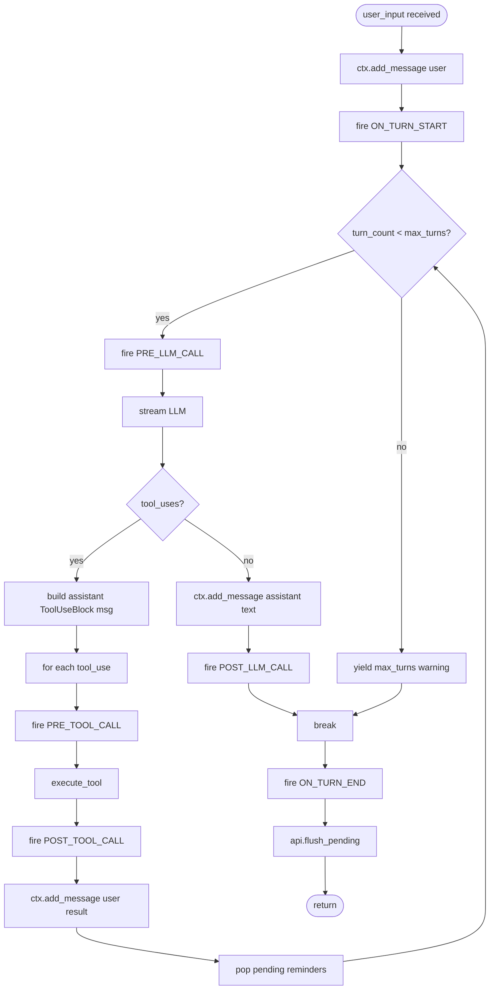

# Chapter 2 — The Think-Act-Observe Agent Loop

## Overview

> **Core Question:** How does `run_agent_loop()` coordinate a streaming LLM, asynchronous tool execution, and a hook system into a coherent, self-terminating turn — and what design constraints make this exact structure inevitable?

The agent loop is the beating heart of the Basement framework. Every user message, every tool call, every hook invocation flows through a single async generator: `run_agent_loop()`. You mastered ch-01's structural overview — two packages, auto-discovery, LOD principles. This chapter goes one level deeper: into the implementation of that loop, line by line, event by event.

By the end of this chapter you will be able to draw the turn lifecycle from memory (including where each `HookEvent` fires and why), explain why `max_turns` is enforced with a `while` loop rather than recursion, trace any `StreamEvent` subtype from the LLM wire protocol through to its effect on the conversation buffer, and locate in the source exactly where interrupts, permission errors, and hook errors are caught and neutralized without killing the turn.

This chapter is dense with real code. Four excerpt sub-pages carry the full walkthroughs; this page is the navigable map. Read the sub-pages in order — they build on each other.

---

## Key Concepts

### 1. The Universal Pattern

Every agent loop in every production LLM framework implements the same five-step cycle. Boson's name for it — think → act → observe — maps directly:

```
THINK-ACT-OBSERVE (universal pseudocode)

turn 0..max_turns:
  1. THINK   fire PRE_LLM_CALL hooks
             stream LLM(messages, system, tools) → events
             accumulate TextDelta → text_parts[]
             accumulate ToolUseStart+InputJsonDelta → tool_uses[]
             emit TextDelta events upstream (caller renders them)

  2. BRANCH  if tool_uses is non-empty:
               a. build assistant message (TextBlock? + ToolUseBlock[])
               b. for each tool_use:
                    fire PRE_TOOL_CALL hook
                    execute tool → ToolResultBlock
                    fire POST_TOOL_CALL hook
                    append ToolResultBlock as user message
               c. continue  ← back to step 1 (inner chaining loop)
             else:
               append text-only assistant message
               fire POST_LLM_CALL hook
               break  ← turn is done

else (loop exhausted):
  yield "[Max turns exceeded]"
  yield MessageEnd(stop_reason="max_turns")

after loop:
  fire ON_TURN_END hook
  flush_pending()  ← apply deferred mutations (AD1)
```

**Why this pattern is inevitable.** LLM APIs built on the Anthropic/OpenAI tool-use model deliver a response that is either "text only" (stop reason `end_turn`) or "tool use" (stop reason `tool_use`). There is no third option. The loop must therefore be structured as a `while` with an inner branch: keep calling the LLM until it produces a text-only response, executing all requested tools on each non-terminal iteration. Recursion would consume call-stack depth proportional to tool chains; a `while` loop is O(1) stack. The `max_turns` guard is not a conservative choice — it is the only mechanism that prevents a misbehaving LLM (one that issues tool calls forever) from running the process indefinitely.

**Mental model.** Think of `run_agent_loop()` as a REPL for the LLM. Each iteration of the `while` loop is one "evaluation" cycle: send the full conversation to the LLM, read back what it wants to do, act on it, append the result, repeat. The LLM's `break` condition is "type `exit`" — i.e., respond with text only.

```mermaid
sequenceDiagram
    participant Caller as Caller<br/>(gateway / __main__)
    participant Loop as run_agent_loop()
    participant Hooks as HookRegistry
    participant LLM as LLMProvider.stream()
    participant Tools as execute_tool()

    Caller->>Loop: run_agent_loop(runtime, user_input)
    Loop->>Loop: ctx.add_message("user", content)
    Loop->>Hooks: fire ON_TURN_START
    loop while turn_count < max_turns
        Loop->>Hooks: fire PRE_LLM_CALL
        Loop->>LLM: stream(messages, system, tools)
        LLM-->>Loop: TextDelta* / ToolUseStart / InputJsonDelta* / ToolUseEnd / MessageEnd
        Loop-->>Caller: yield TextDelta (streamed)
        alt tool_uses non-empty
            Loop->>Loop: build assistant msg (ToolUseBlock[])
            loop for each tool_use
                Loop->>Hooks: fire PRE_TOOL_CALL
                Loop->>Tools: execute_tool(registry, name, input)
                Tools-->>Loop: ToolResultBlock
                Loop->>Hooks: fire POST_TOOL_CALL
                Loop->>Loop: ctx.add_message("user", [result])
            end
            Loop->>Loop: continue (tool chaining)
        else text-only response
            Loop->>Loop: ctx.add_message("assistant", text)
            Loop->>Hooks: fire POST_LLM_CALL
            Loop->>Loop: break
        end
    end
    Loop->>Hooks: fire ON_TURN_END
    Loop->>Loop: api.flush_pending()
```



---

### 2. `run_agent_loop()` — The Orchestrator

**Source:** [[excerpts/agent-loop]]

`agent_loop.py` is the single most important file in the framework. It wires together the five primary collaborators (`ContextManager`, `LLMProvider`, `ToolRegistry`, `HookRegistry`, `ConversationAPI`) using only the `AgentRuntime` bundle — and does so in ~263 lines with no hidden state.

Key mechanical details covered in the sub-page:
- How `skip_user_append` lets the Gateway pre-inject the user message before the loop starts
- How `pop_pending_reminders()` works: system-reminder tags injected mid-turn via hooks are flushed into the next user message automatically
- Why `text_parts` and `tool_uses` are local lists rebuilt on every LLM call iteration, not accumulated across turns
- How the `ToolRouter` branch (lines 103-110) gates which tool specs are sent to the LLM
- The `re.sub` strip that prevents the LLM from echoing `<system-reminder>` tags into its visible reply
- `_execute_tool_uses()` as a named coroutine (not inlined) — and why that boundary matters for `ON_ERROR` isolation

→ Full walkthrough with line-by-line excerpts: [[excerpts/agent-loop]]

---

### 3. `AgentRuntime` — The AD3 Bundle

**Source:** [[excerpts/runtime]]

`AgentRuntime` (in `runtime.py`) is a plain `@dataclass` with 11 fields. No methods. No logic. Its entire job is to be a typed struct passed into `run_agent_loop()` so the function signature stays `(runtime, user_input)` rather than expanding to ten positional arguments.

This is **AD3: Aggregate-Dependencies-into-Dataclass**, one of Boson's explicit design decisions. The sub-page explains the field grouping (v0.1 core fields vs v0.2 plugin fields), why optional fields default to `None` instead of using overloaded constructors, and how `GatewayCore._build_agent_runtime()` assembles a fresh runtime on every turn.

Cross-reference: `GatewayCore._build_agent_runtime()` (core.py lines 384-414) shows exactly how the Gateway populates every field per-session-turn, including the per-turn `ConversationAPI` re-registration that keeps skill injection session-local.

→ Full walkthrough: [[excerpts/runtime]]

---

### 4. `StreamEvent` Types — The Wire Protocol

**Source:** [[excerpts/stream-events]]

`base.py` defines five Pydantic models that map 1:1 to the Anthropic streaming wire events. The sub-page traces each event type through its lifecycle in `run_agent_loop()`:

| Event | Wire trigger | Loop action |
|---|---|---|
| `TextDelta` | LLM emits a text token | Append to `text_parts`; `yield` upstream |
| `ToolUseStart` | LLM begins a tool call block | Append `{"id", "name", "input_json": ""}` to `tool_uses`; `yield` upstream |
| `InputJsonDelta` | LLM streams tool argument JSON | Concat `partial_json` into `tool_uses[-1]["input_json"]` |
| `ToolUseEnd` | LLM closes tool call block | `pass` — input is now complete in `tool_uses[-1]` |
| `MessageEnd` | LLM closes the response | `yield` upstream; `stop_reason` signals branch path |

**Notice:** `ToolUseEnd` is a deliberate no-op in the loop body. All accumulation already happened via `InputJsonDelta`. The `ToolUseEnd` event exists only so callers (like the Gateway) can use it as a trigger — the loop itself ignores it.

→ Full walkthrough with the `LLMProvider` Protocol: [[excerpts/stream-events]]

---

### 5. `execute_tool()` and `_execute_tool_uses()` — Tool Execution

**Source:** [[excerpts/tool-execution]]

Tool execution in Boson is split across two layers:

- **`execute_tool()`** (`tools/executor.py`) — pure mechanical execution: look up the spec, call the handler (sync or async via `inspect.iscoroutinefunction`), wrap the return value in `ToolResultBlock`. Catches all exceptions and returns `is_error=True` rather than propagating.

- **`_execute_tool_uses()`** (`agent_loop.py`, lines 189-258) — the orchestration layer that wraps `execute_tool()` with hooks, permission checks, ToolRouter dispatch, and `ON_ERROR` hook invocation.

The sub-page traces a single tool call end-to-end, showing exactly where each error class is intercepted and what the LLM sees as a result.

Also covered: how `pop_pending_reminders()` after each tool result enables skill activation mid-chain — when `use_skill` is called as tool N, the injected skill prompt appears as a `<system-reminder>` user message before the LLM's next call in iteration N+1.

→ Full walkthrough: [[excerpts/tool-execution]]

---

### 6. Cross-Implementation Synthesis

The chapter touches three distinct "loop" contexts in the codebase:

| Context | Entry point | Owns the loop | Manages session | Max-turns guard |
|---|---|---|---|---|
| Standalone CLI (`__main__`) | `run_agent_loop()` directly | Yes | No (single-turn stateless) | Yes (runtime.config) |
| Gateway turn | `GatewayCore.handle_message()` | Delegates to `run_agent_loop()` | Yes (`SessionStore`) | Yes (same config) |
| Gateway preloads | `_run_stage_preloads()` | No (calls `execute_tool()` directly) | Yes | N/A (not LLM calls) |

**What is invariant (substrate-forced):**
- The `while turn_count < max_turns` / `continue` / `break` structure is forced by the binary nature of LLM responses (tool-use vs text-only).
- `yield`-based streaming is forced by the latency requirement: callers must receive tokens before the LLM finishes.
- Tool results as `user`-role messages is forced by the Anthropic API convention (tool results are always "user" turn in the protocol).
- `ON_TURN_END` + `flush_pending()` firing unconditionally after the `while` (whether it `break`s or exhausts) is forced by the AD1 mutation contract: deferred operations must always flush.

**What is variant (free design choices):**
- `_execute_tool_uses()` as a separate named coroutine vs inlining — Boson chose separation to give `ON_ERROR` a clean isolation boundary.
- `skip_user_append` flag vs two separate entry points — Boson chose a flag on the runtime rather than two function signatures, keeping the caller interface uniform.
- `ToolRouter` filtering at the tool-list construction step (lines 103-110) vs at dispatch time — Boson filters the `tools=` list sent to the LLM, meaning the LLM never sees hidden tools in its tool schema.
- `InterruptHandler` in the CLI is a SIGINT-based `asyncio.Event`; the Gateway's interrupt system uses a per-session `cancellation_flag` set by `InterruptHandler.reset_cancellation(session)` at the start of each `handle_message()` call. Two implementations, same cooperative-cancellation pattern, different signal sources.

---

## Questions

1. **Mechanism recall.** Draw the full turn lifecycle from `run_agent_loop()` entry to return, marking every point where a `HookEvent` fires. Which two hooks bracket the entire turn, and which two hooks bracket each individual LLM call within the `while` loop?

2. **Code trace.** In `_execute_tool_uses()` (agent_loop.py, lines 189-258), there are two separate `except` clauses. What does each catch, and what is the concrete difference in the `HookEvent` that fires — or does not fire — in each case?

3. **Design challenge.** `ToolUseEnd` is explicitly `pass` in the loop body (agent_loop.py, line 129: `pass  # tool_use complete, will execute below`). A colleague proposes moving the `json.loads` of `input_json` into the `ToolUseEnd` branch rather than deferring it to `_execute_tool_uses()`. What breaks, and why?

4. **AD3 interrogation.** `AgentRuntime` has both `tool_registry` and `tool_router` as separate optional fields. When `tool_router` is set, `tool_registry` is still populated. Explain why — what does `tool_registry` do that `tool_router` does not?

5. **Invariant vs variant.** The Gateway's `GatewayCore.handle_message()` calls `InterruptHandler.reset_cancellation(session)` at line 113 before doing anything else. The CLI's `InterruptHandler` calls `reset()` instead. Why can't both use the exact same mechanism, and what substrate difference forces them to diverge?

6. **Synthesis.** The `flush_pending()` call on line 186 fires after `ON_TURN_END`, not before it. Why does the ordering matter? Construct a scenario (using the hook system from ch-01) where swapping the order would produce incorrect behavior.

7. **Extension.** You want to add a `pause_after_tool` feature: after each tool result is appended, yield a `TextDelta(text="[thinking...]")` to the caller before the next LLM call. Identify the exact line in `run_agent_loop()` where you would insert this yield, and explain whether it requires any change to `AgentRuntime`.
