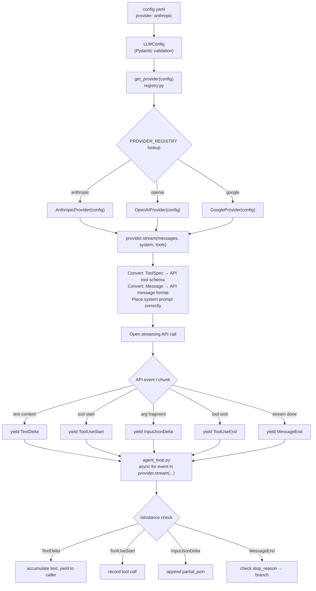

# Chapter 3 — LLM Providers and Streaming Abstraction

---

## Overview

> **Core Question:** How does Basement run the same agent loop against Anthropic, OpenAI, and Google without any `if provider == "anthropic"` logic inside the loop itself — and how does the streaming output reach the caller one token at a time regardless of which API is on the other end?

The agent loop you studied in ch-02 calls exactly one method: `runtime.provider.stream(messages, system, tools)`. It does not know whether the provider is Anthropic, OpenAI, or Google. It receives a stream of five event types, pattern-matches on them with `isinstance`, and acts. This chapter explains the machinery that makes that substitutability possible: a structural Protocol contract, a dict-dispatch registry, three concrete adapter classes, and a two-stage API key pipeline that wires configuration to the right SDK client.

By the end of this chapter you should be able to: (1) draw the five-file call chain from `config.yaml` → `get_provider` → adapter → `yield` events → agent loop from memory; (2) open any of the three provider files and locate exactly where each of the five `StreamEvent` types is emitted and why; (3) explain what it costs to add a fourth provider and which three files need to change; (4) state precisely what `tools=None` does at the API schema layer — not persuasion, schema presence.

This chapter also revisits ch-02's weak spot directly. The ch-02 agent loop passes `tools=None` to `provider.stream()` when no tools are registered. You will see in §3 that this causes the adapter to omit the `"tools"` key from the API request body entirely. The model cannot produce a `tool_use` block when the request schema does not include a `tools` field — this is an API contract constraint, not a behavioral instruction to the model.

---

## Key Concepts

### 1. The Universal Pattern — Adapt, Dispatch, Stream

Every LLM provider integration in Basement follows the same five-step sequence:

```
Step 1.  Read LLMConfig.provider string from config.yaml
         (validated Literal["anthropic", "openai", "google"])

Step 2.  Look up the factory in PROVIDER_REGISTRY[config.provider]
         → call factory(config) → return a concrete provider object
         (dict-dispatch; no if/elif chain; no inheritance)

Step 3.  On each agent turn, call provider.stream(messages, system, tools)
         → adapter converts internal types to API-specific wire format:
            - ToolSpec list  → API-specific tool schema
            - Message list   → API-specific message array
            - system str     → API-specific system prompt placement

Step 4.  Open an API streaming connection; iterate chunks/events
         → translate each API-specific event into one of five StreamEvent types:
            TextDelta | ToolUseStart | InputJsonDelta | ToolUseEnd | MessageEnd

Step 5.  yield each StreamEvent to the agent loop
         → agent loop receives a homogeneous stream regardless of provider
         → isinstance checks branch on event type, not on provider name
```

**Why this pattern is inevitable.** The three APIs have structurally incompatible wire protocols: Anthropic sends discrete SSE events with explicit block boundaries; OpenAI sends index-keyed chunks where boundaries are implicit; Gemini returns complete function calls in a single part with no native IDs. Yet the agent loop needs to do the same thing with all three: accumulate text, detect tool starts, collect argument fragments, detect tool ends, check the stop reason. The only viable architecture is to absorb the differences in a per-provider adapter and expose a uniform event stream. Any alternative — provider checks in the loop, per-provider loop variants, a mega-method with conditionals — violates the single-responsibility principle and means every new provider requires modifying loop logic. The Protocol + adapter pattern pushes all API-specific knowledge to the edges of the system.

**Mental model:** Think of this like a driver adapter for printers. The operating system sends a generic print job; each printer driver translates it to the printer's native language. The OS never knows which printer model is attached. Here, the agent loop is the OS, `StreamEvent` is the generic print job format, and each provider class is a driver.

**The `tools=None` mechanism (revisiting ch-02 gap).** When the agent loop builds the `tools` argument for `provider.stream()`, it passes `runtime.tool_registry.get_all_specs() or None`. The `or None` means an empty list becomes `None`. Each adapter guards with `if tools: kwargs["tools"] = self._convert_tools(tools)`. When `tools` is `None` or an empty list, the `"tools"` key is never added to `kwargs`. The API request goes out without a `tools` field. Without that field in the request schema, the model's response schema cannot include a `tool_use` block — the API would return a validation error. This is enforcement at the API schema layer: the absence of the field in the request makes the block structurally impossible in the response, not just unlikely.

**Mermaid — Call Flow**



**Mermaid — Sequence Diagram (one turn)**

```mermaid
sequenceDiagram
    participant Loop as agent_loop.py
    participant Provider as AnthropicProvider
    participant API as Anthropic API (SSE)

    Loop->>Provider: stream(messages, system, tools=[...])
    Provider->>Provider: _convert_messages()
    Provider->>Provider: _convert_tools()
    Provider->>API: POST /v1/messages (stream=true)
    API-->>Provider: content_block_start {type: tool_use}
    Provider-->>Loop: yield ToolUseStart(id, name)
    API-->>Provider: content_block_delta {type: input_json_delta}
    Provider-->>Loop: yield InputJsonDelta(partial_json)
    API-->>Provider: content_block_stop
    Provider-->>Loop: yield ToolUseEnd(id)
    API-->>Provider: message_stop
    Provider->>API: get_final_message()
    API-->>Provider: {stop_reason: "tool_use"}
    Provider-->>Loop: yield MessageEnd(stop_reason="tool_use")
    Loop->>Loop: tool_uses not empty → execute tools → loop back
```

---

### 2. `LLMConfig` — The Data Contract — `schemas/config_schema.py`

Full walkthrough: [[excerpts/config_schema]]

`LLMConfig` is a five-field Pydantic model with `extra="forbid"`. It is the single object that travels from YAML parsing all the way to the provider SDK client constructor. Its fields and how each adapter uses them:

| Field | Type | Default | Where adapters use it |
|---|---|---|---|
| `provider` | `Literal["anthropic","openai","google"]` | `"anthropic"` | Registry dispatch key only; not passed to adapter |
| `model` | `str` | `"claude-sonnet-4-20250514"` | `kwargs["model"]` in all three adapters |
| `temperature` | `float` (0.0–2.0) | `0.7` | Conditional: `if self._config.temperature is not None` |
| `max_tokens` | `int` (1–200,000) | `4096` | Anthropic: `max_tokens`; OpenAI: `max_completion_tokens`; Gemini: `max_output_tokens` |
| `api_key` | `str \| None` | `None` | Passed to SDK client constructor; resolved from env if `None` |

The field name `max_tokens` is the framework's canonical name; each adapter silently renames it to whatever the target API expects. The caller of `provider.stream()` never sees those API-specific names.

A minimal working `config.yaml` (from `agents/demo/config.yaml`):

```yaml
# agents/demo/config.yaml, lines 1-4

llm:
  provider: anthropic
  model: claude-sonnet-4-6
  temperature: 0.3
  max_tokens: 1024
```

This file produces an `LLMConfig` that routes to `AnthropicProvider` via the registry. The `api_key` field is absent, so it defaults to `None` and the loader resolves it from `ANTHROPIC_API_KEY` in the environment.

---

### 3. The Provider Protocol — `basement/llm/base.py`

Full walkthrough: [[excerpts/base]]

`base.py` is the contract file. Nothing in it executes; everything in it is a type definition. The `LLMProvider` Protocol declares one method:

```python
# packages/basement/basement/llm/base.py, lines 54-63

@runtime_checkable
class LLMProvider(Protocol):
    async def stream(
        self,
        messages: list[Message],
        system: str,
        tools: list[ToolSpec] | None = None,
    ) -> AsyncIterator[StreamEvent]: ...
```

`@runtime_checkable` makes the Protocol usable with `isinstance()`. The three adapter classes (`AnthropicProvider`, `OpenAIProvider`, `GoogleProvider`) never `import` or inherit from `LLMProvider` — they simply implement `stream` with the right signature, and Python's structural typing considers them compliant.

The five `StreamEvent` types form a complete and closed vocabulary:

- `TextDelta(text: str)` — one text fragment from a streaming response
- `ToolUseStart(id: str, name: str)` — a tool call is beginning; `id` correlates with `ToolUseEnd`
- `InputJsonDelta(partial_json: str)` — one JSON fragment for the tool's arguments
- `ToolUseEnd(id: str)` — the tool call is complete; arguments can now be parsed
- `MessageEnd(stop_reason: str)` — the full response is done; `stop_reason` drives loop control

The `StreamEvent` type alias is a union: `TextDelta | ToolUseStart | InputJsonDelta | ToolUseEnd | MessageEnd`. The agent loop's `isinstance` checks are exhaustive over this union.

---

### 4. Provider Registry — `basement/llm/registry.py`

Full walkthrough: [[excerpts/registry]]

```python
# packages/basement/basement/llm/registry.py, lines 39-58

PROVIDER_REGISTRY: dict[str, Callable] = {
    "anthropic": _create_anthropic,
    "openai": _create_openai,
    "google": _create_google,
}

def get_provider(config: LLMConfig) -> LLMProvider:
    factory = PROVIDER_REGISTRY.get(config.provider)
    if not factory:
        raise ProviderError(
            f"Unknown provider: '{config.provider}'. "
            f"Available: {list(PROVIDER_REGISTRY)}"
        )
    return factory(config)
```

The registry is a plain Python dict. `get_provider` does one lookup, one null check, one call. The three `_create_*` functions each do a lazy import of the concrete provider class — so the `openai` and `google` SDKs are never imported if the agent is configured for Anthropic.

To add a fourth provider: (1) create `basement/llm/xai_provider.py` with an `XAIProvider` class that implements `stream`; (2) add `"xai": _create_xai` to `PROVIDER_REGISTRY`; (3) add `"xai"` to the `Literal` type in `LLMConfig`. Three file edits, zero changes to the agent loop.

---

### 5. Anthropic Adapter — `basement/llm/anthropic_provider.py`

Full walkthrough: [[excerpts/anthropic_provider]]

The Anthropic adapter is the reference implementation — the framework was built around the Anthropic API shape, so this adapter has the least translation work.

**Tool conversion** is a one-to-one projection: `ToolSpec.input_schema` maps directly to the Anthropic API's `input_schema` field. The field name is identical; no renaming needed.

**Message conversion** passes the system prompt as a separate `system=` kwarg to the Anthropic API call. The conversation history goes in the `messages=` list. This matches the Anthropic API's design exactly.

**Stream loop — where each yield happens:**

```python
# packages/basement/basement/llm/anthropic_provider.py, lines 94-121

async with self._client.messages.stream(**kwargs) as stream:
    async for event in stream:
        if event.type == "content_block_start":
            block = event.content_block
            if block.type == "tool_use":
                current_tool_id = block.id
                yield ToolUseStart(id=block.id, name=block.name)   # ← yield 1

        elif event.type == "content_block_delta":
            delta = event.delta
            if delta.type == "text_delta":
                yield TextDelta(text=delta.text)                   # ← yield 2
            elif delta.type == "input_json_delta":
                yield InputJsonDelta(partial_json=delta.partial_json)  # ← yield 3

        elif event.type == "content_block_stop":
            if current_tool_id is not None:
                yield ToolUseEnd(id=current_tool_id)               # ← yield 4
                current_tool_id = None

    final = await stream.get_final_message()
    yield MessageEnd(stop_reason=final.stop_reason)                # ← yield 5
```

Each `yield` is the exact point where an Anthropic SSE event becomes a framework event. The `current_tool_id` variable is the only local state — it tracks which tool block is open so `content_block_stop` can emit the matching `ToolUseEnd`.

**`tools=None` at the API layer:**

```python
# packages/basement/basement/llm/anthropic_provider.py, lines 88-89

if tools:
    kwargs["tools"] = self._convert_tools(tools)
```

When `tools` is `None` (or an empty list, which is falsy), this guard prevents the `"tools"` key from appearing in `kwargs`. The Anthropic API call goes out without a `tools` field. Without that field, the API schema does not permit a `tool_use` block in the response — the model cannot produce one, regardless of what the system prompt says. This is a structural API constraint, not model persuasion.

---

### 6. OpenAI Adapter — `basement/llm/openai_provider.py`

Full walkthrough: [[excerpts/openai_provider]]

The OpenAI adapter is the most complex of the three — the source file has a `# AD4: OpenAI 250 LOC Budget` note documenting that this complexity was anticipated in the architecture.

**The core difficulty:** OpenAI's streaming protocol has no explicit tool-block open/close events. Tool call boundaries must be reconstructed from `delta.tool_calls[i].index` — when a new index appears, a new tool call has started; when the stream ends, all open tool calls are closed.

```python
# packages/basement/basement/llm/openai_provider.py, lines 135-177

active_tool_ids: dict[int, str] = {}   # index → tool_id, tracks open tool calls
finish_reason: str | None = None

response = await self._client.chat.completions.create(**kwargs)

async for chunk in response:
    choice = chunk.choices[0] if chunk.choices else None
    if not choice:
        continue
    delta = choice.delta
    if choice.finish_reason:
        finish_reason = choice.finish_reason

    if delta and delta.content:
        yield TextDelta(text=delta.content)

    if delta and delta.tool_calls:
        for tc in delta.tool_calls:
            idx = tc.index
            if idx not in active_tool_ids and tc.id:
                active_tool_ids[idx] = tc.id
                name = tc.function.name if tc.function else "unknown"
                yield ToolUseStart(id=tc.id, name=name)
            if tc.function and tc.function.arguments:
                yield InputJsonDelta(partial_json=tc.function.arguments)

# After the loop — emit ToolUseEnd for every open tool
for idx in sorted(active_tool_ids.keys()):
    yield ToolUseEnd(id=active_tool_ids[idx])

# Normalize finish_reason to framework vocabulary
stop = "end_turn"
if finish_reason == "tool_calls":
    stop = "tool_use"
elif finish_reason == "length":
    stop = "max_tokens"
yield MessageEnd(stop_reason=stop)
```

The `active_tool_ids` dict is the state machine. `ToolUseEnd` events are emitted only after the loop completes — the agent loop receives them in a burst at the end rather than interleaved. The agent loop's design accommodates this: it only acts on tool uses after `MessageEnd`, not after each `ToolUseEnd`.

**System prompt placement** differs from Anthropic: OpenAI expects the system prompt as the first element of the messages array with `role: "system"`. The adapter's `_convert_messages(messages, system)` prepends `{"role": "system", "content": system}` before converting the rest of the history.

**Tool schema shape** adds a wrapper: `{"type": "function", "function": {"name": ..., "description": ..., "parameters": ...}}`. The inner field is `parameters` (not `input_schema`). Same data; different envelope.

---

### 7. Google Gemini Adapter — `basement/llm/google_provider.py`

Full walkthrough: [[excerpts/google_provider]]

The Google adapter introduces two unique characteristics not present in the other two.

**Synchronous SDK wrapped in an async generator.** The `google-genai` SDK's `generate_content_stream` returns a plain synchronous iterator. The adapter method is `async def stream(...)` — making it an async generator via the `yield` keywords — but the inner iteration is a regular `for chunk in response` loop. This is legal Python: `yield` inside `async def` produces an async generator regardless of whether the inner loop is sync or async. The agent loop's `async for event in provider.stream(...)` drives the async generator protocol; the sync SDK iteration is opaque inside.

**Tool ID synthesis.** Gemini's function call protocol does not assign IDs to tool calls. The adapter invents one:

```python
# packages/basement/basement/llm/google_provider.py, lines 141-148

elif part.function_call:
    has_tool_calls = True
    fc = part.function_call
    tool_id = f"toolu_{uuid4().hex[:12]}"
    yield ToolUseStart(id=tool_id, name=fc.name)
    args = dict(fc.args) if fc.args else {}
    yield InputJsonDelta(partial_json=json.dumps(args))
    yield ToolUseEnd(id=tool_id)
```

The synthesized `tool_id` is used consistently — the same value appears in `ToolUseStart`, `ToolUseEnd`, and is later recorded in `ToolUseBlock.id` when the agent loop builds the assistant message. Gemini never sees this ID; it only exists within the framework.

**No argument streaming.** Gemini delivers function arguments as a complete dict (`fc.args`) in one part. The adapter still emits the three-event sequence `ToolUseStart → InputJsonDelta → ToolUseEnd` within a single iteration of the `for part` loop — `InputJsonDelta` carries the full JSON string, not a fragment. The agent loop's accumulation logic (`tool_uses[-1]["input_json"] += event.partial_json`) still works; it just concatenates a single "fragment" that happens to be complete.

---

### 8. API Key Resolution — `loader.py` + `__main__.py`

Full walkthrough: [[excerpts/loader]]

Key resolution is a two-stage pipeline that runs before the agent loop starts:

**Stage 1 — .env walk-up (at process startup).** The top of `__main__.py` runs before any framework import:

```python
# packages/basement/basement/__main__.py, lines 17-28

try:
    from dotenv import load_dotenv
    agent_dir = Path(sys.argv[1]) if len(sys.argv) > 1 else Path(".")
    for parent in [agent_dir.resolve()] + list(agent_dir.resolve().parents):
        env_file = parent / ".env"
        if env_file.exists():
            load_dotenv(env_file)
            break
except ImportError:
    pass
```

The walk-up iterates from the agent directory to the filesystem root, stopping at the first `.env` found. `load_dotenv` reads that file and sets its contents into `os.environ`.

**Stage 2 — environment variable lookup (during config loading).** After Pydantic validates `config.yaml`:

```python
# packages/basement/basement/config/loader.py, lines 70-74 + 95-109

if config.llm.api_key is None:
    config.llm.api_key = resolve_api_key(config.llm)

# resolve_api_key:
env_map = {
    "anthropic": "ANTHROPIC_API_KEY",
    "openai": "OPENAI_API_KEY",
    "google": "GOOGLE_API_KEY",
}
env_var = env_map.get(config.provider)
if env_var:
    return os.environ.get(env_var)
```

The priority order is: explicit `api_key` in `config.yaml` → `.env` file found by walk-up → shell environment variable → `None` (SDK auth error at first call).

---

### 9. Cross-Implementation Synthesis

| Implementation | System prompt placement | Tool schema shape | Stream protocol | Tool ID source | ToolUseEnd timing |
|---|---|---|---|---|---|
| **Anthropic** | Separate `system=` kwarg | `{name, description, input_schema}` | SSE with explicit `content_block_start/stop` | From API response | Interleaved: emitted at `content_block_stop` |
| **OpenAI** | First element of messages array as `role: "system"` | `{type: "function", function: {name, description, parameters}}` | Chunks with `delta.tool_calls[i]`, index-keyed | From API response (`tc.id`) | Batch: all emitted after stream loop ends |
| **Google** | `system_instruction=` in `GenerateContentConfig` | `FunctionDeclaration(name, description, parameters)` | Sync iterator, complete function calls in one part | Synthesized: `f"toolu_{uuid4().hex[:12]}"` | Immediate: emitted in same part iteration as start |

**What is invariant (forced by the substrate):**

Every streaming LLM API must distinguish between text content and function call content, and must signal when the response is complete. These needs force some vocabulary of open/close/delta/end events. The five `StreamEvent` types are therefore required by the structure of the problem — any adapter to any streaming LLM API would need to produce something equivalent. The specific type names and field shapes are the framework's design choice, but having exactly this vocabulary (or something equivalent) is inevitable.

The `tools: list[ToolSpec] | None = None` parameter on `stream()` is also forced: every API has a mechanism to inform the model what tools are available, and omitting it changes the response schema. The `None` sentinel for "no tools" is the framework's design choice; but some distinction between "tools available" and "no tools" is inevitable.

**What is variant (free design choices):**

The OpenAI adapter's `active_tool_ids` state machine for reconstructing boundaries, the Google adapter's UUID synthesis for tool IDs, the Anthropic adapter's `get_final_message()` call for the stop reason — these are all artifacts of each API's specific protocol, absorbed by the adapter layer. The framework's consumer (the agent loop) sees none of this complexity.

The system prompt routing (kwarg vs. prepended message vs. config object) is entirely variant — three different API conventions that the three adapters handle without any shared abstraction. The `LLMProvider` Protocol passes `system: str` as a plain string and leaves routing to the adapter.

---

## Questions

1. Open `anthropic_provider.py` and find the line `if tools:` (line 88). What is the exact sequence of events that leads to `tools` being falsy at that point, starting from an agent folder with an empty `tools/` directory? Name every file and variable in the chain.

2. The OpenAI adapter emits all `ToolUseEnd` events in a batch after the async-for loop ends, while Anthropic emits them interleaved with `InputJsonDelta` events. The agent loop works correctly with both. Looking at `agent_loop.py` lines 125–129, why does the loop's design tolerate this difference? What would break if the loop checked stop conditions after each `ToolUseEnd` instead of waiting for `MessageEnd`?

3. Google's `stream` method is `async def` but uses a plain `for chunk in response` loop internally (not `async for`). A classmate says: "That can't be right — it has to be `async for` if it's in an async method." Correct this claim with a precise explanation of Python's async generator semantics. Cite the specific Google adapter lines that demonstrate your point.

4. The `PROVIDER_REGISTRY` is a module-level mutable dict. The README instructs you to add a new provider by editing it directly. What are two things you would need to change in `config_schema.py` and `registry.py` respectively to support a new provider named `"xai"`? What would happen if you added the registry entry but forgot the `config_schema.py` change — what error would occur, at what point in the startup sequence, and in which file?

5. Trace the full API key resolution for an agent whose `config.yaml` omits `api_key`, whose agent directory is `/home/user/projects/mybot/`, and which has a `.env` file at `/home/user/.env` containing `ANTHROPIC_API_KEY=sk-ant-xyz`. Walk through every line of code in `__main__.py` and `loader.py` that executes before `AnthropicProvider.__init__` receives the key. At what point does the key value enter Python's process memory?

6. Looking at the synthesis table in §9: the `ToolUseEnd` timing column shows three different behaviors (interleaved, batch, immediate). Suppose a future agent hook wanted to act immediately after each individual tool's arguments are fully received — a `POST_TOOL_ARG_COMPLETE` hook. Which provider's stream protocol would make this hook easiest to implement in the adapter, and which would make it hardest? Justify your answer with specific adapter code.
