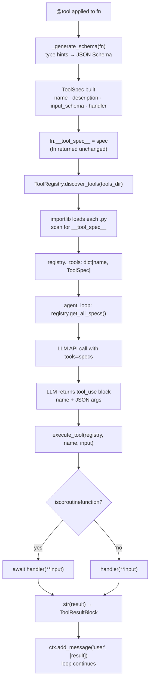

## Overview

> **Core Question:** How does Basement turn a plain Python function — annotated with
> type hints and a docstring — into a fully-specified, LLM-callable tool, with zero
> registration boilerplate?

The tool system is the most author-facing part of Basement. Every agent behaviour that
the LLM can initiate at runtime passes through it: from a one-line calculator to a
16-tool insurance sales assistant. Understanding exactly what the `@tool` decorator does,
how the registry discovers it, and how the executor bridges Python and the conversation
API is the prerequisite for building any non-trivial agent — and for reasoning about
what the LLM can and cannot do at each turn.

This chapter traces the full lifecycle of a tool: from the moment a developer writes
`@tool` on a function, through JSON Schema generation, registry auto-discovery, execution
with sync/async normalisation, and finally into the `ToolResultBlock` that appears in
the conversation context. You will be able to draw this pipeline from memory, predict
the schema produced by any annotated function, and locate the integration points where
hooks and permissions intercept the tool call path (covered in [[ch-05]] and [[ch-06]]).

Depth is split across four sub-pages. Read this file for the full conceptual picture;
follow the wikilinks for line-by-line source commentary.

---

## Key Concepts

### 1. The Universal Pattern

Every tool system that exposes Python functions to an LLM API must solve the same
problem: the LLM API demands a formal schema describing what arguments the function
accepts, and Python functions carry that information only implicitly in their type hints
and signatures. The pattern that emerges is always a four-step pipeline:

```
Step 1 — Decoration
    @tool applied to fn
    → extract name, docstring, signature
    → generate JSON Schema from type hints
    → build ToolSpec(name, description, input_schema, handler)
    → stamp spec on fn as fn.__tool_spec__

Step 2 — Discovery
    ToolRegistry.discover_tools(tools_dir)
    → glob *.py, skip _private files
    → importlib-load each module
    → scan module attrs for __tool_spec__
    → register(spec) into name→spec dict

Step 3 — Exposure
    agent_loop asks registry.get_all_specs()
    → list of ToolSpec sent to LLM provider.stream(tools=...)
    → LLM receives tool definitions as part of API call

Step 4 — Execution
    LLM responds with tool_use block (name + JSON args)
    → execute_tool(registry, name, tool_input)
        → registry.get(name) → ToolSpec
        → iscoroutinefunction? await or call
        → str(result) → ToolResultBlock.content
    → ToolResultBlock added to conversation context
    → loop continues from Step 3 (tool chaining)
```

**Why this pattern is inevitable.** The Anthropic (and OpenAI) tool-use API shape forces
it. The API requires `tools` as a list of objects with `name`, `description`, and
`input_schema` (JSON Schema). That means the framework must produce JSON Schema from
*something* — and Python type hints are the only structured metadata available on a
function without requiring the developer to write the schema by hand. Given that
constraint, introspecting the function's signature at decoration time is the only
mechanism that delivers zero-boilerplate tool definition. Everything else follows from
that forced choice: the decorator becomes the extraction point, the stamp-on-function
trick (`__tool_spec__`) becomes the coupling between decoration and discovery, and the
executor becomes a thin async normalisation layer because the API call is always async
but user handlers need not be.

**Mental model.** This is like Python's dataclass machinery, but pointed at the LLM API
instead of at `__init__`. Just as `@dataclass` reads field annotations and generates
boilerplate methods, `@tool` reads parameter annotations and generates JSON Schema. The
"boilerplate" here is the schema object the LLM API needs.

**Structure diagram — decoration to execution:**



**Sequence — one tool call within a turn:**

```mermaid
sequenceDiagram
    participant Loop as agent_loop
    participant Hooks as HookRegistry
    participant Exec as execute_tool
    participant Reg as ToolRegistry
    participant Fn as tool handler

    Loop->>Hooks: fire PRE_TOOL_CALL (tool_name, tool_input)
    Loop->>Exec: execute_tool(registry, name, input)
    Exec->>Reg: get(name) → ToolSpec
    Reg-->>Exec: spec.handler
    alt async handler
        Exec->>Fn: await handler(**input)
    else sync handler
        Exec->>Fn: handler(**input)
    end
    Fn-->>Exec: result (any type)
    Exec-->>Loop: ToolResultBlock(content=str(result))
    Loop->>Hooks: fire POST_TOOL_CALL (tool_result)
    Loop->>Loop: ctx.add_message("user", [result])
    Loop->>Loop: continue → next LLM call
```

---

### 2. `decorator.py` — Schema Generation Engine

**Source:** `boson-agent/packages/basement/basement/tools/decorator.py`
Full walkthrough with line-by-line commentary: [[excerpts/decorator]]

The decorator module is 113 lines doing three distinct jobs: dual-mode decorator entry
(`@tool` and `@tool(name="x")`), parameter scanning via `inspect.signature`, and
recursive type mapping via `_type_to_schema`.

```python
# boson-agent/packages/basement/basement/tools/decorator.py, lines 18-54

TYPE_MAP: dict[type, dict] = {
    str: {"type": "string"},
    int: {"type": "integer"},
    float: {"type": "number"},
    bool: {"type": "boolean"},
}

def tool(fn: Callable | None = None, *, name: str | None = None) -> Callable:
    def decorator(func: Callable) -> Callable:
        if not func.__doc__:
            raise ValueError(
                f"Tool '{func.__name__}' must have a docstring (used as description)"
            )
        spec = ToolSpec(
            name=name or func.__name__,
            description=func.__doc__.strip(),
            input_schema=_generate_schema(func),
            handler=func,
        )
        func.__tool_spec__ = spec
        return func

    if fn is not None:
        return decorator(fn)
    return decorator
```

The `if fn is not None` branch at line 56 is the dual-mode switch: `@tool` passes the
function as `fn`; `@tool(name="x")` passes `None` for `fn` and a string for `name`,
getting back `decorator` for Python to apply. The inner `decorator` closes over `name`.

The docstring guard (`if not func.__doc__`) is a hard error by design — an empty
description makes the tool invisible to the LLM's selection heuristics. The handler is
returned unchanged, so the function remains directly callable in tests without unwrapping.

The type-mapping logic in `_type_to_schema` (lines 90–113) handles the four JSON Schema
primitives via `TYPE_MAP`, then recurses for `list[X]` and `Optional[X]` using
`get_origin` / `get_args`. Unknown types fall back to `{"type": "string"}` silently.

> **Notice:** `func.__tool_spec__ = spec` is the entire coupling mechanism between the
> decorator and the registry. No import-time side effect, no call to any central registry,
> no metaclass. The spec rides on the function object until `discover_tools` reads it.
> This is what makes the decoration phase pure and testable in isolation.

Connection to the universal pattern: this is Step 1 entirely. Steps 2–4 are handled by
registry, agent_loop, and executor respectively.

---

### 3. `registry.py` — Auto-Discovery via importlib

**Source:** `boson-agent/packages/basement/basement/tools/registry.py`
Full walkthrough with discovery flow diagram: [[excerpts/registry]]

```python
# boson-agent/packages/basement/basement/tools/registry.py, lines 50-71

def discover_tools(self, tools_dir: Path) -> int:
    if not tools_dir.exists():
        return 0

    count = 0
    for py_file in sorted(tools_dir.glob("*.py")):
        if py_file.name.startswith("_"):
            continue
        try:
            module = _import_module_from_path(py_file)
            for obj in vars(module).values():
                if hasattr(obj, "__tool_spec__"):
                    self.register(obj.__tool_spec__)
                    count += 1
        except Exception as e:
            logger.error("Failed to load tool from %s: %s", py_file, e)
            continue

    return count
```

The discovery loop is alphabetically sorted (`sorted()`) for deterministic registration
order — the order tools appear in `get_all_specs()` affects the order they appear in the
LLM API request. Files starting with `_` are skipped (used for shared utilities like
`_session.py`). Each file is loaded via `_import_module_from_path`, which uses
`importlib.util.spec_from_file_location` and inserts the file's parent directory into
`sys.path` — enabling relative imports like `from _session import get_active_customer`.

`hasattr(obj, "__tool_spec__")` is the complete protocol for identifying a decorated
function. No base class, no `isinstance` check against a registry type.

> **Notice:** The exception handler around each file load (`except Exception: continue`)
> is fail-open. A broken tool file is logged but does not crash agent startup. This is a
> deliberate operational decision: partial availability beats total failure. In development,
> this can mask syntax errors — check the logs if a tool silently fails to appear.

Connection to the universal pattern: this is Step 2. The `_import_module_from_path`
helper is shared with `HookRegistry` — the same dynamic-import mechanism discovers both
tools and hooks from their respective folders (see [[ch-05]]).

---

### 4. `executor.py` — Sync/Async Normalisation

**Source:** `boson-agent/packages/basement/basement/tools/executor.py`
Full walkthrough with agent-loop call site context: [[excerpts/executor]]

```python
# boson-agent/packages/basement/basement/tools/executor.py, lines 23-61

async def execute_tool(
    registry: ToolRegistry,
    name: str,
    tool_input: dict,
) -> ToolResultBlock:
    spec = registry.get(name)  # raises ToolNotFoundError

    try:
        if inspect.iscoroutinefunction(spec.handler):
            result = await spec.handler(**tool_input)
        else:
            result = spec.handler(**tool_input)

        return ToolResultBlock(
            tool_use_id=f"toolu_{uuid4().hex[:12]}",
            content=str(result),
            is_error=False,
        )
    except Exception as e:
        logger.error("Tool '%s' raised: %s", name, e, exc_info=True)
        return ToolResultBlock(
            tool_use_id="",
            content=f"Tool error: {type(e).__name__}: {e}",
            is_error=True,
        )
```

`execute_tool` is always `async` even when the handler is synchronous — because the
caller (`_execute_tool_uses` in `agent_loop.py`) is itself in an async context and must
`await` it. The `inspect.iscoroutinefunction` check dispatches to `await` or direct call.

`str(result)` at line 50 is the Python-to-LLM boundary. Whatever the handler returns
— a formatted string, a dict, a Pydantic model — becomes a string in `content`.

The `tool_use_id` generated here (`toolu_{uuid4()...}`) is a placeholder immediately
overwritten by `agent_loop.py` line 239 (`result.tool_use_id = tu["id"]`) with the
actual streaming ID from the LLM response. The field is required by `ToolResultBlock`'s
schema, so the executor supplies a syntactically valid value.

> **Notice:** `is_error=True` in the error path does not crash the loop. The
> `ToolResultBlock` with `is_error=True` is added to the conversation context as a user
> message (line 249 of `agent_loop.py`): `ctx.add_message("user", [result])`. The LLM
> reads the error text in `content` and can respond to it — ask for different arguments,
> try a different tool, or surface the error to the user. This is why tool error messages
> are written for LLM readability, not for stack-trace debugging.

**POST_LLM_CALL hook visibility (carryforward from ch-02):** When the LLM returns a
text-only response (no tool use), `POST_LLM_CALL` fires with a `HookContext` containing
the conversation state. When the LLM uses a tool, `POST_LLM_CALL` is **not** fired —
instead `PRE_TOOL_CALL` and `POST_TOOL_CALL` fire per tool (lines 198–246 of
`agent_loop.py`), and the loop continues without ever reaching the `POST_LLM_CALL`
branch. This asymmetry matters for hooks that expect to see every LLM response: a tool
call path bypasses `POST_LLM_CALL` entirely. See [[ch-05]] for the full hook event map.

Connection to the universal pattern: this is Steps 3 and 4. `execute_tool` receives the
LLM's `tool_input` dict (already JSON-decoded by the loop), invokes the handler, and
returns the `ToolResultBlock` that closes the turn's tool-use cycle.

---

### 5. Real @tool Implementations — Demo and Production

**Sources:** `agents/demo/tools/` and `agents/test-lina/tools/`
Full four-tool walkthrough with generated schemas: [[excerpts/example-tool]]

Three patterns appear across all real tool files:

**Minimal sync tool** — `calculate.py` (1 required `str` param, error-handling via
return value):

```python
# boson-agent/agents/demo/tools/calculate.py, lines 4-15

@tool
def calculate(expression: str) -> str:
    """Evaluate a math expression and return the result. Example: '2 + 3 * 4' returns '14'."""
    try:
        allowed = set("0123456789+-*/.() ")
        if not all(c in allowed for c in expression):
            return f"Error: invalid characters in expression"
        result = eval(expression)
        return str(result)
    except Exception as e:
        return f"Error: {e}"
```

**Optional parameter via Python default** — `get_time.py` (1 optional `str` param with
default `"UTC"`; absent from JSON Schema `required` array):

```python
# boson-agent/agents/demo/tools/get_time.py, lines 5-17

@tool
def get_time(timezone: str = "UTC") -> str:
    """Get current time for a timezone.

    Args:
        timezone: Timezone name (e.g., UTC, KST, EST, PST)
    """
    offsets = {"UTC": 0, "KST": 9, "EST": -5, "PST": -8, "JST": 9, "CET": 1}
    offset = offsets.get(timezone.upper(), 0)
    now = datetime.utcnow() + timedelta(hours=offset)
    return f"{timezone.upper()}: {now.strftime('%Y-%m-%d %H:%M:%S')}"
```

**Zero-parameter tool with session-scoped state** — `check_dnc_status.py` (no
parameters; state sourced from `_session.py` shared module):

```python
# boson-agent/agents/test-lina/tools/check_dnc_status.py, lines 11-29

@tool
def check_dnc_status() -> str:
    """Check if a customer is on the Do-Not-Call list."""
    customer_id = get_active_customer()
    with open(CUSTOMER_DB) as f:
        data = yaml.safe_load(f)
    customers = data.get("customers", {})
    if customer_id not in customers:
        return f"Error: Customer '{customer_id}' not found."
    customer = customers[customer_id]
    status = customer.get("dnc_status", False)
    name = customer.get("name", customer_id)
    if status:
        return f"{name} ({customer_id}) is ON the Do-Not-Call list. Do not proceed with sales."
    return f"{name} ({customer_id}) is NOT on the Do-Not-Call list. OK to proceed."
```

> **Notice:** `check_dnc_status` takes zero parameters. The generated schema is
> `{"type": "object", "properties": {}, "required": []}`. The LLM calls it with `{}`
> as input — valid per JSON Schema. Session context (the active customer ID) is
> retrieved via `get_active_customer()` from `_session.py`, which is discoverable only
> because the registry inserts the tool file's parent into `sys.path` at load time.

These three patterns — required param, optional param, no param — cover the full range
of what `_generate_schema` produces. The `list[X]` and `Optional[X]` cases exist in the
decoder but are not used in any current agent tool; they are structural affordances for
richer data contracts.

---

### 6. `ToolSpec` — The Data Contract

**Source:** `boson-agent/packages/basement/basement/schemas/tool_schema.py`

```python
# boson-agent/packages/basement/basement/schemas/tool_schema.py, lines 15-23

class ToolSpec(BaseModel):
    """Specification for a registered tool."""

    model_config = {"arbitrary_types_allowed": True}

    name: str
    description: str
    input_schema: dict
    handler: Callable = Field(exclude=True)
```

`ToolSpec` is a Pydantic model with four fields. `handler: Callable` uses
`Field(exclude=True)` — it is excluded from serialisation. When the agent loop sends
tool specs to the LLM API, it passes the `ToolSpec` objects; the LLM provider's
serialisation layer calls `.model_dump()` or equivalent, and `handler` is absent from
the output. The LLM only sees `name`, `description`, and `input_schema`.

`arbitrary_types_allowed = True` is required because `Callable` is not a Pydantic-native
type. Without it, Pydantic would reject the model definition.

This schema is the bridge between the decorator's output and the LLM API's input format.
It maps cleanly to Anthropic's tool definition structure:

```
ToolSpec.name          → tool.name
ToolSpec.description   → tool.description
ToolSpec.input_schema  → tool.input_schema (JSON Schema object)
ToolSpec.handler       → (not sent to LLM; kept for executor)
```

---

### 7. Cross-Implementation Synthesis

| Implementation | Role | Mechanism | Key design choice |
|----------------|------|-----------|-------------------|
| `decorator.py` | Schema generation | `inspect.signature` + `TYPE_MAP` + recursive `_type_to_schema` | Stamp spec on fn; no central registry at decoration time |
| `registry.py` | Discovery | `importlib.util.spec_from_file_location` + `hasattr(__tool_spec__)` | Fail-open per file; `sorted()` for determinism |
| `executor.py` | Invocation | `inspect.iscoroutinefunction` branch; `str(result)` boundary | Always async wrapper; `is_error` result never crashes loop |
| `tool_schema.py` | Data contract | Pydantic `BaseModel`; `handler` excluded from serialisation | `arbitrary_types_allowed` for `Callable` field |
| Example tools | Consumer | `@tool` + docstring + type hints | Sync or async; zero-param and optional-param patterns |

**What is invariant (required by the substrate):**

The Anthropic tool-use API requires `name`, `description`, and `input_schema` (as JSON
Schema) for every tool. That requirement forces: (1) extraction of a description from
*somewhere* on the function — docstring is the only reasonable source; (2) generation of
JSON Schema from *something* — type hints are the only structured metadata available
without a separate schema file; (3) a `required` array derived from which parameters
have defaults — because JSON Schema and the LLM API both use `required` to distinguish
mandatory from optional fields. These three things cannot be designed away.

**What is free design choice:**

The dual-mode decorator pattern (`@tool` vs `@tool(name="x")`), the stamp-on-function
coupling (`__tool_spec__`), the fail-open exception handling in `discover_tools`, the
alphabetical sort, the fallback of unknown types to `{"type": "string"}`, and the
`str(result)` coercion in the executor. Any of these could be implemented differently
without breaking the API contract. The current choices prioritise developer ergonomics
(zero boilerplate, any return type) and operational stability (fail-open discovery,
errors as results not crashes) over strictness.

---

## Questions

1. Trace the full path of `@tool` applied to `check_dnc_status()` (zero parameters)
   through decoration, discovery, and execution. At each of the four steps in the
   universal pattern, state exactly what data structure changes and which file/function
   is responsible.

2. `_type_to_schema` falls back to `{"type": "string"}` for unknown types. What are the
   concrete consequences of this choice — for the LLM, for the executor, and for the
   tool author — compared to raising a `TypeError` at decoration time?

3. Look at `executor.py` line 49: `tool_use_id=f"toolu_{uuid4().hex[:12]}"`. Then look
   at `agent_loop.py` line 239: `result.tool_use_id = tu["id"]`. Why does the executor
   generate an ID it knows will be overwritten? What constraint forces this?

4. The `discover_tools` loop wraps each file load in `except Exception: continue`. Give
   a concrete scenario where this fail-open behaviour hides a bug that would be
   immediately obvious with a fail-fast approach. How would you detect the hidden failure
   in a production deployment?

5. `POST_LLM_CALL` is never fired during a tool-use turn; `PRE_TOOL_CALL` and
   `POST_TOOL_CALL` fire instead. If you were writing a hook to log every LLM response
   for auditing, which events would you need to subscribe to, and why does subscribing
   to `POST_LLM_CALL` alone give incomplete coverage? (See [[ch-05]] for hook event
   reference.)

6. A new tool has the signature `def lookup(ids: list[str], limit: Optional[int] = 10)
   -> str`. Write out the exact JSON Schema dict that `_generate_schema` produces for
   this function, showing your reasoning for each field.
