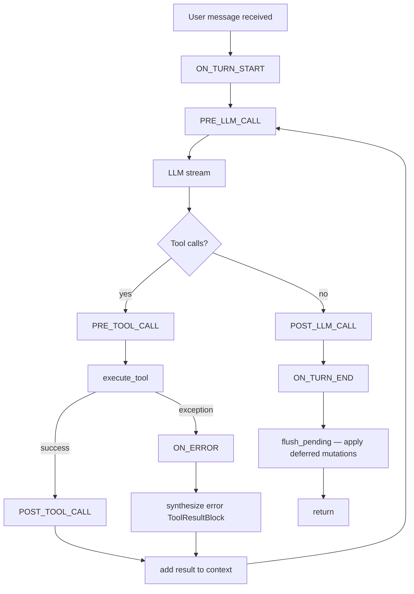

## Overview

> **Core Question:** How does Basement let external code observe and intervene in the agent loop at precise moments — without modifying the loop itself — and what guarantees does the framework provide about ordering, error isolation, and mutation safety?

The agent loop you studied in [[ch-02]] is a sealed orchestrator. It knows nothing about what any particular agent wants to observe or change. The hook system is the designed seam: nine named events, fired at every boundary that matters, with a sorted list of async callbacks attached to each. A hook file dropped in `hooks/` is discovered automatically, attached to one or more events, and executed in priority order. The loop never changes; the agent's observability does.

This chapter builds a complete mental model of the hook subsystem from four source files — `events.py`, `registry.py`, `runner.py`, `supervisor.py` — plus the `ConversationAPI` that hooks use to mutate state, and the agent loop call sites where events actually fire. After working through this chapter you will be able to: draw the full hook dispatch path from decorator to `await handler(context)` from memory; identify which `HookContext` fields are populated for any given event; explain the AD1 mutation timing contract (why some operations are immediate and others deferred); and write a supervisor hook that injects corrective context on tool failure.

The hook system is also where [[ch-04]]'s `@tool` decorator pattern reappears in a new role: `@hook` stamps metadata on functions at decoration time and a registry reads it at discovery time. The pattern is identical; only the metadata keys and the dispatcher differ. [[ch-06]] (skills pipeline) touches hooks at `ON_SKILL_INVOKE`. [[ch-10]] (rule engine vs hooks) contrasts the hooks model with the gateway's `@check` rule system — both are pluggable, but hooks are intra-loop and rules are pre-loop.

---

## Key Concepts

### 1. The Universal Pattern

Every event-hook system, regardless of language or framework, reduces to the same shape:

```
1. At each significant boundary in the core algorithm:
   a. Identify the event name (a stable, versioned identifier)
   b. Collect the relevant state snapshot (the context object)
   c. Iterate the registered handlers for that event, in defined order
   d. For each handler: call it with the context; isolate its errors

2. Registration (separate from dispatch):
   a. Attach metadata to callables at definition time (decorator)
   b. Discover callables by scanning a well-known location (directory)
   c. Store them sorted by priority in a per-event list

3. Mutation contract:
   a. Handlers that append to state: execute immediately (safe, additive)
   b. Handlers that remove or replace state: queue, apply atomically
      at a defined boundary (prevents mid-loop index corruption)
```

This pattern is **inevitable** given the substrate constraints:

- The core loop is sealed and must not be modified per agent. Therefore extension points must be external.
- LLM calls are async and sequential. Therefore hook dispatch must be async and sequential (parallel dispatch would allow hooks to race on shared state).
- The message history is an append-only protocol artifact (the Anthropic API requires user/assistant alternation). Therefore destructive mutations cannot happen mid-turn without corrupting the alternation invariant. Deferring them to turn boundary is the only safe option.
- The agent folder is the unit of deployment. Therefore discovery must be filesystem-based (no central registry to update).

**Mental model:** Think of hooks as breakpoints in a debugger, but writable. The loop pauses at each event, hands you a context object with the current state, and lets you inject side effects or queue mutations before resuming.



```mermaid
sequenceDiagram
    participant Loop as agent_loop
    participant Runner as fire_event
    participant Registry as HookRegistry
    participant Handler as user hook fn
    participant API as ConversationAPI

    Loop->>Runner: fire_event(registry, ON_TURN_START, ctx)
    Runner->>Registry: get_handlers(ON_TURN_START)
    Registry-->>Runner: [handler_A, handler_B]
    Runner->>Handler: await handler_A(ctx)
    Handler->>API: inject_system_reminder("Current time: ...")
    API-->>Handler: (reminder queued)
    Handler-->>Runner: (returns)
    Runner->>Handler: await handler_B(ctx)
    Handler-->>Runner: (returns)
    Runner-->>Loop: (returns)
    Loop->>Loop: PRE_LLM_CALL → stream LLM → ...
```

---

### 2. events.py — HookEvent, HookContext, @hook

**Source:** `boson-agent/packages/basement/basement/hooks/events.py` — pure definitions, no side effects, imported by everything.

Full walkthrough: [[excerpts/events]]

```python
# boson-agent/packages/basement/basement/hooks/events.py, lines 17-66

class HookEvent(str, Enum):
    PRE_TOOL_CALL = "pre_tool_call"
    POST_TOOL_CALL = "post_tool_call"
    PRE_LLM_CALL = "pre_llm_call"
    POST_LLM_CALL = "post_llm_call"
    ON_ERROR = "on_error"
    ON_COMPACT = "on_compact"
    ON_TURN_START = "on_turn_start"
    ON_TURN_END = "on_turn_end"
    ON_SKILL_INVOKE = "on_skill_invoke"

@dataclass
class HookContext:
    event: HookEvent
    conversation: Any          # ConversationAPI — Any avoids circular import
    tool_name: str | None = None
    tool_input: dict | None = None
    tool_result: Any | None = None   # ToolResultBlock
    error: Exception | None = None
    metadata: dict = field(default_factory=dict)

def hook(event: HookEvent, *, priority: int = 100) -> Callable:
    def decorator(fn: Callable) -> Callable:
        fn.__hook_event__ = event
        fn.__hook_priority__ = priority
        return fn
    return decorator
```

`HookEvent(str, Enum)` — the dual inheritance lets members compare equal to their string values, which matters when logging (`event.value` returns `"pre_tool_call"` directly) and when serializing to JSON without extra conversion.

`HookContext` is a single shape for all nine events. The optional fields are selectively populated by `_make_context()` in `agent_loop.py`. The `metadata: dict` field is an escape hatch for inter-handler communication: since `fire_event` passes the same object to all handlers in sequence, `ctx.metadata["key"] = val` set by handler A is visible to handler B.

Critical field population table:

| Event | `tool_name` | `tool_input` | `tool_result` | `error` |
|---|---|---|---|---|
| `ON_TURN_START` | — | — | — | — |
| `PRE_LLM_CALL` | — | — | — | — |
| `POST_LLM_CALL` | — | — | — | — |
| `PRE_TOOL_CALL` | set | set | — | — |
| `POST_TOOL_CALL` | set | set | set | — |
| `ON_ERROR` | set | set | — | set |
| `ON_TURN_END` | — | — | — | — |

`@hook` stamps `__hook_event__` and `__hook_priority__` on the decorated function and returns it unchanged. No wrapper, no side effects. The function is callable directly in tests without any framework involvement. Connection to the universal pattern: this is step 2a — "attach metadata to callables at definition time."

**Notice:** `POST_LLM_CALL` fires only on the text-only path (agent_loop.py line 166-171). In a turn where the LLM makes three tool calls before giving a final text response, `POST_LLM_CALL` fires exactly once — after the final text response. It fires zero times in a turn that exceeds `max_turns` (the loop bails before reaching the `break`).

---

### 3. registry.py + runner.py — Discovery and Dispatch

**Source:** `boson-agent/packages/basement/basement/hooks/registry.py` and `basement/hooks/runner.py` — the sorted handler store and the async dispatch loop.

Full walkthrough: [[excerpts/registry-runner]]

```python
# boson-agent/packages/basement/basement/hooks/registry.py, lines 22-73

class HookRegistry:
    def __init__(self):
        self._hooks: dict[HookEvent, list[tuple[int, Callable]]] = {
            event: [] for event in HookEvent
        }

    def discover_hooks(self, hooks_dir: Path) -> int:
        if not hooks_dir.exists():
            return 0
        count = 0
        for py_file in sorted(hooks_dir.glob("*.py")):
            if py_file.name.startswith("_"):
                continue
            try:
                module = _import_module_from_path(py_file)
                for obj in vars(module).values():
                    if hasattr(obj, "__hook_event__"):
                        self.register(obj.__hook_event__, obj, obj.__hook_priority__)
                        count += 1
            except Exception as e:
                logger.error("Failed to load hook from %s: %s", py_file, e)
                continue
        return count

    def register(self, event: HookEvent, handler: Callable, priority: int = 100) -> None:
        self._hooks[event].append((priority, handler))
        self._hooks[event].sort(key=lambda x: x[0])

    def get_handlers(self, event: HookEvent) -> list[Callable]:
        return [handler for _, handler in self._hooks[event]]
```

The internal store is `dict[HookEvent, list[tuple[int, Callable]]]`. One list per event, each list sorted ascending by priority after every `register` call. The sort happens at registration time (startup cost), not at dispatch time (hot path). `get_handlers` returns only callables — priority is stripped since ordering is already encoded in list position.

`discover_hooks` uses `sorted(glob(...))` for filename-based load-order determinism. The `except Exception: continue` pattern is fail-open: a broken hook file logs an error but does not abort discovery of subsequent files.

```python
# boson-agent/packages/basement/basement/hooks/runner.py, lines 20-46

async def fire_event(
    registry: HookRegistry,
    event: HookEvent,
    context: HookContext,
) -> None:
    handlers = registry.get_handlers(event)
    if not handlers:
        return
    for handler in handlers:
        try:
            await handler(context)
        except Exception as e:
            logger.error(
                "Hook '%s' for event '%s' raised: %s",
                handler.__name__, event.value, e, exc_info=True,
            )
```

Sequential `await` (not `asyncio.gather`) is deliberate: handler A can mutate `ctx.metadata` and handler B reads it. Parallel execution would make that race. The per-handler `try/except` means one failing handler does not abort subsequent handlers or the agent loop. `exc_info=True` attaches the full traceback to the log record — check structured logs when a hook silently fails.

`fire_event` is a module-level function, not a method. It takes the registry as a parameter. This makes it trivially testable without instantiating any class.

**Notice:** The agent loop `await`s `fire_event` inside an `async def` that also uses `yield` (it is an async generator). This is valid Python — `await` inside an async generator simply suspends the generator coroutine until the awaited coroutine completes. The `yield` calls and the `await fire_event(...)` calls are fully compatible; they share the same event loop and never overlap.

---

### 4. conversation_api.py — The AD1 Mutation Contract

**Source:** `boson-agent/packages/basement/basement/context/conversation_api.py` — the only surface through which hooks read or mutate conversation state.

Full walkthrough: [[excerpts/conversation-api]]

```python
# boson-agent/packages/basement/basement/context/conversation_api.py, lines 52-100

# === Append-ops (immediate, safe mid-turn) ===

async def inject_assistant_tool_use(self, tool_name: str, tool_input: dict) -> str:
    tool_use_id = f"toolu_{uuid4().hex[:12]}"
    self._manager.add_message("assistant", [ToolUseBlock(...)])
    return tool_use_id

async def inject_tool_result(self, tool_use_id: str, result: str, is_error: bool = False) -> None:
    self._manager.add_message("user", [ToolResultBlock(...)])

async def inject_system_reminder(self, content: str) -> None:
    self._manager.add_pending_reminder(content)

# === Destructive-ops (deferred to turn boundary) ===

async def remove_message(self, index: int) -> None:
    self._pending.append(PendingMutation(op="remove", index=index))

async def replace_message(self, index: int, new_content: Any) -> None:
    self._pending.append(PendingMutation(op="replace", index=index, new_content=new_content))

async def trigger_compact(self, preserve_rules: dict | None = None) -> None:
    self._pending.append(PendingMutation(op="compact", preserve_rules=preserve_rules or {}))
```

The AD1 contract divides operations into two classes by their safety profile mid-turn:

**Append-ops are immediate** because adding messages to the end of the history never invalidates any existing index. The Anthropic API requires user/assistant alternation, but appending a `user`-role `ToolResultBlock` after an `assistant`-role `ToolUseBlock` maintains that alternation. Safe to call from any hook at any point in the turn.

**Destructive-ops are deferred** because removing or replacing a message by index mid-turn would shift all subsequent indices, corrupting any pending mutations that captured indices earlier. Deferring to `flush_pending()` at turn boundary — after all hooks and tool executions for the turn have completed — means all indices are stable when mutations apply.

`flush_pending` applies mutations in a defined three-phase order:

```python
# boson-agent/packages/basement/basement/context/conversation_api.py, lines 104-142

async def flush_pending(self) -> int:
    removes = [m for m in self._pending if m.op == "remove"]
    replaces = [m for m in self._pending if m.op == "replace"]
    compacts = [m for m in self._pending if m.op == "compact"]

    # 1. Replaces first (indices still valid, no elements deleted yet)
    for mutation in replaces:
        self._manager._replace_at(mutation.index, mutation.new_content)

    # 2. Removes in reverse index order (high index first prevents shifting)
    removes.sort(key=lambda m: m.index or 0, reverse=True)
    for mutation in removes:
        self._manager._remove_at(mutation.index)

    # 3. Compacts last (operates on already-mutated list)
    for mutation in compacts:
        truncated = truncate_messages(self._manager.get_messages(), ...)
        self._manager._set_messages(truncated)

    self._pending.clear()
```

The agent loop calls `await api.flush_pending()` at line 186 — after `ON_TURN_END` fires. This means an `ON_TURN_END` hook can still queue destructive mutations and they will be applied in the same flush.

**Notice:** `inject_system_reminder` is named "inject" but is not truly immediate in the same sense as `inject_assistant_tool_use`. It queues into `ContextManager._pending_reminders`, which drains at the next user message boundary (the top of `run_agent_loop` or after tool execution). The reminder does not appear in the LLM context until the next user message is constructed.

---

### 5. supervisor.py — ON_ERROR Sugar with Priority

**Source:** `boson-agent/packages/basement/basement/hooks/supervisor.py` — 37 lines, pure decorator.

Full walkthrough: [[excerpts/supervisor]]

```python
# boson-agent/packages/basement/basement/hooks/supervisor.py, lines 22-37

def supervisor_hook(fn: Callable | None = None, *, priority: int = 50) -> Callable:
    if fn is not None:
        return hook(HookEvent.ON_ERROR, priority=priority)(fn)
    return hook(HookEvent.ON_ERROR, priority=priority)
```

`supervisor_hook` is pure sugar. It is identical to `@hook(HookEvent.ON_ERROR, priority=50)`. The two things it adds: a more expressive name that signals intent (this is a recovery handler, not an observer), and a default priority of 50 that puts it ahead of regular hooks (default 100).

The dual-call pattern (`fn: Callable | None = None`) lets users write:
- `@supervisor_hook` — bare, fn passed directly, priority=50
- `@supervisor_hook(priority=10)` — called with args, fn=None, returns decorator

**The ON_ERROR flow in the agent loop:**

```python
# boson-agent/packages/basement/basement/loop/agent_loop.py, lines 226-237

except Exception as e:
    error_ctx = _make_context(
        api, HookEvent.ON_ERROR,
        tool_name=tu["name"], tool_input=tool_input, error=e,
    )
    await fire_event(hooks, HookEvent.ON_ERROR, error_ctx)
    result = ToolResultBlock(
        tool_use_id=tu["id"],
        content=f"Tool error: {type(e).__name__}: {e}",
        is_error=True,
    )
```

The loop does **not bail**. After `ON_ERROR` fires, a `ToolResultBlock` with `is_error=True` is synthesized and appended. The loop continues. The LLM sees the error result plus any system reminder the supervisor hook injected, and can decide to retry. Retry is LLM-driven — the supervisor hook influences the LLM's decision by injecting guidance, but cannot directly force a re-execution.

**Notice:** `PermissionDeniedError` is caught in a separate `except` block before the generic `Exception` handler (agent_loop.py lines 220-225). It does not reach `ON_ERROR`. A supervisor hook cannot observe or recover from permission denials — those are framework-level rejections, not tool runtime failures.

---

### 6. Demo hook — agents/demo/hooks/logger.py

**Source:** `boson-agent/agents/demo/hooks/logger.py` — the minimal reference implementation.

Full walkthrough: [[excerpts/example-hook]]

```python
# boson-agent/agents/demo/hooks/logger.py, lines 1-27

from basement.hooks.events import hook, HookEvent

@hook(HookEvent.ON_TURN_START)
async def log_turn_start(ctx):
    print("[HOOK] Turn started")

@hook(HookEvent.PRE_TOOL_CALL)
async def log_pre_tool(ctx):
    print(f"[HOOK] PRE_TOOL_CALL: {ctx.tool_name}({ctx.tool_input})")

@hook(HookEvent.POST_TOOL_CALL)
async def log_post_tool(ctx):
    result_preview = str(ctx.tool_result.content)[:80] if ctx.tool_result else "N/A"
    print(f"[HOOK] POST_TOOL_CALL: {ctx.tool_name} -> {result_preview}")

@hook(HookEvent.ON_TURN_END)
async def log_turn_end(ctx):
    print(f"[HOOK] Turn ended (messages: {ctx.conversation.message_count})")
```

Four handlers, four events, one file, no registration calls. The `HookRegistry.discover_hooks` loop imports this file, scans `vars(module).values()`, finds all four functions via `hasattr(obj, "__hook_event__")`, and registers each to its respective event list.

`log_turn_end` accesses `ctx.conversation.message_count`. At `ON_TURN_END`, all tool calls have completed and messages have been appended — but `flush_pending` has not yet run. The count reflects pre-flush state.

**Notice:** `log_post_tool` guards `ctx.tool_result` with `if ctx.tool_result else "N/A"`. In practice, `POST_TOOL_CALL` always populates `tool_result` (the loop constructs it before firing the hook, even for error results). The guard is defensive programming, not required. A guard is required for `PRE_TOOL_CALL`, where `tool_result` is genuinely `None`.

---

### 7. Cross-Implementation Synthesis

| Component | Mechanism | Key design choice | Why |
|---|---|---|---|
| `@hook` decorator | Stamps `__hook_event__` / `__hook_priority__` on fn | Returns fn unchanged (no wrapper) | Keeps handlers directly callable in tests; no framework leakage |
| `HookRegistry.discover_hooks` | Scans directory, reads dunder attrs | `sorted(glob())` + `except: continue` | Deterministic load order; fail-open on broken files |
| `HookRegistry.register` | Appends + sorts `(priority, callable)` list | Sort at registration, not dispatch | Amortizes sort cost to startup; dispatch is O(n) iteration only |
| `fire_event` | Sequential `await` per handler | Per-handler `try/except`, not outer | One bad hook cannot abort others; same-event handlers can share `ctx.metadata` |
| `ConversationAPI` append-ops | Direct `_manager.add_message` | Immediate execution | Adding to end of history never invalidates indices |
| `ConversationAPI` destructive-ops | Queue `PendingMutation`, flush at turn boundary | Phase-ordered flush (replace → remove desc → compact) | Prevents index corruption; preserves user/assistant alternation |
| `supervisor_hook` | Sugar for `@hook(ON_ERROR, priority=50)` | Default priority 50 vs 100 | Recovery handlers fire before observers by convention |
| ON_ERROR flow | Catch exception → fire hooks → synthesize error ToolResultBlock | Loop continues, retry is LLM-driven | Framework cannot know how to retry; LLM can reason about the error |

**What is invariant (forced by the substrate):**

- Events must fire at async boundaries (the loop is async). Sync hooks would require running them in executors — unnecessary complexity.
- Destructive mutations must be deferred (the LLM API requires valid message alternation throughout the turn).
- Dispatch must be sequential within an event (shared mutable context object; parallel dispatch would race).
- Discovery must be filesystem-based (the agent folder is the unit of deployment; no central registry exists).

**What is variant (free design choices this implementation made):**

- Priority as an integer (vs named levels like FIRST/NORMAL/LAST — either would work).
- Default priority of 100 for `@hook` and 50 for `@supervisor_hook` (arbitrary constants; the important thing is that supervisors are lower).
- `except Exception: continue` in discovery vs failing fast (the framework chose resilience; a stricter framework might abort).
- `metadata: dict` on `HookContext` for inter-handler communication (could have been omitted; adds flexibility at near-zero cost).
- `flush_pending` applies replaces before removes (necessary for correctness given index semantics, but the phase ordering is a specific choice among valid options).

---

## Questions

1. The `POST_LLM_CALL` event is described as firing only on a "text-only response path." Walk through the agent loop source (`agent_loop.py` lines 133-172) and identify the exact condition under which `POST_LLM_CALL` fires versus does not fire. In a turn where the LLM calls two tools and then returns text, how many times does each of `PRE_LLM_CALL`, `POST_LLM_CALL`, `PRE_TOOL_CALL`, and `POST_TOOL_CALL` fire?

2. In `fire_event` (`runner.py` lines 35-45), handlers run sequentially and share the same `HookContext` object. Suppose you have two `PRE_TOOL_CALL` handlers: handler A at priority 10 calls `await ctx.conversation.inject_system_reminder("warning")`, and handler B at priority 50 reads `ctx.metadata.get("warned")`. Does B see any effect from A's `inject_system_reminder` call? Why or why not? What would you need to change to pass a signal from A to B?

3. The `flush_pending` method in `conversation_api.py` applies removes in reverse index order. Construct a concrete scenario — with specific message indices — where applying removes in forward order would produce incorrect results. Then show why reverse order is correct.

4. `supervisor_hook` defaults to `priority=50`. A teammate argues you should always use `@supervisor_hook(priority=1)` to guarantee your recovery hook fires first. What is wrong with this argument? When would a supervisor hook at priority 50 fire *after* another hook, and why might that be intentional?

5. The demo logger (`agents/demo/hooks/logger.py` line 19) guards `ctx.tool_result` with `if ctx.tool_result else "N/A"`. Given the exact execution path in `_execute_tool_uses` (`agent_loop.py` lines 239-246), is this guard actually necessary for `POST_TOOL_CALL`? Is it necessary for `PRE_TOOL_CALL`? Justify from the source.

6. `PermissionDeniedError` is caught before the generic `except Exception` block (agent_loop.py lines 220-225). A supervisor hook registered for `ON_ERROR` will never see a `PermissionDeniedError`. Design an alternative architecture where permission denials ARE observable by hooks — what event name would you add, what fields would `HookContext` carry, and what is the risk of making permission errors recoverable by user code?
