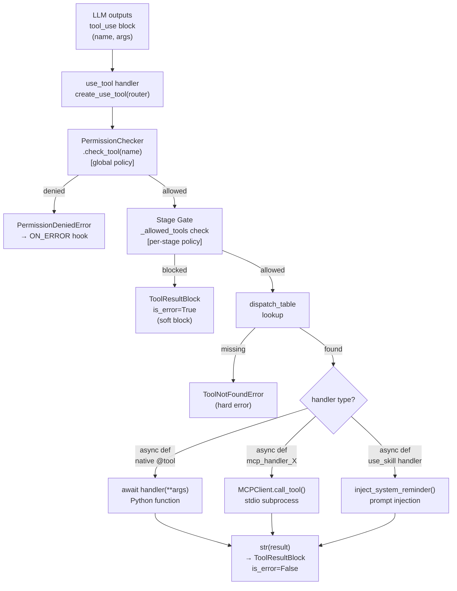
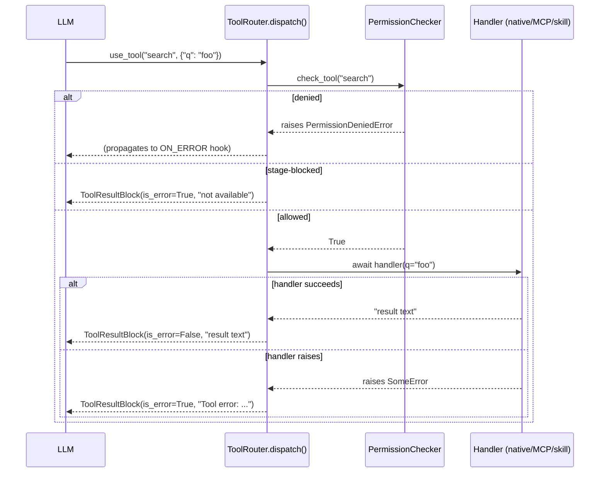

# Ch-06: Skills, Permissions, ToolRouter, and MCP

## Overview

> **Core Question:** How does one function call — `router.dispatch(tool_name, args)` —
> end up executing in three different runtimes (native Python, an MCP server, or a
> skill prompt injection), and what filters stand between the LLM's tool-use request
> and actual execution?

This chapter covers the v0.2 plugin layer of the Basement framework: the four systems
that sit between the LLM's tool-call output and whatever actually runs. By the end you
should be able to draw the full dispatch path from memory, open any of the five source
files and immediately locate the decision point you care about, and explain to another
engineer why each design choice follows from the constraints of the underlying substrate.

The four systems are not independent. They compose in a fixed order: **Skills** provide
the `.md`-based prompt injection mechanism and register `use_skill` as an ordinary tool.
**PermissionChecker** enforces a global allow/deny policy over tool and skill names.
**ToolRouter** unifies all tools (native Python and MCP-bridged) into one dispatch
table, applies the permission check and a per-stage access gate, then executes the
handler. **MCPClient / MCPManager** connect to external stdio processes, discover their
tools, and produce `ToolSpec` objects that the router treats identically to native tools.

The chapter assumes familiarity with `@tool` and `ToolRegistry` from [[ch-04]], and with
`inject_system_reminder` from [[ch-05]]. Cross-references to [[ch-10]] (rules that inject
system reminders) and [[ch-12]] (stages that call `router.set_allowed_tools`) appear
where those systems interact with what you are studying here.

---

## Key Concepts

### 1. The Universal Pattern

Every tool call in the Basement framework — regardless of whether it runs a Python
function, contacts an MCP server, or injects a Markdown prompt — passes through the
same five-step sequence:

```
1. PERMISSION CHECK (global)
      PermissionChecker.check_tool(name)
      deny-list first, then allow-list; deny overrides allow
      raises PermissionDeniedError → propagates to ON_ERROR hook

2. STAGE GATE (per-turn)
      if router._allowed_tools is not None:
          name must be in _allowed_tools OR in _META_TOOLS
      failure → ToolResultBlock(is_error=True) returned (not raised)

3. DISPATCH TABLE LOOKUP
      router._dispatch_table[name] → ToolSpec
      not found → raises ToolNotFoundError (programming error, not user error)

4. HANDLER INVOCATION (runtime-polymorphic)
      if coroutinefunction: await spec.handler(**args)
      else:                 spec.handler(**args)
      handler is one of:
        - native Python function (decorated with @tool)
        - MCP closure (created by mcp/bridge.py, calls MCPClient.call_tool)
        - use_skill closure (calls inject_system_reminder)

5. RESULT WRAPPING
      str(result) → ToolResultBlock(content=..., is_error=False)
      exception  → ToolResultBlock(content="Tool error: ...", is_error=True)
```

**Why this pattern is inevitable.** The LLM API speaks one language: JSON tool-use
blocks. Every tool-use block is a `(name, arguments)` pair. The framework must map that
pair to execution. Given that the set of possible execution backends is open-ended
(Python functions, HTTP endpoints, stdio subprocesses, prompt injections), a dispatch
table keyed by name is the only structure that satisfies all three requirements: O(1)
lookup, heterogeneous handlers, and a single choke point for cross-cutting concerns
(permissions, stage gating, error wrapping). The pattern is not an arbitrary design
choice — it is forced by the shape of the API.

**Mental model.** Think of `ToolRouter` as a telephone exchange: every tool-use call
arrives at the same switchboard, passes through the same authentication desk (permissions)
and access-level check (stage gate), then gets routed to whichever room (Python process,
MCP subprocess, conversation buffer) the name maps to. The caller never knows which room;
the switchboard handles it.



---

### 2. Skills — `basement/skills/` — [[excerpts/skills-injector]]

The skills subsystem converts `.md` files into prompt injections delivered on demand
through the `use_skill` meta-tool.

**Source:** `packages/basement/basement/skills/` (loader.py, registry.py, injector.py)

```python
# packages/basement/basement/skills/loader.py, lines 20-48

def discover_skills(skills_dir: Path) -> list[SkillSpec]:
    if not skills_dir.exists():
        return []
    skills: list[SkillSpec] = []
    for md_file in sorted(skills_dir.glob("*.md")):
        try:
            content = md_file.read_text(encoding="utf-8")
            lines = content.splitlines()
            description = lines[0].strip() if lines else ""
            skills.append(
                SkillSpec(
                    name=md_file.stem,
                    description=description,
                    prompt_template=content,
                    file_path=md_file,
                )
            )
        except Exception as e:
            logger.error("Failed to load skill from %s: %s", md_file, e)
            continue
    return skills
```

The loader is pure filesystem I/O: filename stem → name, line 0 → description, full
content → prompt_template. Errors are silently skipped (fail-open). The `SkillRegistry`
stores results in `dict[str, SkillSpec]`, raising on duplicates.

The critical piece is `create_use_skill` in `injector.py`:

```python
# packages/basement/basement/skills/injector.py, lines 49-82

def create_use_skill(
    registry: SkillRegistry,
    api: ConversationAPI,
    hook_registry: HookRegistry | None = None,
    permissions: PermissionChecker | None = None,
) -> ToolSpec:
    async def handler(skill_name: str) -> str:
        if permissions is not None:
            permissions.check_skill(skill_name)      # permission gate
        skill = registry.get(skill_name)             # registry lookup
        await inject_skill(api, skill, hook_registry) # inject into conversation
        return f"Skill '{skill_name}' has been activated."

    return ToolSpec(
        name="use_skill",
        description="Activate a skill by name to inject its prompt template.",
        input_schema={
            "type": "object",
            "properties": {"skill_name": {"type": "string", ...}},
            "required": ["skill_name"],
        },
        handler=handler,
    )
```

`inject_skill` fires `ON_SKILL_INVOKE` (giving [[ch-05]]-style hooks a chance to observe)
then calls `api.inject_system_reminder(skill.prompt_template)`. This is the same
injection channel hooks use — skills and hooks share the conversation mutation API.

**Notice:** `permissions.check_skill` is checked inside the handler closure at
invocation time, not at registration time. Stage transitions that change which skills
are permitted take effect immediately on the next `use_skill` call without re-creating
the tool.

Connection to universal pattern: `use_skill` is itself a `ToolSpec` registered in the
tool registry. When the LLM calls `use_skill`, the router dispatches it like any other
tool. The handler's side-effect (prompt injection) is the execution — there is no
subprocess, no Python computation, just a mutation of the conversation buffer.

For full line-by-line walkthrough and real skill file annotations: [[excerpts/skills-injector]]

---

### 3. PermissionChecker — `basement/permissions/checker.py` — [[excerpts/permission-checker]]

**Source:** `packages/basement/basement/permissions/checker.py`

```python
# packages/basement/basement/permissions/checker.py, lines 14-56

class PermissionChecker:
    def __init__(self, config: PermissionConfig) -> None:
        self._denied_tools: frozenset[str] = frozenset(config.denied_tools)
        self._allowed_tools: frozenset[str] | None = (
            frozenset(config.allowed_tools) if config.allowed_tools is not None else None
        )
        self._denied_skills: frozenset[str] = frozenset(config.denied_skills)
        self._allowed_skills: frozenset[str] | None = (
            frozenset(config.allowed_skills) if config.allowed_skills is not None else None
        )

    def check_tool(self, name: str) -> bool:
        if name in self._denied_tools:
            raise PermissionDeniedError(f"Tool '{name}' is denied by permissions.")
        if self._allowed_tools is not None and name not in self._allowed_tools:
            raise PermissionDeniedError(f"Tool '{name}' is not in the allowed_tools list.")
        return True
```

Three facts to hold in working memory:

1. **Deny-overrides-allow** is implemented by two sequential `if` statements, deny
   first. A name in both lists is always blocked.

2. **`allowed_tools=None`** means "no allowlist restriction" — the second condition
   short-circuits because `self._allowed_tools is not None` is `False`. Every tool
   passes. This is the default when `config.yaml` omits `permissions.allowed_tools`.

3. **`frozenset`** gives O(1) membership and is immutable after construction. The
   checker is sealed — there is no `add_allowed_tool` method. To change permissions
   you rebuild the checker from a new `PermissionConfig`.

The `PermissionChecker` instance is created once in `__main__.py` via
`load_permissions(config)` and shared between `ToolRouter.__init__` (where it guards
`dispatch`) and `create_use_skill` (where it guards skill activation). One object,
two enforcement points.

**The two-filter model.** `PermissionChecker` and `ToolRouter._allowed_tools` are
independent gates applied in sequence. `PermissionChecker` is a global, static policy
(set once from config). `ToolRouter._allowed_tools` is a dynamic, per-stage policy
(updated on every stage transition by [[ch-12]]). A tool clears both or fails.

For the full dual-filter analysis and loader code: [[excerpts/permission-checker]]

---

### 4. ToolRouter — `basement/metatool/router.py` — [[excerpts/tool-router]]

**Source:** `packages/basement/basement/metatool/router.py`

```python
# packages/basement/basement/metatool/router.py, lines 37-51

_META_TOOLS = {"use_tool", "use_skill"}

def __init__(self, permission_checker: PermissionChecker | None = None) -> None:
    self._permission_checker = permission_checker
    self._dispatch_table: dict[str, ToolSpec] = {}
    self._allowed_tools: set[str] | None = None  # None = all allowed

def set_allowed_tools(self, tool_names: list[str] | None) -> None:
    self._allowed_tools = set(tool_names) if tool_names is not None else None
```

```python
# packages/basement/basement/metatool/router.py, lines 85-142

async def dispatch(self, tool_name: str, arguments: dict) -> ToolResultBlock:
    if self._permission_checker is not None:
        self._permission_checker.check_tool(tool_name)          # step 1: global policy

    if (self._allowed_tools is not None                         # step 2: stage gate
            and tool_name not in self._allowed_tools
            and tool_name not in self._META_TOOLS):
        return ToolResultBlock(                                  # soft block, not raise
            tool_use_id=f"toolu_{uuid4().hex[:12]}",
            content=f"Tool '{tool_name}' is not available in the current stage.",
            is_error=True,
        )

    if tool_name not in self._dispatch_table:                   # step 3: lookup
        raise ToolNotFoundError(...)

    spec = self._dispatch_table[tool_name]
    try:
        if inspect.iscoroutinefunction(spec.handler):           # step 4: invocation
            result = await spec.handler(**arguments)
        else:
            result = spec.handler(**arguments)
        return ToolResultBlock(content=str(result), is_error=False)   # step 5: wrap
    except Exception as e:
        logger.error("Tool '%s' raised: %s", tool_name, e, exc_info=True)
        return ToolResultBlock(content=f"Tool error: {type(e).__name__}: {e}", is_error=True)
```

Three asymmetries in the error handling are worth memorizing:

| Failure type | Mechanism | Why |
|---|---|---|
| Permission denied | `raise PermissionDeniedError` | Policy violation → agent loop must handle |
| Stage-blocked tool | Returns `ToolResultBlock(is_error=True)` | Expected runtime condition → LLM can adapt |
| Tool not found | `raise ToolNotFoundError` | Programming error → should never happen in production |
| Handler exception | Returns `ToolResultBlock(is_error=True)` | Tool bug → LLM can retry or recover |

`_META_TOOLS = {"use_tool", "use_skill"}` as a class constant means every router
instance inherits this bypass. Stages can restrict domain tools completely but cannot
prevent the LLM from accessing the dispatch mechanism itself.

`set_allowed_tools(None)` reverts to open access. `set_allowed_tools([...])` narrows.
Called by the Gateway's stage machine on each stage transition — see [[ch-12]].

When `enable_tool_router: false` (default), no router is created and the LLM sees
native tool schemas directly in the API call. The router is an opt-in indirection layer.

For the full `dispatch()` algorithm with startup wiring: [[excerpts/tool-router]]

---

### 5. MCPClient and MCPManager — `basement/mcp/` — [[excerpts/mcp-client]]

**Source:** `packages/basement/basement/mcp/client.py`, `manager.py`, `bridge.py`

```python
# packages/basement/basement/mcp/client.py, lines 32-55

async def connect(self) -> None:
    params = StdioServerParameters(
        command=self.config.command,
        args=self.config.args,
        env=self.config.env if self.config.env else None,
    )
    self._exit_stack = AsyncExitStack()
    try:
        read_stream, write_stream = await self._exit_stack.enter_async_context(
            stdio_client(params)
        )
        self._session = await self._exit_stack.enter_async_context(
            ClientSession(read_stream, write_stream)
        )
        await self._session.initialize()
    except OSError as exc:
        await self._cleanup()
        raise MCPError(...) from exc
```

`AsyncExitStack` holds two nested context managers — subprocess and protocol session —
under one cleanup handle. `session.initialize()` performs the MCP handshake. If any
step fails, `_cleanup()` closes whatever opened, preventing resource leaks.

```python
# packages/basement/basement/mcp/bridge.py, lines 18-44

def create_mcp_handler(client: "MCPClient", tool_name: str) -> Callable:
    async def handler(**kwargs: Any) -> str:
        return await client.call_tool(tool_name, kwargs)
    handler.__name__ = f"mcp_handler_{tool_name}"
    return handler

def mcp_tool_to_spec(server_name: str, mcp_tool: dict, client: "MCPClient") -> ToolSpec:
    qualified_name = f"mcp:{server_name}:{tool_name}"
    handler = create_mcp_handler(client, tool_name)
    return ToolSpec(
        name=qualified_name,
        description=description,
        input_schema=input_schema,     # taken verbatim from MCP server's schema
        handler=handler,
    )
```

`mcp_tool_to_spec` is the translation boundary. On one side: MCP's raw tool dict
(name, description, JSON Schema from the server). On the other: a `ToolSpec` with a
closure handler. After this translation, the router cannot tell the difference between
this spec and one built by `@tool` from a Python function. The dispatch table is
type-erased at the `ToolSpec` boundary.

The naming convention `mcp:{server_name}:{tool_name}` prevents collisions when multiple
servers expose same-named tools (e.g., both `postgres` and `sqlite` expose `query`).

```python
# packages/basement/basement/mcp/manager.py, lines 30-54

async def start_all(self) -> int:
    for name, config in self._configs.items():
        if not config.enabled:
            continue
        client = MCPClient(name, config)
        try:
            await client.connect()
            self._clients[name] = client
            raw_tools = await client.list_tools()
            for raw_tool in raw_tools:
                spec = mcp_tool_to_spec(name, raw_tool, client)
                self._tools.append(spec)
        except MCPError as exc:
            logger.error("Failed to start MCP server '%s': %s", name, exc)
```

Fail-partial: one server failing does not block others. The manager collects all
`ToolSpec` objects from all connected servers; `ToolRouter.register_mcp(mcp_mgr)` bulk-
imports them into the dispatch table.

**Notice:** MCP tools' `input_schema` is taken verbatim from the server — no synthesis
required. This is the mirror image of [[ch-04]]'s `@tool` decorator, which synthesises
JSON Schema from Python type hints. Both paths produce a `ToolSpec` with an
`input_schema`; the router is indifferent to the origin.

For the full connection lifecycle and call path trace: [[excerpts/mcp-client]]

---

### 6. Cross-Implementation Synthesis

| System | Mechanism | Key difference | Why |
|---|---|---|---|
| Native `@tool` | Python function wrapped by decorator into `ToolSpec` | Schema auto-generated from type hints at decoration time | Framework controls the function; can introspect it |
| MCP tool | Closure over `MCPClient.call_tool` wrapped into `ToolSpec` | Schema taken verbatim from server at connect time | Framework does not control the subprocess; must accept its schema |
| `use_skill` | Closure over `inject_system_reminder` wrapped into `ToolSpec` | "Result" is a conversation side-effect, not a computed value | Skills are behavioral, not computational |
| `use_tool` | Closure over `ToolRouter.dispatch` wrapped into `ToolSpec` | Dispatches to any of the above at runtime | Meta-level indirection enabling permission/stage gating |

**What is invariant** (forced by the substrate): every execution path must ultimately
produce a `ToolResultBlock` with a `content: str` and an `is_error: bool`, because
that is what the LLM API accepts as a tool result. The router always converts, whether
the underlying execution was a Python return value, an MCP response, or a string like
`"Skill 'explain' has been activated."`.

**What is variant** (free design choice): which errors are raised vs returned as
`is_error=True` results. The framework chose to raise permission errors (hard policy
violation, the loop should intervene) and return stage-block and handler errors as soft
failures (runtime conditions the LLM can reason about). A different framework could
choose differently — but then the LLM's error-recovery behavior would change.

**The `tools=None` API argument.** When `enable_tool_router: true`, `__main__.py`
registers only `use_tool` and `use_skill` in the LLM API call's tools list. Native
tools are in the router's dispatch table but hidden from the LLM's schema. When
`enable_tool_router: false`, all native tool schemas go directly to the LLM. The router
is an indirection layer that trades LLM schema simplicity (two meta-tools) for
flexibility (centralized dispatch, permission gating, MCP unification).

**The `ON_ERROR` interaction.** `ToolRouter.dispatch` catches handler exceptions and
returns them as `ToolResultBlock(is_error=True)`. But `PermissionDeniedError` is not
caught inside `dispatch` — it propagates up to `run_agent_loop`, which fires the
`ON_ERROR` hook. This means a permission failure triggers hook-based error recovery
([[ch-05]]) while a tool bug is surfaced to the LLM as a tool result. The distinction
is intentional: permission failures are administrative events, not LLM-recoverable
conditions.



---

## Questions

1. In `PermissionChecker.check_tool`, the deny check runs before the allowlist check.
   What would break if the order were reversed — allowlist checked first, then deny?
   Construct a concrete `PermissionConfig` that produces different outcomes under the
   two orderings.

2. Look at `ToolRouter.dispatch()` lines 108-116 (the stage gate). When the gate blocks
   a tool it **returns** a `ToolResultBlock(is_error=True)` rather than **raising**. Why
   does this matter for the LLM's behavior? What would the agent do differently if it
   raised `StageBlockedError` instead?

3. `mcp_tool_to_spec` in `bridge.py` uses `input_schema` verbatim from the MCP server.
   The `@tool` decorator in [[ch-04]] synthesises `input_schema` from Python type hints.
   Both produce a `ToolSpec` the router treats identically. What is the practical risk of
   taking the schema verbatim, and when would it silently fail?

4. Trace the full execution path for this sequence:
   - Stage transition fires, calling `router.set_allowed_tools(["get_consent_status", "record_consent"])`
   - LLM calls `use_skill(skill_name="consent_manager")`
   - The injected skill instructs the LLM to call `use_tool("get_consent_status", {})`
   Name every function invoked, in order, from `set_allowed_tools` through to the
   `ToolResultBlock` returned to the LLM. Cite file and line numbers where you can.

5. `_META_TOOLS = {"use_tool", "use_skill"}` is a class-level constant on `ToolRouter`.
   This means no stage can prevent the LLM from calling `use_skill`. Is this the right
   design? Describe a scenario where you would want a stage to block `use_skill`, and
   explain what change to the router code would implement that.

6. When `enable_tool_router: false` (the default), native tools are exposed directly in
   the LLM API call. When `enable_tool_router: true`, only `use_tool` and `use_skill`
   are exposed. From the LLM's perspective, what changes? From the agent developer's
   perspective, what changes? Are there agent behaviors that are only possible in one
   mode?
