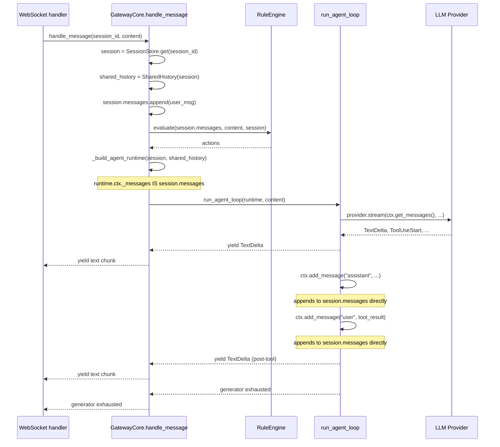

# Chapter 7: Gateway — Conversation Ownership

---

## Overview

> **Core Question:** Who owns the message list — and how does a single Python list safely mutate from two sides (Gateway session and agent loop) without copies or locks within a turn?

In [[ch-02]] you studied `run_agent_loop`: the think-act-observe cycle that executes a single LLM turn. That chapter left a question unanswered — where does the message history *come from*, and who holds it between turns? The answer is the Gateway layer, and specifically `GatewayCore.handle_message`.

This chapter establishes a clean boundary in your mental model: the **Gateway owns the conversation** (the full multi-turn message list, session state, stage, skill activation) while the **agent loop owns a single turn** (one LLM call, its tool uses, and their results). Understanding this boundary is essential for reasoning about every other chapter that touches gateway behaviour — [[ch-10]] (rules run inside `handle_message` before the agent loop), [[ch-05]] (hooks access history through the same shared list), [[ch-12]] (stage and compact state live on `SessionState`), and [[ch-08]] (WebSocket handlers are the outermost caller of `handle_message`).

The mechanism that makes dual-ownership work without copies or locks is a single two-line assignment in `SharedHistory.create_context_manager`:

```python
ctx._messages = self._session.messages
```

After this line, `session.messages` and `ctx._messages` are two names for one Python list. Every append from the Gateway lands in the agent loop's view; every append from the agent loop is immediately visible to the Gateway. This chapter explains why that design is safe, where it is enforced, where it could break, and how compaction preserves the invariant even when the list must be replaced wholesale.

After studying this chapter you should be able to: draw the full turn flow from WebSocket frame receipt to first streaming token without notes; locate and explain every point at which `session.messages` is mutated; explain why no asyncio lock is needed between Gateway and agent loop within a single turn; and explain how `swap_compact` replaces list contents without invalidating the shared reference.

---

## Key Concepts

---

### 1. The Universal Pattern

Every conversational agent framework that separates "conversation management" from "LLM execution" must solve the same synchronisation problem: two subsystems need to write to the same message list within one request lifecycle. The substrate — Python asyncio, a mutable list, a single-threaded event loop — determines the solution space.

**Pseudocode — per-turn flow:**

```
1. RECEIVE message (session_id, content) from transport layer
2. LOOKUP session = SessionStore[session_id]   // or CREATE if missing
3. APPLY any deferred mutations from last turn  // compact, etc.
4. APPEND user message to session.messages
5. RUN pre-LLM rules against session.messages
6. IF rules produce terminal action:
       YIELD response
       RETURN                                  // agent loop never runs
7. BUILD turn-scoped runtime wrapping session.messages (by reference)
8. YIELD FROM agent_loop(runtime):             // agent loop APPENDS to same list
       FILTER / TRANSFORM events
       YIELD text chunks to transport
9. TURN COMPLETE — session.messages now contains full turn record
```

Steps 7-8 are the critical section. The runtime passed to the agent loop holds a `ContextManager` whose `_messages` attribute *is* `session.messages` — not a snapshot, not a copy. Writes in step 8 (assistant messages, tool results) land directly in `session.messages`. When the next turn arrives, step 2 recovers the same session object and the appended messages are already there.

**Why this pattern is inevitable**

The substrate forces it. Python asyncio is single-threaded: within a single turn, only one coroutine runs at a time. The event loop's cooperative scheduling means that "between yields" is an atomic unit from the perspective of any other coroutine. A lock between Gateway and agent loop would be deadlock-prone (both are in the same coroutine chain) and unnecessary (they never run concurrently within a turn). The natural synchronisation primitive is the call stack: the Gateway calls the agent loop, so they are in a strict sequential relationship per turn. Two turns for the same session *could* race — that is what `SessionState.history_lock` is for — but intra-turn sharing is lock-free by construction.

A copy-based design would require: copy messages for agent loop → agent appends → copy back to session. This doubles memory, breaks hook visibility (hooks would see a detached copy), and makes compact synchronisation more complex. The shared-reference design avoids all three problems at the cost of requiring careful in-place mutation semantics during compact.

**Mental model analogy:** SharedHistory is like a REPL session variable. When you type `x = some_list` and then pass `x` to a function that appends to it, the appends are visible after the function returns — you never had two lists. The Gateway and the agent loop are in exactly this relationship.

**Structural diagram — the shared list across the turn lifecycle:**



---

### 2. GatewayCore — `handle_message` walkthrough

**Full deep walkthrough:** [[excerpts/gateway-core]]

`GatewayCore` is the per-turn orchestrator. It is constructed once at server startup by `__main__.py`, holds `SessionStore` and all registries, and exposes `handle_message` as the single entry point for all inbound messages.

```python
# boson-agent/packages/gateway/gateway/core.py, lines 108-116
async def handle_message(self, session_id: str, content: str) -> AsyncIterator[str]:
    """Per-turn flow: rules → executor → agent loop. Yields text chunks."""
    session = self._get_or_create_session(session_id)

    # v0.4: Reset cancellation flag at turn start
    InterruptHandler.reset_cancellation(session)

    # 2. Create SharedHistory adapter
    shared_history = SharedHistory(session)
```

`handle_message` is an async generator: it `yield`s text chunks rather than returning a single response. The WebSocket handler consumes it with `async for`. This means the first token can reach the client before the turn is complete — true streaming, not buffering.

`SharedHistory(session)` is constructed every turn but the expensive objects it wraps (`ContextManager`, `ConversationAPI`) are lazy-cached on `session.context_manager` / `session.conversation_api` — singletons for the session's lifetime.

The turn sequence, condensed:

| Step | Code site | What happens |
|------|-----------|-------------|
| 1 | `_get_or_create_session` | Recover or create `SessionState` |
| 2 | `SharedHistory(session)` | Wrap session for adapter use |
| 3 | `compact_pipeline.apply_pending` | Apply deferred compact before touching history |
| 4 | `session.messages.append(...)` | User message lands in shared list |
| 5 | `rule_engine.evaluate(...)` | Rules inspect history, produce actions |
| 6 | `action_executor.execute(...)` | Actions may short-circuit (no agent call) |
| 7 | `_build_agent_runtime(...)` | Wrap session objects into `AgentRuntime` |
| 8 | `run_agent_loop(runtime, content)` | Agent loop runs; yields events |
| 9 | streaming bridge | Filter/tag events; yield text to WebSocket |

**Notice:** `_build_agent_runtime` is where `GatewayCore` constructs the `AgentRuntime` — the AD3 Aggregated Dependency object from [[ch-02]]. It is built fresh every turn (so `skip_user_append` and tool filter state are clean) but the `ContextManager` and `ConversationAPI` inside it are reused from `session`. See [[excerpts/gateway-core]] for the full `_build_agent_runtime` listing.

---

### 3. SessionStore and SessionState — conversation-scoped state

**SessionState deep dive:** [[excerpts/session-state]]
**SessionStore deep dive:** [[excerpts/session-store]]

```python
# boson-agent/packages/gateway/gateway/schemas/session.py, lines 30-53
@dataclass
class SessionState:
    session_id: str
    messages: list[Message] = field(default_factory=list)
    system_prompt: str = ""
    active_skill: str | None = None
    active_stage: str | None = None
    pending_compact: dict | None = None
    compact_in_progress: bool = False
    context_manager: Any = None
    conversation_api: Any = None
    cancellation_flag: CancellationFlag = field(default_factory=CancellationFlag)
    partial_buffer: PartialBuffer | None = None
    status_tracker: AgentStatusTracker = field(default_factory=AgentStatusTracker)
    history_lock: asyncio.Lock = field(default_factory=asyncio.Lock)
```

`SessionState` is the durable record of everything the Gateway needs to remember *between* turns. Contrast this with `AgentRuntime`, which is assembled fresh *for* each turn. The division is:

- **`SessionState` fields** = conversation-scoped state (persists across turns)
- **`AgentRuntime` fields** = turn-scoped runtime (assembled from session at turn start, discarded after)

`messages` is the central field. Every other field either controls *how* the messages list is built (`active_stage`, `active_skill`) or manages *lifecycle operations* on it (`pending_compact`, `compact_in_progress`, `history_lock`).

`context_manager` and `conversation_api` are typed `Any` to avoid circular imports. They are initialised by `SharedHistory` on first turn and cached here for reuse. The comment "Persisted across turns (Architect/Critic fix)" records a real regression: an earlier version recreated `ContextManager` each turn, which silently discarded pending reminders queued by skills.

```python
# boson-agent/packages/gateway/gateway/session/store.py, lines 13-46
class SessionStore:
    def __init__(self) -> None:
        self._sessions: dict[str, SessionState] = {}

    def create(self, session_id: str, system_prompt: str = "") -> SessionState:
        if session_id in self._sessions:
            raise ValueError(f"Session already exists: {session_id!r}")
        session = SessionState(session_id=session_id, system_prompt=system_prompt)
        self._sessions[session_id] = session
        return session
```

`SessionStore` is a plain dict wrapper. One `SessionStore` instance lives inside `GatewayCore` for the lifetime of the server process. Sessions are never evicted automatically — memory grows linearly with active connections. This is an intentional tradeoff: in-memory sessions have microsecond lookup time and zero serialisation cost.

**Notice:** `create` raises `ValueError` on duplicate session IDs. The caller (`_get_or_create_session`) always calls `has()` before `create()`, making this guard defensive. If you see this error in logs it means two WebSocket connections were assigned the same session ID — a bug in the session ID generation layer, not in `SessionStore`.

---

### 4. SharedHistory — the shared-reference adapter

**Full SharedHistory analysis:** [[excerpts/shared-history]]

```python
# boson-agent/packages/gateway/gateway/session/history.py, lines 29-43
def create_context_manager(self) -> ContextManager:
    if self._session.context_manager is not None:
        return self._session.context_manager

    ctx = ContextManager(system_prompt=self._session.system_prompt)
    # Intentional direct assignment: share the same list object so that
    # gateway writes to session.messages are visible to the agent loop
    # through ctx._messages and vice-versa.
    ctx._messages = self._session.messages
    self._session.context_manager = ctx
    return ctx
```

This is the load-bearing line of the entire chapter. `ContextManager.__init__` assigns `self._messages = []` — a fresh empty list. The very next line overwrites that attribute with `session.messages`. From this point forward:

```
session.messages  ──► [msg0, msg1, msg2, ...]   ◄── ctx._messages
```

Both sides are aliases for the same list object. There is no synchronisation protocol because none is needed: the Python asyncio event loop is single-threaded and the Gateway and agent loop are in a strict caller-callee relationship within a turn.

The two unit tests that prove this most directly:

```python
# boson-agent/packages/gateway/tests/test_shared_history.py, lines 47-55
def test_agent_writes_visible():
    """Agent adds a message via ContextManager → session.messages sees it."""
    session = _make_session()
    sh = SharedHistory(session)
    ctx = sh.create_context_manager()

    ctx.add_message("user", "hello from agent")
    assert len(session.messages) == 1
    assert session.messages[0].content == "hello from agent"
```

```python
# boson-agent/packages/gateway/tests/test_shared_history.py, lines 58-66
def test_gateway_writes_visible():
    """Gateway appends to session.messages → ContextManager sees it."""
    session = _make_session()
    sh = SharedHistory(session)
    ctx = sh.create_context_manager()

    session.messages.append(Message(role="user", content="hello from gateway"))
    assert ctx.message_count == 1
```

**Notice:** `ctx.get_messages()` returns `deepcopy(self._messages)`. This copy goes to the LLM provider API — a snapshot of history at the moment of the LLM call. The deep copy is for the API call only; the shared list is never copied for internal use. Hooks that call `api.conversation.get_messages()` get a snapshot; hooks that mutate history through `api` write to the shared list directly.

---

### 5. The Streaming Bridge — async generator yield chain

**Full streaming bridge analysis:** [[excerpts/streaming-bridge]]

This is the section of `handle_message` that most learners find opaque on first read. Lines 196–256 implement a two-state machine that transforms the raw event stream from `run_agent_loop` into clean text chunks for the WebSocket.

```python
# boson-agent/packages/gateway/gateway/core.py, lines 198-227
initial_buf: list[str] = []
streaming = False

async for event in run_agent_loop(runtime, content):
    if isinstance(event, TextDelta):
        if streaming:
            yield event.text
        else:
            initial_buf.append(event.text)
            combined = ''.join(initial_buf)
            if '<system-reminder>' in combined:
                if '</system-reminder>' in combined:
                    clean = _SR_RE.sub('', combined)
                    clean = _TOOL_CALL_RE.sub('', clean).strip()
                    if clean:
                        yield clean
                    initial_buf = []
                    streaming = True
                # else: tag still open, keep buffering
            elif len(combined) > 30 or '\n' in combined:
                clean = _TOOL_CALL_RE.sub('', combined).strip()
                if clean:
                    yield clean
                initial_buf = []
                streaming = True
    elif isinstance(event, ToolUseStart):
        if initial_buf:
            raw = ''.join(initial_buf)
            clean = _SR_RE.sub('', raw)
            clean = _TOOL_CALL_RE.sub('', clean).strip()
            if clean:
                yield f"[FILLER]{clean}[/FILLER]"
            initial_buf = []
        streaming = False   # ← CRITICAL: reset guard after every tool call
```

**State machine summary:**

| State | Trigger | Action |
|-------|---------|--------|
| `streaming=False` | Turn start | Accumulate in `initial_buf` |
| `streaming=False` | Complete `<system-reminder>` found | Strip tag, yield remainder, set `streaming=True` |
| `streaming=False` | >30 chars or newline, no tag | Flush clean, set `streaming=True` |
| `streaming=True` | `TextDelta` | `yield event.text` immediately |
| Any | `ToolUseStart` | Flush buf as `[FILLER]`, set `streaming=False` |

**Why the guard resets on every `ToolUseStart`:** After a tool call, `run_agent_loop` loops back to the LLM with tool results injected into history. The LLM makes a fresh call and can produce a new system-reminder echo at the start of its response. Without the reset, post-tool responses would bypass the guard and deliver reminder syntax to the client.

**The async generator chain:**

```
provider.stream()     → yields TextDelta, ToolUseStart, ...
run_agent_loop()      → consumes provider events, yields StreamEvents
handle_message()      → consumes agent_loop events, yields str chunks
WebSocket handler     → consumes str chunks, sends to wire
```

Each level is an `async def` function containing `yield`. Python makes each an async generator. The `async for` statement at each level pulls from the level below. There are no queues, no threads, no explicit backpressure mechanism — the generator chain provides it structurally: if the WebSocket is slow, the `async for chunk in handle_message(...)` loop in the WebSocket handler pauses, which pauses `handle_message` at its `yield`, which pauses `run_agent_loop` at its `yield`, which pauses `provider.stream` at its `yield`, which stops reading from the HTTP response. Backpressure propagates through the call stack.

**Notice:** `run_agent_loop` yields `ToolUseStart` *before* executing the tool. By the time `handle_message` receives a `ToolUseStart` event and yields filler text to the client, the tool has not yet run. This is intentional: the filler text is displayed while the tool is executing, providing UX feedback during what would otherwise be a silent pause.

---

### 6. Cross-Implementation Synthesis

#### Comparison: Gateway vs agent loop — what each side owns

| Dimension | GatewayCore (conversation scope) | run_agent_loop (turn scope) |
|-----------|----------------------------------|------------------------------|
| Object lifetime | Server process | Single `handle_message` call |
| `session.messages` ownership | Creates, appends user msg, triggers compact | Appends assistant msgs and tool results via `ctx` |
| State held between turns | `SessionState` (messages, stage, skill, compaction state) | None — constructed fresh each turn via `AgentRuntime` |
| Decision authority | Can short-circuit (no agent call) via rule actions | Must call LLM at least once per turn |
| Streaming | Filters, tags, and re-yields chunks from agent loop | Yields raw `StreamEvent` objects |
| Tool execution | Indirect (delegates to `run_agent_loop`) | Direct (`_execute_tool_uses`) |
| Hook execution | None — hooks are inside agent loop | `fire_event` for all hook events |

#### Comparison: SharedHistory vs ContextManager — who owns the list

| Object | Holds the list | Creates the list | Can replace contents |
|--------|---------------|-----------------|----------------------|
| `SessionState.messages` | Owner (via `field(default_factory=list)`) | Yes (at session creation) | Yes (via `swap_compact`) |
| `ContextManager._messages` | Alias (assigned by `SharedHistory`) | No | Via `_set_messages` (compact only) |
| `SharedHistory` | Neither — adapter only | No | Via `swap_compact` (calls `.clear()` + `.extend()`) |

#### Invariant vs variant

**Invariant (required by the substrate):**
- There must be exactly one list object serving as the shared message history within a turn. Two lists would require a merge step, which is not safe under asyncio without a lock at the merge point.
- The list must be mutated in-place during compaction (`.clear()` + `.extend()`) rather than replaced by assignment, because `ctx._messages` holds a reference to the object, not a reference to the attribute name.
- The agent loop must not be given a copy of messages, because hooks and tool results appended during the turn would not be visible to the Gateway after the loop returns.

**Variant (design choices):**
- The adapter (`SharedHistory`) could have been dissolved into `GatewayCore` directly. Keeping it separate makes the shared-reference contract explicit and testable in isolation.
- `context_manager` and `conversation_api` could be reconstructed each turn. The caching is a fix for the pending-reminder loss bug, not a requirement of the substrate.
- The streaming gate (`streaming=False` initial buffer) is a Gateway-specific detail. A different gateway could choose to strip system-reminder echoes via post-processing or not at all.
- Tool filler text (`[FILLER]...[/FILLER]`) is a UX convention, not a framework requirement.

---

## Questions

1. In `SharedHistory.create_context_manager()`, the line `ctx._messages = self._session.messages` overwrites the list that `ContextManager.__init__` just created. What would break if instead the code did `ctx._messages.extend(self._session.messages)` — and why would it break specifically for sessions that have already had messages appended by the Gateway before `create_context_manager` is called?

2. The streaming bridge resets `streaming = False` on every `ToolUseStart`. Trace a turn that has three sequential tool calls. Draw the state of `streaming` and `initial_buf` after each `ToolUseStart` event and after the final text response. At which point(s) does text actually reach the WebSocket client?

3. `swap_compact` uses `session.messages.clear()` followed by `session.messages.extend(new_messages)` rather than `session.messages = new_messages`. The excerpt comment explains why. Now explain it in the opposite direction: what would break in `ctx` if the assignment form were used — and why does that not break `session.messages` itself?

4. Looking at the `_build_agent_runtime` method (lines 384–414 in `core.py`), `use_skill` is re-registered into `self._tool_registry._tools` on every turn. Given that `session.conversation_api` is a singleton (cached on the session), why does re-registering the skill spec each turn matter at all? Under what circumstances would *not* re-registering cause a bug?

5. `RuleEngine.evaluate` receives `session.messages` as its first argument (line 151 in `core.py`). At this point in `handle_message`, the user message has already been appended to the list. A rule's `@check` function can therefore read the full history including the current user message. Now consider: what would a rule need to do to add a message to history (e.g., inject a pre-LLM context document), and what are the risks of doing so from inside a rule?

6. The `pending_compact` dict is set by a background `asyncio.create_task` during turn N and applied at the top of turn N+1. Why is a one-turn delay safer than applying the compact immediately at the end of turn N (while `handle_message` is still running)?
