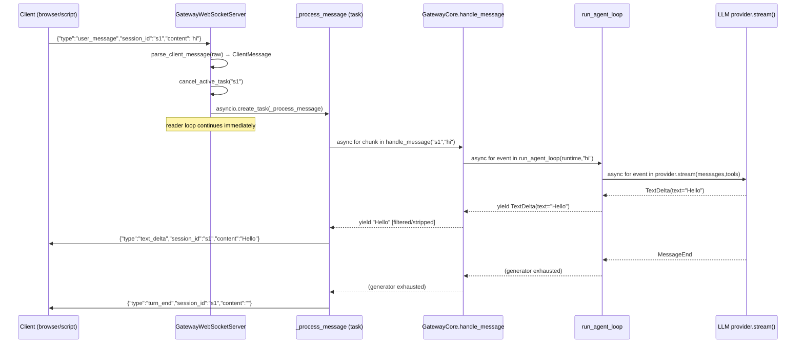

# Chapter 08 — Gateway Networking: WebSocket Server and Protocol

---

## Overview

> **Core Question:** When the browser sends a single `user_message` frame,
> what exact path does a single token travel to become a `text_delta` frame
> on its way back?

This chapter traces that path end-to-end — from the raw JSON bytes arriving
on the wire, through five layers of Python async machinery, to the JSON
bytes going back out. The mechanism involves four distinct async generator
boundaries, a cancellation-aware task-per-session concurrency model, a
codec layer that is pure and stateless, and a session store that binds an
opaque string identifier to a long-lived Python object containing the
entire conversation state.

By the end of this chapter you should be able to: (1) draw the full
`user_message → text_delta` async yield chain from memory, labeling every
`yield` and `await` point; (2) locate the exact line in `_process_message`
where a token first touches the wire; (3) explain why the reader loop never
blocks on handler completion and why that matters for barge-in; (4) describe
the protocol's backward-compatibility contract and why adding a new server
message type is non-breaking.

This chapter builds directly on [[ch-07]] (GatewayCore owns the session
that the socket consumes) and is a prerequisite for [[ch-09]] (interrupts
and the full barge-in concurrency layer that sits on top of this one).
Hooks that emit content to the wire via `inject_system_reminder` are
covered in [[ch-05]].

---

## Key Concepts

### 1. The Universal Pattern

Every WebSocket-backed streaming server that wraps an async generator
follows the same shape. The substrate forces it: WebSocket connections are
long-lived, messages are bidirectional, and the LLM API is a streaming
iterator. Given those three facts, the implementation is almost entirely
determined.

**Pseudocode — the invariant shape:**

```
1. bind(host, port, handler_fn)
   → one handler_fn coroutine spawned per TCP connection

2. connection loop:
   for each raw_frame in websocket:
     msg = decode(raw_frame)           # parse JSON → typed object
     validate(msg.type)                # reject unknown types early
     cancel_inflight(msg.session_id)   # barge-in: stop old handler
     spawn task(_process, msg)         # non-blocking: reader continues

3. _process(session_id, content):
   session = store.get_or_create(session_id)
   async for chunk in message_handler(session_id, content):
     wire_frame = encode(text_delta(session_id, chunk))
     await websocket.send(wire_frame)
   await websocket.send(encode(turn_end(session_id)))

4. message_handler(session_id, content):  ← GatewayCore.handle_message
   session = session_store.get_or_create(session_id)
   ... rules, executor, stage machine ...
   async for event in run_agent_loop(runtime, content):
     if TextDelta: yield event.text    # stripped, filtered

5. run_agent_loop(runtime, content):   ← basement agent loop
   async for event in provider.stream(...):
     if TextDelta: yield event         # raw from LLM provider
```

**Why this pattern is inevitable.** WebSocket is a full-duplex stream of
frames, not a request-response protocol. The LLM API is an async generator
that yields tokens incrementally. Connecting them requires a loop that reads
frames in one direction and drives an async generator in the other. The
reader loop cannot block on generator completion (that would prevent
barge-in), so handlers must be spawned as tasks. Per-session task tracking
is then required to enable cancellation. Each of these steps follows
mechanically from the one before — no step is a free design choice.

**Mental model:** this is like a REPL server where each "eval" is itself a
streaming iterator. The server's job is purely mechanical: receive an
expression, fan out to an evaluator, stream back the printed output
token-by-token, signal done.

**Structural diagram:**



---

### 2. WebSocket Server Startup and Connection Dispatch

**Source:** [[excerpts/websocket-server]] — full walkthrough of
`gateway/server/websocket.py`

`GatewayWebSocketServer.__init__` receives a `message_handler: Callable[[str, str], AsyncIterator[str]]` — a plain callable, not a `GatewayCore`
instance. This is the key decoupling achieved across versions v0.3→v0.6:
the network layer has zero knowledge of rules, sessions, or tools.

```python
# packages/gateway/gateway/server/websocket.py, lines 40-58

def __init__(
    self,
    message_handler: Callable[[str, str], AsyncIterator[str]],
    host: str = "localhost",
    port: int = 8765,
    on_disconnect: Callable[[str], None] | None = None,
    silence_timeout_ms: float = 2000,
    get_session: Callable | None = None,
) -> None:
    self._message_handler = message_handler
    self._host = host
    self._port = port
    self._on_disconnect = on_disconnect
    self._silence_timeout_ms = silence_timeout_ms
    self._get_session = get_session
    self._server: websockets.server.WebSocketServer | None = None
    self._session_timers: dict[str, asyncio.Task] = {}
    # v0.6: per-session active handler task
    self._active_tasks: dict[str, asyncio.Task] = {}
```

Two dicts live on the server object: `_session_timers` (silence-timer tasks
for voice/partial-transcript sessions) and `_active_tasks` (the currently
in-flight handler task per session). Both are keyed by `session_id`.

Startup via `start()` uses `websockets.serve(self._handle_connection, ...)`.
The `async with` block plus `await asyncio.get_running_loop().create_future()`
parks the coroutine forever. `start_background()` skips the park and instead
returns after binding — used by tests.

The reader loop in `_handle_connection` (lines 110–178) does the frame
dispatch. The critical v0.6 change: instead of `await`-ing
`_process_message`, it calls `asyncio.create_task(...)` and stores the task
in `_active_tasks[session_id]`. The reader loop is never blocked by handler
execution.

**Notice (barge-in):** Line 172 calls `self._cancel_active_task(msg.session_id)` *before* spawning the new task. This means a new
`user_message` always cancels any in-flight handler for that session. The
cancelled handler catches `asyncio.CancelledError` and suppresses it — no
error frame reaches the client. See [[excerpts/websocket-server]] for the
full annotated walkthrough.

---

### 3. Protocol Frames — The Wire Codec

**Source:** [[excerpts/protocol-frames]] — full walkthrough of
`gateway/server/protocol.py`

```python
# packages/gateway/gateway/server/protocol.py, lines 14-33

@dataclass
class ClientMessage:
    session_id: str
    type: str
    content: str

@dataclass
class ServerMessage:
    session_id: str
    type: str
    content: str = ""

VALID_CLIENT_TYPES = {"user_message", "partial_transcript", "get_history"}
VALID_SERVER_TYPES = {"text_delta", "turn_end", "error", "interrupted",
                      "stage_changed", "history"}
```

Both dataclasses share the same three-field shape — the wire schema is
symmetric. `ServerMessage.content` defaults to `""` so `turn_end` needs no
special constructor path.

The parser (`parse_client_message`, lines 41–60) raises `ValueError` on
invalid JSON or missing fields. It does *not* validate `type` — that is
deferred to the dispatch logic in `websocket.py`. This separation keeps
the codec testable independently of which types are valid at a given
version.

The serializer (`serialize_server_message`, lines 63–67) constructs the
dict explicitly rather than using `dataclasses.asdict()`, preventing future
internal fields from leaking onto the wire.

**Notice:** `VALID_CLIENT_TYPES` and `VALID_SERVER_TYPES` are plain Python
sets, not enums. Type evolution (adding a new message type) requires only
updating the set and adding a handler branch — the dataclasses and codec
functions never change. This is why the v0.3→v0.4 protocol extension was
backward compatible.

See [[excerpts/protocol-frames]] for the full annotated walkthrough.

---

### 4. Session Binding — How a `session_id` String Becomes State

**Source:** [[excerpts/session-binding]] — full walkthrough of
`gateway/session/store.py` and `gateway/schemas/session.py`

```python
# packages/gateway/gateway/core.py, lines 261-265

def _get_or_create_session(self, session_id: str) -> SessionState:
    """Return existing session or create a new one."""
    if self._sessions.has(session_id):
        return self._sessions.get(session_id)
    return self._sessions.create(session_id, system_prompt=self._system_prompt)
```

This is the binding moment: the first `user_message` for a `session_id`
creates a `SessionState` object. All subsequent messages retrieve the same
object. Everything that persists across turns — message history, active
stage, partial buffer, cancellation flag, context manager — lives on that
object.

`SessionStore` is a plain `dict[str, SessionState]` wrapped in a typed API
that enforces create-once semantics (`create()` raises `ValueError` on a
duplicate key). No lock protects the dict itself; the v0.6 `history_lock`
field on `SessionState` is an `asyncio.Lock` that protects multi-step
append sequences when concurrent tasks operate on the same session.

Key fields on `SessionState`:

| Field | Purpose |
|-------|---------|
| `messages` | Canonical conversation history; both agent loop and rules read/write it |
| `active_stage` | Current stage machine state; `None` until first turn |
| `context_manager` / `conversation_api` | Persisted across turns to preserve pending hook reminders |
| `cancellation_flag` | `CancellationFlag` checked at barge-in points throughout `handle_message` |
| `partial_buffer` | Holds the latest partial ASR transcript between silence-timer ticks |
| `history_lock` | `asyncio.Lock` for concurrent task safety (v0.6) |

**Notice:** `context_manager` and `conversation_api` are typed `Any` on
`SessionState`. This avoids a circular import between the `schemas` package
and `basement.context`. It is not laziness — it is a deliberate schema
boundary decision.

See [[excerpts/session-binding]] for the full annotated walkthrough.

---

### 5. Per-Turn Streaming Translation — The Full Async Yield Chain

**Source:** [[excerpts/streaming-translation]] — annotated full chain from
`gateway/core.py` and `basement/loop/agent_loop.py`

This is the answer to the Core Question. Four async generator boundaries
connect the LLM provider to the wire:

```
provider.stream()        yields TextDelta(text="tok")
  └── agent_loop.py:118  yield event         → TextDelta travels up
        └── core.py:206  yield event.text    → str travels up (after filter)
              └── websocket.py:207  await websocket.send(serialize(...))
```

**Layer 1 — `run_agent_loop` (agent_loop.py lines 112–131):**

```python
# packages/basement/basement/loop/agent_loop.py, lines 112-119

async for event in runtime.provider.stream(
    messages=ctx.get_messages(),
    system=ctx.get_system_prompt(),
    tools=tools,
):
    if isinstance(event, TextDelta):
        text_parts.append(event.text)
        yield event              # re-yield TextDelta to GatewayCore
```

`run_agent_loop` is an async generator. It suspends at
`async for event in provider.stream(...)` until the LLM provider yields
the next event. When a `TextDelta` arrives, it appends to `text_parts`
(for history) and immediately `yield`s the event upward.

**Layer 2 — `GatewayCore.handle_message` filtering (core.py lines 196–255):**

```python
# packages/gateway/gateway/core.py, lines 203-226

async for event in run_agent_loop(runtime, content):
    if isinstance(event, TextDelta):
        if streaming:
            yield event.text         # fast path: direct pass-through
        else:
            initial_buf.append(event.text)
            combined = ''.join(initial_buf)
            if '<system-reminder>' in combined:
                if '</system-reminder>' in combined:
                    clean = _SR_RE.sub('', combined)
                    clean = _TOOL_CALL_RE.sub('', clean).strip()
                    if clean:
                        yield clean  # deferred yield after strip
                    initial_buf = []
                    streaming = True
            elif len(combined) > 30 or '\n' in combined:
                clean = _TOOL_CALL_RE.sub('', combined).strip()
                if clean:
                    yield clean      # buffered flush, no tag found
                initial_buf = []
                streaming = True
```

`handle_message` is also an async generator. The `initial_buf` logic is a
one-time filter at the start of each response: it buffers early tokens to
detect and strip `<system-reminder>` tags the LLM might echo. Once
`streaming = True` is set (either after a complete tag is stripped, or
after 30 chars arrive without a tag), every subsequent `TextDelta.text` is
yielded immediately with no buffering — the fast path.

After every `ToolUseStart` event, `streaming` is reset to `False` so the
filter is re-armed for post-tool text.

**Layer 3 — `_process_message` wire encoding (websocket.py lines 205–217):**

```python
# packages/gateway/gateway/server/websocket.py, lines 205-217

async for chunk in self._message_handler(session_id, content):
    delta = serialize_server_message(
        ServerMessage(
            session_id=session_id, type="text_delta", content=chunk
        )
    )
    await websocket.send(delta)

turn_end = serialize_server_message(
    ServerMessage(session_id=session_id, type="turn_end")
)
await websocket.send(turn_end)
```

Each `chunk` string from `handle_message` is wrapped in a `ServerMessage`,
serialized to JSON, and `await`-ed onto the wire. `await websocket.send()`
is the only true I/O call in the chain. It is also the backpressure point:
if the client is slow to read, this `await` will block, slowing the
`async for chunk` loop, slowing `run_agent_loop`, slowing
`provider.stream()`. The entire chain is naturally flow-controlled through
the single `await` at the wire boundary.

After generator exhaustion, `turn_end` is sent unconditionally.

**Error path:** Any unhandled exception in `_process_message` is caught,
logged, and an `error` frame is attempted. `asyncio.CancelledError` is
caught and suppressed (not re-raised), so barge-in cancellations are
invisible to the client — the stream simply stops.

See [[excerpts/streaming-translation]] for the full annotated call trace
with every suspension point labeled.

---

### 6. Client Usage Pattern

**Source:** [[excerpts/client-example]] — full walkthrough of both
`demo-gateway/client.py` and `test-lina-gateway/client.py`

The protocol contract from the client side:

```python
# agents/demo-gateway/client.py, lines 57-78

await ws.send(json.dumps({
    "session_id": session_id,
    "type": "user_message",
    "content": user_input,
}))

while True:
    raw = await asyncio.wait_for(ws.recv(), timeout=30)
    data = json.loads(raw)
    if data["type"] == "text_delta":
        print(data["content"], end="", flush=True)
    elif data["type"] == "turn_end":
        print()
        break
    elif data["type"] == "error":
        print(f"\n[Error: {data['content']}]")
        break
```

Three observations that reveal the protocol design:

1. One TCP connection, one `session_id`, many turns. The client never
   reconnects between messages.
2. The receive loop is `while True` terminated by `turn_end` — not by a
   timeout or a frame count. `turn_end` is the only valid stop signal.
3. Unknown frame types can be added to the server without breaking existing
   clients, as long as existing clients' receive loops skip unrecognized
   types (which both reference clients do via `elif` chaining).

The Lina client (`test-lina-gateway/client.py`) adds one `elif` branch for
`stage_changed` frames, which display inline without breaking the stream.

See [[excerpts/client-example]] for the full annotated walkthrough.

---

### 7. Protocol Design History

**Source:** [[excerpts/design-history]] — full walkthrough of the v0.3 and
v0.4 planning documents

The planning documents reveal the design arc:

**v0.3 (Phase 5):** Three message types. Server took `GatewayCore` as a
constructor argument. Reader loop blocked on `handle_message()` completion.
No concurrency, no cancellation. The payload-embedded `session_id` was a
v0.3 decision — enabling multi-session multiplexing from the start.

**v0.4 (Phase 6):** Added `partial_transcript` (ASR/voice), `interrupted`,
`stage_changed`. Added silence timer (asyncio.Task per session). The design
document explicitly records the rejected alternative:

```markdown
# docs/plan/v0_4/07-phase6-websocket-e2e.md, lines 90-91

**Alternative (rejected):** Polling loop — wastes CPU, harder to cancel,
less precise timing.
```

**v0.6:** Constructor changed from `core: GatewayCore` to
`message_handler: Callable[[str, str], AsyncIterator[str]]`. Reader loop
changed from blocking to task-per-session. Added `_active_tasks` dict for
barge-in cancellation.

The E2E test `test_v03_client_unchanged` enforces backward compatibility:
a client that sends only `user_message` and reads only `text_delta` +
`turn_end` must continue to work after all v0.4/v0.6 changes.

See [[excerpts/design-history]] for the full annotated walkthrough.

---

### 8. Cross-Implementation Synthesis

The following table compares the key mechanisms across the three evolution
points of the gateway WebSocket layer:

| Aspect | v0.3 (Phase 5) | v0.4 (Phase 6) | v0.6 (current) |
|--------|---------------|----------------|----------------|
| Constructor dep | `core: GatewayCore` | `message_handler: Callable` | `message_handler: Callable` (typed) |
| Reader loop | Blocks on handler | Blocks on handler | Non-blocking (spawns tasks) |
| Barge-in | Not supported | Supported via CancelledError | Task-cancel via `_active_tasks` dict |
| Voice/ASR | Not supported | `partial_transcript` + silence timer | Same + `_session_timers` dict |
| Session tracking | Implicit (one session per connection) | Explicit `session_ids: set` per connection | Same |
| Error semantics | Error frame on exception | Error frame on exception | Error frame + silent swallow on send failure |
| Protocol types (client) | `user_message` | + `partial_transcript` | + `get_history` |
| Protocol types (server) | `text_delta`, `turn_end`, `error` | + `interrupted`, `stage_changed` | + `history` |

**What is invariant (forced by the substrate):**

- The payload-embedded `session_id` is invariant. WebSocket connections are
  not inherently associated with a session — the application must carry the
  identifier in the payload. This is true of any stateful WebSocket server
  that supports multiple concurrent sessions per connection.
- The `async for chunk in generator; await send(chunk)` pattern is
  invariant. As long as the LLM API is a streaming iterator and WebSocket is
  the transport, this is the only shape that delivers tokens progressively.
- `turn_end` as an explicit termination signal is invariant. HTTP has
  Content-Length or chunked encoding to signal end-of-body; WebSocket has no
  equivalent. The application must define its own stop signal.
- Parse-then-validate separation is invariant. The codec layer must be
  testable in isolation, so type validation belongs to the dispatch layer.

**What is variant (free design choices):**

- Blocking vs. non-blocking reader loop. v0.3 blocked; v0.6 does not. Both
  are correct — the non-blocking version is required only when barge-in is
  a feature.
- Constructor coupling. Taking `GatewayCore` vs. a plain `Callable` are
  both valid; the callable approach is better for testing and future
  extensibility.
- Silence timer implementation. The task-per-session approach was chosen
  over polling. Either works; the task approach is cleaner to cancel.
- `<system-reminder>` stripping. The `initial_buf` filtering logic in
  `handle_message` is specific to the Anthropic API's tendency to echo
  injected prompts. A different LLM provider might not need this.

---

## Questions

1. Trace the `user_message` frame from arrival at `_handle_connection` to
   the first `await websocket.send(delta)` call in `_process_message`. Name
   every function call and data transformation in order. At which exact line
   in `websocket.py` does the reader loop stop blocking and allow another
   frame to arrive?

2. The `initial_buf` logic in `handle_message` (core.py lines 207–226)
   resets `streaming = False` after every `ToolUseStart`. Why? What would
   go wrong in a multi-tool turn if `streaming` were *not* reset after a
   tool call?

3. Looking at the `_process_message` excerpt (websocket.py lines 205–232):
   `asyncio.CancelledError` is caught and logged but not re-raised. What
   happens to the client's receive loop when a barge-in silently cancels the
   handler mid-stream? Does the client receive a `turn_end` frame? What
   should a robust client do when neither `turn_end` nor `error` arrives
   within a timeout?

4. `SessionStore.create()` raises `ValueError` on a duplicate `session_id`,
   but `GatewayCore._get_or_create_session()` calls `has()` before `create()`
   to avoid that error. Under what concurrency conditions could two
   `asyncio` tasks still hit `create()` simultaneously for the same
   `session_id`, and does the current v0.6 code protect against it?

5. The design history document (v0.4 Phase 6) records the rejected
   alternative for the silence timer: a polling loop. Reconstruct the
   argument against polling in terms of the event loop model — specifically,
   what happens to event loop latency when a polling loop with a short
   `asyncio.sleep` runs alongside 50 concurrent session silence timers?

6. The protocol's `session_id` is embedded in the JSON payload rather than
   in the WebSocket URL path (e.g., `ws://localhost:8765/session/s1`). What
   does the URL-path approach enable that the payload approach does not, and
   vice versa? Which approach is better suited to the gateway's current
   architecture where one connection can carry multiple sessions?

7. Both `demo-gateway/client.py` and `test-lina-gateway/client.py` use a
   `while True` loop terminated only by `turn_end` or `error`. In the Lina
   client's `_receive_response` (lines 82–104), what happens if the server
   sends a `stage_changed` frame *after* a `turn_end` frame for the same
   turn? Is this a latent bug in the receive loop, or does the server
   guarantee ordering?
