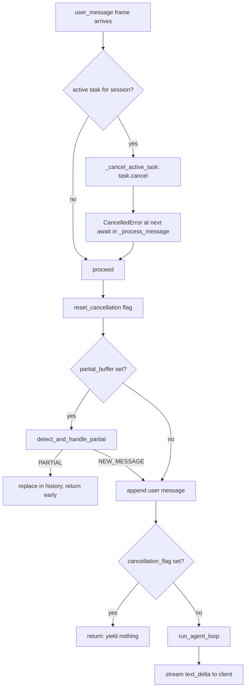

## Overview

> **Core Question:** What happens in the 50ms between a user typing a new message and an in-flight tool_use being cancelled — who owns each piece of state along that cancellation chain?

A WebSocket agent is never truly idle. While the LLM streams a response and
tools execute in the background, the WebSocket read loop is still accepting
frames. When a new `user_message` arrives during an active turn, the system
faces a multi-owner state problem: the assistant's partial text lives in
`session.messages`, the in-flight tool has its own execution context, the
asyncio task running `_process_message` holds the streaming generator, and the
client is waiting for either the current response to complete or an
acknowledgment of the interruption.

This chapter traces the full cancellation chain, layer by layer, from the
moment a WebSocket frame arrives to the moment the interrupted state is
committed to `SharedHistory`. You will be able to draw from memory which
component sets the `CancellationFlag`, which component checks it, why the
agent loop is — by design — completely unaware of cancellation, and what
actually terminates an in-flight streaming turn in the current code. You will
also be able to explain the three-point cancellation model (before LLM / during
streaming / during tool) and why each point requires different history
preservation logic.

This chapter carries two important carryforwards. First, a ch-01 open question:
the Gateway's `InterruptHandler` class has several methods (`check_barge_in`,
`handle_barge_in`) that were flagged as "defined but not integrated into core
flow." We verify that status directly against the code — the gap is confirmed
and the reason is documented. Second, a ch-02 carryforward on async generator
cancellation mechanics: asyncio task cancellation is the actual mechanism that
terminates an in-flight stream, and we trace exactly how `CancelledError`
propagates through the generator chain.

---

## Key Concepts

### 1. The Universal Pattern

Every streaming agent over a real-time channel must solve the same problem: the
channel delivers messages regardless of what the agent is doing, but the agent
can only coherently process one turn at a time per session. The invariant shape
of the solution is:

```
1. CLIENT sends user_message frame (session_id, content)
2. SERVER checks: is there an active turn for session_id?
   a. YES → interrupt the active turn
      i.  Record partial state (partial assistant text, tool status)
      ii. Set a cancellation signal visible to the turn's execution context
      iii. Terminate the turn's coroutine/task
   b. NO  → proceed directly to step 3
3. SERVER appends user message to session history
4. SERVER starts new turn (rule engine → agent loop → stream response)
5. CLIENT receives stream of text_delta frames, then turn_end
```

Step 2a is where all the complexity lives. "Record partial state" and "set a
cancellation signal" and "terminate the coroutine" are three distinct
operations that can be done by different subsystems — and in Boson Gateway,
they are.

**Why this pattern is inevitable:** A WebSocket is a full-duplex channel. The
client can send at any time. The server's response generator is an async
iterator that yields chunks — it cannot "pause" on its own. The only way to
stop a running async generator is either to stop consuming it (let the task
complete naturally, which defeats the purpose of interruption) or to cancel
the asyncio Task that wraps it. The session history must be updated
atomically-enough that the next turn's LLM call sees a coherent message list.
These three requirements — stop the generator, update history, start fresh —
force the three-phase structure above.

**Mental model:** Think of this like a drive-through intercom. The agent is
the voice speaking an order confirmation. The user cuts in. The operator must:
(1) stop the agent's speaker output, (2) log what the agent said before being
cut off, and (3) hand the microphone back to the user. Each of those is a
separate action on a separate piece of equipment. In Boson Gateway: (1) is
`task.cancel()` in `_cancel_active_task`, (2) is `cancel_during_streaming()`
writing to `session.messages`, and (3) is the new `asyncio.create_task()`
call.

```mermaid
sequenceDiagram
    participant C as Client
    participant WS as WebSocket Server
    participant Core as GatewayCore.handle_message
    participant Loop as run_agent_loop
    participant LLM as LLM Provider

    C->>WS: user_message (turn 1)
    WS->>WS: create_task(_process_message, session="abc")
    WS->>Core: handle_message("abc", content1)
    Core->>Loop: run_agent_loop(runtime)
    Loop->>LLM: stream(messages)
    LLM-->>Loop: TextDelta chunks
    Loop-->>Core: yield TextDelta
    Core-->>WS: yield chunk
    WS-->>C: text_delta frames

    Note over C,LLM: User speaks while agent is mid-sentence

    C->>WS: user_message (turn 2, barge-in)
    WS->>WS: _cancel_active_task("abc")  ← task.cancel()
    Note over Loop,LLM: CancelledError raised at next await in _process_message
    WS->>WS: create_task(_process_message, session="abc", content2)
    WS->>Core: handle_message("abc", content2)
    Core->>Core: reset_cancellation(session)
    Core->>Loop: run_agent_loop(runtime)
```



---

### 2. Basement InterruptHandler vs Gateway InterruptHandler — [[excerpts/two-interrupt-handlers]]

The codebase contains two classes both named `InterruptHandler`. They are in
different packages, solve different problems, and are wired into different
callers. Understanding the contrast is the ch-01 carryforward that this chapter
resolves.

**Basement (`loop/interrupt.py`):** A CLI tool. Registers a POSIX SIGINT
handler so Ctrl+C sets an `asyncio.Event`. The CLI `__main__` polls
`is_interrupted` between streaming chunks. Scope is process-wide. The agent
loop has no knowledge of it.

**Gateway (`interrupt/handler.py`):** A collection of static methods operating
on per-session `SessionState`. Designed for WebSocket barge-in. Four methods:
`reset_cancellation`, `detect_and_handle_partial`, `check_barge_in`,
`handle_barge_in`.

**Critical wiring status (verified against source):**

```python
# boson-agent/packages/gateway/gateway/core.py, lines 112-127

    # v0.4: Reset cancellation flag at turn start
    InterruptHandler.reset_cancellation(session)

    # ...

    # v0.4: Detect partial vs new message
    if self._partial_detector and session.partial_buffer:
        if InterruptHandler.detect_and_handle_partial(
            session, content, time.monotonic(), self._partial_detector
        ):
            return  # partial handled, yields nothing
```

`reset_cancellation` and `detect_and_handle_partial` are called in
`core.handle_message`. `check_barge_in` and `handle_barge_in` are not called
anywhere in the codebase. The `_bargein_policy` field on `GatewayCore` is
settable via `set_bargein_policy()` but is never read inside `handle_message`
or `_process_message`. The barge-in detection machinery is complete as isolated
components; the integration glue has not been written.

This is not a documentation error. The docs describe the intended design. The
code implements the building blocks. The wire between the WebSocket read loop
and `handle_barge_in` does not exist yet.

Full line-by-line contrast: [[excerpts/two-interrupt-handlers]]

---

### 3. CancellationFlag and the Three Interruption Points — [[excerpts/cancel-propagation]]

```python
# boson-agent/packages/gateway/gateway/interrupt/cancellation.py, lines 21-46

class CancellationFlag:
    def __init__(self) -> None:
        self._is_set: bool = False

    def set(self) -> None:
        """Set the cancellation flag. Called by Gateway on barge-in."""
        self._is_set = True

    def reset(self) -> None:
        """Reset the flag. Called at start of new turn."""
        self._is_set = False

    def check(self) -> None:
        """Check flag. Raises CancellationError if set."""
        if self._is_set:
            raise CancellationError("Cancelled by user interruption")
```

`CancellationFlag` is a plain boolean wrapped in a class. `set()` is called
by `handle_barge_in` (when that code path is eventually wired). `reset()` is
called by `InterruptHandler.reset_cancellation` at the top of every
`handle_message` call. `check()` raises `CancellationError` — but is not
called anywhere in `agent_loop.py`. The single check in the current code is a
direct `is_set` property read in `core.py`:

```python
# boson-agent/packages/gateway/gateway/core.py, line 171

    if session.cancellation_flag.is_set:
        return
```

This is the only checkpoint. If the flag is set before `run_agent_loop` is
reached, the turn is skipped silently. If the flag is set after
`run_agent_loop` starts, there is nothing to stop it — the asyncio task
cancellation from `_cancel_active_task` is what actually terminates the
stream.

The three `CancelResult` factories encode the three phases of a turn and what
history should be preserved at each:

| Phase | Factory | `discard_pending` | `history_entries` |
|---|---|---|---|
| Before LLM call | `cancel_before_llm()` | `True` | `[]` |
| During LLM streaming | `cancel_during_streaming(partial)` | `False` | `[assistant msg + [interrupted-by-user] tag]` |
| During tool execution | `cancel_during_tool(name, args)` | `False` | `[tool cancel user msg, interrupted assistant msg]` |

Full walkthrough: [[excerpts/cancel-propagation]]

---

### 4. Barge-in Policies — [[excerpts/bargein-policies]]

```python
# boson-agent/packages/gateway/gateway/interrupt/policy.py, lines 108-116

def default_bargein_policy() -> CompositePolicy:
    """Sensible default: requires both duration AND meaningful content."""
    return CompositePolicy(
        policies=[
            DurationPolicy(min_ms=500),
            WordFilterPolicy(ignore_words=["hmm", "uh", "um", "ah"], max_chars=3),
        ],
        mode="all",
    )
```

The policy hierarchy (`AlwaysPolicy`, `DurationPolicy`, `WordFilterPolicy`,
`CompositePolicy`) is a pure Strategy pattern. All policies are stateless after
construction — they take `elapsed_ms` as a parameter rather than tracking time
internally. The `default_bargein_policy()` function (not a singleton) is called
per-agent to produce a fresh instance.

`DurationPolicy` gates on elapsed time since turn start: prevents the first
500ms of streaming from triggering a barge-in (guards against STT early
partials). `WordFilterPolicy` gates on content: rejects filler words and
messages shorter than 3 chars (guards against "hmm", "uh" being treated as
real interruptions).

`CompositePolicy` with `mode="all"` requires both to pass — the default. With
`mode="any"`, either suffices (useful for voice-only agents where any
non-filler content should interrupt).

**Notice — no policy is currently called from a hot path.** The policies are
tested in isolation. The call to `InterruptHandler.check_barge_in()` that would
invoke them during an active stream does not yet exist in `core.py` or
`websocket.py`. See [[excerpts/two-interrupt-handlers]] for the integration gap.

Full policy walkthrough and test cases: [[excerpts/bargein-policies]]

---

### 5. Per-Session Lock and WebSocket Concurrency — [[excerpts/per-session-lock]]

```python
# boson-agent/packages/gateway/gateway/schemas/session.py, lines 50-53

    # v0.6: History write lock for WebSocket concurrency
    history_lock: asyncio.Lock = field(default_factory=asyncio.Lock)
```

`SessionState` gains a per-session `asyncio.Lock` in v0.6. The intended use is
to guard all writes to `session.messages` across concurrent coroutines. The
v0.6 concurrency design document (`04-phase4-websocket-concurrency.md`)
specifies three lock acquisition sites: user message append in `core.py`,
staged injection commit in `pipeline.py`, and inject action in the router
executor.

The v0.6 WebSocket server uses a simpler mechanism for turn serialization:

```python
# boson-agent/packages/gateway/gateway/server/websocket.py, lines 171-178

                # v0.6: Cancel in-progress handler for this session
                self._cancel_active_task(msg.session_id)

                # v0.6: Spawn handler as task (non-blocking reader loop)
                task = asyncio.create_task(
                    self._process_message(websocket, msg.session_id, msg.content)
                )
                self._active_tasks[msg.session_id] = task
```

`_cancel_active_task` cancels the previous task before spawning a new one.
This means at most one task per session is active at a time — which makes the
`history_lock` redundant for the normal message flow. The lock matters for
concurrent writes from outside the normal flow (compact pipeline commits,
inject actions) that could race against an active turn.

**Critical distinction from the design doc:** The design doc describes a
queue-based model (per-session `asyncio.Queue` + worker task providing FIFO
ordering). The actual implementation uses the cancel-and-replace model. The
queue model would queue the second message and process it after the first
completes; the cancel model discards the first in-flight work and immediately
starts the second. This is a "last writer wins" semantic, not a queue semantic.

Full analysis: [[excerpts/per-session-lock]]

---

### 6. Partial Transcripts — [[excerpts/partial-transcript]]

```python
# boson-agent/packages/gateway/gateway/interrupt/detector.py, lines 57-68

    def detect(
        self,
        text: str,
        previous: str | None,
        elapsed_ms: float,
    ) -> DetectResult:
        """Combined detection: content overlap is primary, timing secondary."""
        if self.is_partial(text, previous):
            return DetectResult.PARTIAL
        if previous and self.is_likely_partial_by_timing(elapsed_ms):
            return DetectResult.PARTIAL
        return DetectResult.NEW_MESSAGE
```

Partial transcript handling is a separate concern from barge-in, but it is
adjacent: both deal with messages arriving while the agent may or may not be
active. A `partial_transcript` frame updates an in-progress user message
in-place (via `replace_partial_in_history`) without triggering an agent turn.
A silence timer fires after `silence_timeout_ms` of no new partials, calling
`_finalize_partial` with an empty string to trigger the actual agent turn.

The `PartialBuffer` on `SessionState` tracks: current partial text, its
timestamp, and its index in `session.messages`. The index is what enables
in-place replacement — without it, each partial update would append a new
message, producing a history like `["I wa", "I wan", "I want", "I want to"]`
instead of a single finalized `"I want to"`.

**ch-02 carryforward — async generator cancellation:** When a `partial_transcript`
frame arrives mid-stream, the silence timer is (re)started but the active
streaming task is not cancelled. Partial transcripts and barge-ins have
separate handling paths. Only a `user_message` type triggers
`_cancel_active_task`. A flood of `partial_transcript` frames while the agent
is streaming does not interrupt the stream — it just updates the history entry
that will be processed after the current stream completes.

Full detector walkthrough and latent edge case: [[excerpts/partial-transcript]]

---

### 7. Reconnect Behavior — [[excerpts/reconnect]]

```python
# boson-agent/packages/gateway/gateway/core.py, lines 261-265

    def _get_or_create_session(self, session_id: str) -> SessionState:
        """Return existing session or create a new one."""
        if self._sessions.has(session_id):
            return self._sessions.get(session_id)
        return self._sessions.create(session_id, system_prompt=self._system_prompt)
```

Reconnect is implicit: the client sends a `user_message` with the same
`session_id`. `_get_or_create_session` returns the existing session with full
history. `SharedHistory.create_context_manager` short-circuits and returns the
existing `ContextManager` — the one whose `_messages` attribute is already
pointing at `session.messages`. No re-initialization, no history replay.

The session survives as long as the process runs. `on_disconnect` writes a
JSON history file but does not remove the session from the store. A restarted
server starts fresh — the JSON files are not loaded back.

**The `swap_compact` in-place mutation is what makes reconnect safe:**

```python
# boson-agent/packages/gateway/gateway/session/history.py, lines 94-98

        # Replace session.messages contents in-place so any existing
        # shared reference (e.g. ctx._messages) stays valid.
        session.messages.clear()
        session.messages.extend(new_messages)
```

`swap_compact` cannot replace `session.messages` with a new list object because
`ctx._messages` holds a reference to the original list. It must mutate the
existing list in-place. This same constraint applies to any code that modifies
the message history — reassigning `session.messages = new_list` would silently
break the agent loop's view of history.

Full reconnect analysis and memory leak note: [[excerpts/reconnect]]

---

### 8. Cross-Implementation Synthesis

| Component | Mechanism | Key choice | Why |
|---|---|---|---|
| Basement `InterruptHandler` | OS SIGINT → `asyncio.Event` | Process-wide, polled | CLI has one user, one channel; POSIX signal is the natural interrupt primitive |
| Gateway `InterruptHandler` (static) | Per-session `CancellationFlag` | Per-session, checked once before LLM | WebSocket has many sessions; signals would kill all of them |
| `CancellationFlag` | Plain boolean + class wrapper | Cooperative, not preemptive | Tools run to completion; preemptive kill risks resource corruption |
| `_cancel_active_task` | `asyncio.Task.cancel()` | Preemptive at the task level | The task boundary (not the loop boundary) is the right granularity for aborting a stream |
| `BargeInPolicy` hierarchy | Strategy pattern, pure evaluators | Stateless, composable | Hot path; policies must be testable in isolation; composition avoids combinatorial subclassing |
| `PartialDetector` | Content overlap + timing heuristic | Dual-signal, content-primary | STT partials share prefixes; timing alone is insufficient; neither signal is reliable alone |
| `SessionStore` | In-memory dict, session_id keyed | No TTL, connection-agnostic | Enables implicit reconnect; tradeoff is memory leak for abandoned sessions |
| `history_lock` | Per-session `asyncio.Lock` | Defense-in-depth, minimal scope | Primary protection is task serialization; lock covers edge cases (compact, inject) |

**Invariant vs variant:**

The invariant — forced by the substrate — is that you must: (a) stop
consuming the current response generator when a new message arrives, (b)
preserve whatever partial state is worth preserving for history coherence, and
(c) start a new turn with the barge-in message appended after the interrupted
partial. Any WebSocket agent with streaming LLM output must do all three.

The variant — free design choices — is everything else: whether to cancel via
OS signal or asyncio task cancellation, whether cancellation is preemptive or
cooperative, how fine-grained the lock is, whether the policy system is a
class hierarchy or a simple function, and whether the barge-in check lives in
the WebSocket read loop or inside `handle_message`. Boson's choices (asyncio
task cancel for the hot path, cooperative flag for the pre-LLM guard,
Strategy pattern for policies, static methods on `InterruptHandler`) are all
internally consistent and each reflects the constraint of the layer it lives in.

---

## Questions

1. The current code has one cancellation checkpoint in `core.py` (line 171,
   `if session.cancellation_flag.is_set: return`) and uses asyncio task
   cancellation via `_cancel_active_task` for in-flight streams. These are two
   different mechanisms for two different phases. Draw the boundary: which
   mechanism handles which phase of a turn, and what would happen if you removed
   one of them?

2. `cancel_during_streaming(partial_text)` appends an assistant message with
   `f"{partial_text}[interrupted-by-user]"` to `session.messages`. The next
   turn's LLM call will see this message. What does the LLM "think" happened?
   Is the `[interrupted-by-user]` tag sufficient for the LLM to understand the
   conversational context, or does it depend on the model being fine-tuned to
   recognize that tag?

3. From `cancellation.py` lines 140-156: `cancel_during_tool` is documented
   as cooperative — "tool runs to completion, then flag is checked." Given that
   `agent_loop.py` never reads `cancellation_flag`, where exactly would
   `cancel_during_tool` be called in the intended design? Trace the call chain
   from `handle_barge_in` through to the point where `cancel_during_tool`
   would be invoked.

4. The `PartialDetector.detect` method uses content overlap as the primary
   signal and timing as secondary. Construct a concrete scenario where this
   ordering produces the wrong result — either a PARTIAL when it should be
   NEW_MESSAGE, or NEW_MESSAGE when it should be PARTIAL. Then explain why
   fixing that scenario might break a different scenario.

5. `SharedHistory.swap_compact` does `session.messages.clear()` then
   `session.messages.extend(new_messages)` rather than
   `session.messages = new_messages`. The comment says this preserves the
   shared reference. Identify every other place in the codebase where this
   constraint must be respected, and what would silently break if someone
   assigned `session.messages = new_list` instead.

6. The v0.6 concurrency doc describes a per-session queue model; the actual
   implementation uses cancel-and-replace. A user sends two messages in rapid
   succession: "What is the weather?" followed 200ms later by "Actually, cancel
   that — what time is it?". Walk through what happens under each model. Which
   semantic is more correct for a voice agent? Which is simpler to implement?

7. The `SessionStore` never removes sessions on disconnect, creating a potential
   memory leak. Propose a TTL eviction design that preserves the reconnect
   contract (clients can reconnect within N minutes and get their history back)
   while bounding memory usage. What fields on `SessionState` would you need
   to add, and what is the right place to run the eviction check?
