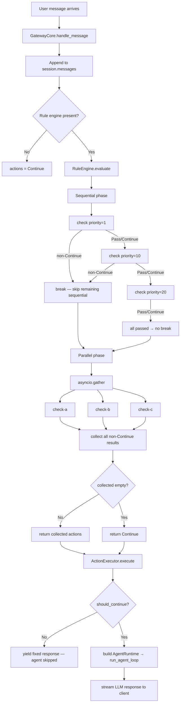

# Chapter 10 — The Rule Engine: `@check`, Modes, and Priorities

---

## Overview

> **Core Question:** Given the same user message, why does one request skip
> the LLM entirely (`Respond`), another get a system reminder prepended
> (`Inject`), and a third pass through untouched (`Continue`) — and what
> single abstraction decides?

The answer is the **Rule Engine**: a two-phase evaluator that runs before
every call to the agent loop. Every incoming message passes through it. The
engine asks a fixed set of Python functions — called *checks* — what to do
with the message. Checks return *actions*. The engine collects those actions
and hands them to an `ActionExecutor`, which decides whether the agent loop
runs at all.

This chapter dissects that mechanism at the source level. By the end, you
should be able to: (1) draw the full evaluation flow from memory — stamp,
discover, sort, sequential phase, parallel phase, collect, execute; (2) open
any `@check`-decorated file in the codebase and immediately know when it runs,
in what order, and what its return value does; (3) explain the tradeoff between
sequential and parallel mode and why each exists.

**Where this fits in the larger picture.** [[ch-07]] established that
`GatewayCore` owns the conversation. The rule engine is the first thing
`GatewayCore.handle_message` calls after appending the user message to
history (core.py line 149–154). [[ch-05]] drew the hooks-vs-rules distinction:
hooks (`@hook`) are fired by the Basement agent loop around tool calls and
turn boundaries — they do not gate the LLM. Rules (`@check`) gate the LLM
entirely: a rule can prevent the LLM from ever seeing a message. [[ch-11]]
covers the full action vocabulary that rules return. [[ch-12]] covers stage
gating — which rules apply depends on the active stage.

---

## Key Concepts

### 1. The Universal Pattern

Every rule system in this framework, regardless of how many checks exist or
what they do, executes the same five-step procedure:

```
STAMP     1. Author decorates a function with @check(name, mode, priority, check_type)
          2. Decorator stamps four dunder attributes onto the function object
             (fn.__check_name__, fn.__check_mode__, fn.__check_priority__, fn.__check_type__)

DISCOVER  3. CheckRegistry scans rules/ directory, imports each .py file,
             inspects module vars for __check_name__, appends to _checks list

SORT      4. RuleEngine.__init__ splits checks into _sequential and _parallel,
             each sorted ascending by __check_priority__

EVALUATE  5a. Sequential phase: iterate _sequential in order
              - call _run_check(check_fn, messages, user_message, session)
              - filter out Continue/Pass results
              - if any non-Continue action → extend collected, BREAK (short-circuit)
          5b. Parallel phase: asyncio.gather all _parallel coroutines concurrently
              - for each result: filter Continue/Pass, extend collected (NO break)

COLLECT   6. Return collected if non-empty, else [Continue()]
             ActionExecutor receives the list; GatewayCore decides whether
             to call the agent loop based on result.should_continue
```

**Why this pattern is inevitable.** The substrate forces it. `GatewayCore`
owns a `session` object that must be inspected before every LLM call — that
inspection is the check. Checks are user-defined and discovered at startup,
so a registry scan is required. Different checks have different urgency (spam
detection must run before greeting detection), so priority ordering is required.
Some checks are independent and slow (LLM-backed moderation), so concurrent
execution via `asyncio.gather` is required. The two-phase structure — ordered
gates first, concurrent annotations second — is not an arbitrary design choice.
It falls out of having both mutually exclusive gates (sequential) and
independent enrichments (parallel) in the same system.

**Mental model.** Think of it as a REPL for conversation policy. Before every
turn, the framework "evaluates" the message against a list of policy
expressions (checks). The first policy expression that produces a verdict in
the sequential phase terminates that phase. All policy expressions in the
parallel phase produce verdicts simultaneously. The collected verdicts are
then "executed" by the `ActionExecutor`.



---

### 2. The `@check` Decorator — `gateway/rules/check.py`

One file, 43 lines. The decorator is the definition end of a two-sided
contract: authors stamp functions here; the registry and engine enforce the
contract at runtime.

```python
# gateway/rules/check.py, lines 16-42

def check(
    name: str,
    *,
    mode: CheckMode = "sequential",
    priority: int = 100,
    check_type: CheckType = "deterministic",
) -> Callable:
    def decorator(fn: Callable) -> Callable:
        fn.__check_name__ = name
        fn.__check_mode__ = mode
        fn.__check_priority__ = priority
        fn.__check_type__ = check_type
        return fn          # original function returned unchanged
    return decorator
```

The implementation is four attribute assignments and a return. The decorator
does not wrap the function — it stamps it. The consequence: a
`@check`-decorated function is still just a function. You can call
`spam_filter(messages, "buy now", session)` directly in a unit test. No
unwrapping, no fixtures, no factory. The metadata only matters to the
registry (discovery) and the engine (scheduling).

`check_type` (`"deterministic"` vs `"llm"`) is informational at runtime —
the engine does not branch on it. Its value signals to operators and tooling
whether the check makes LLM calls. `mode` and `priority` are load-bearing:
they determine which phase the check belongs to and when within that phase
it runs.

**Notice:** `inspect.iscoroutinefunction` in `_run_check` (engine.py line 86)
correctly detects `async def` functions even after stamping, because the
decorator returns `fn` unchanged. If it wrapped the function in a new
callable, `iscoroutinefunction` would inspect the wrapper, not the original.

Full line-by-line walkthrough: [[excerpts/check-decorator.md]]

---

### 3. `CheckRegistry` — `gateway/rules/registry.py`

The registry bridges the filesystem and the engine. It turns `.py` files in
a `rules/` directory into a list of stamped callables.

```python
# gateway/rules/registry.py, lines 26-48

def discover_checks(self, checks_dir: Path) -> int:
    if not checks_dir.exists():
        return 0
    count = 0
    for py_file in sorted(checks_dir.glob("*.py")):
        if py_file.name.startswith("_"):
            continue
        try:
            module = _import_module_from_path(py_file)
            for obj in vars(module).values():
                if hasattr(obj, "__check_name__"):
                    self.register(obj)
                    count += 1
        except Exception as exc:
            logger.error("Failed to load check from %s: %s", py_file, exc)
            continue
    return count
```

Three decisions encoded here:

1. **`sorted(checks_dir.glob("*.py"))`** — glob returns files in
   OS-dependent order; `sorted()` normalises to lexicographic order. This
   gives developers a numbering convention (`01_safety.py`, `02_context.py`)
   to control which file loads first. Load order does not affect execution
   order (priority does), but it does break ties when two checks share the
   same priority value.

2. **`if py_file.name.startswith("_"): continue`** — files named `_utils.py`
   or `__init__.py` are skipped. Authors can place shared helpers in
   underscore-prefixed files without accidentally registering them as checks.

3. **`hasattr(obj, "__check_name__")`** — pure duck typing. Any callable with
   this attribute is a check, regardless of how it was created. The registry
   does not import the `check` decorator to compare types.

**Notice:** Module-level code runs at discovery time (via `_import_module_from_path`).
The `SPAM_WORDS = {...}` set in `spam_filter.py` is built once at startup, not
on every check invocation. Large lookup tables loaded this way are effectively
process-lifetime caches.

Full walkthrough: [[excerpts/registry.md]]

---

### 4. Sequential Phase — `gateway/rules/engine.py` lines 53–60

```python
# gateway/rules/engine.py, lines 30-60

def __init__(self, checks: list, fail_open: bool = True) -> None:
    self._fail_open = fail_open
    self._sequential: list = sorted(
        [c for c in checks if c.__check_mode__ == "sequential"],
        key=lambda c: c.__check_priority__,
    )
    self._parallel: list = sorted(
        [c for c in checks if c.__check_mode__ == "parallel"],
        key=lambda c: c.__check_priority__,
    )

# Inside evaluate():
        for check_fn in self._sequential:
            actions = await self._run_check(check_fn, messages, user_message, session)
            non_continue = [a for a in actions if a.type not in ("continue", "pass")]
            if non_continue:
                collected.extend(non_continue)
                break    # short-circuit: stop sequential pipeline
```

The sort happens once in `__init__`, not on every `evaluate` call. This is a
deliberate performance choice: eliminate a repeated O(n log n) sort for a
gateway handling thousands of turns per minute.

The `break` is the entire short-circuit policy. When a sequential check
returns a non-Continue action, execution stops immediately. No later
sequential check runs. This is correct for policy gates: if a spam filter
blocks a message, a greeting detector should not also fire on it.

Both `"continue"` and `"pass"` are treated as "no opinion". The distinction
is semantic for authors (`Pass` = deliberately chose not to act; `Continue` =
actively approves), but the engine treats them identically.

**Notice:** The sequential phase does not prevent the parallel phase from
running. If a sequential check returned `Filter(...)` and broke, the parallel
phase still executes. The `ActionExecutor` receives all collected actions from
both phases. In practice, a `Respond` or `Filter` in `collected` causes
`ActionExecutor` to set `result.should_continue = False`, which `GatewayCore`
checks before calling the agent loop (core.py line 167).

Full walkthrough: [[excerpts/engine-sequential.md]]

---

### 5. Parallel Phase and `_run_check` — `gateway/rules/engine.py` lines 62–106

```python
# gateway/rules/engine.py, lines 62-106

        # --- parallel phase ---
        if self._parallel:
            results = await asyncio.gather(
                *[
                    self._run_check(fn, messages, user_message, session)
                    for fn in self._parallel
                ],
                return_exceptions=False,
            )
            for actions in results:
                non_continue = [a for a in actions if a.type not in ("continue", "pass")]
                collected.extend(non_continue)

        return collected if collected else [Continue()]

    async def _run_check(self, check_fn, messages, user_message, session) -> list[Action]:
        try:
            if inspect.iscoroutinefunction(check_fn):
                result = await check_fn(messages, user_message, session)
            else:
                result = check_fn(messages, user_message, session)
            if isinstance(result, Action):
                return [result]
            if isinstance(result, list):
                return result
            return [Continue()]
        except Exception as exc:
            if self._fail_open:
                logger.warning(
                    "Check '%s' raised an exception (fail_open=True): %s",
                    getattr(check_fn, "__check_name__", repr(check_fn)),
                    exc,
                    exc_info=True,
                )
                return [Continue()]
            raise
```

Four mechanisms in this block:

**`asyncio.gather`** runs all parallel checks concurrently in the same event
loop. True concurrency is achieved only when checks are `async def` and
yield at `await` points. Sync checks wrapped in `_run_check` coroutines run
to completion immediately when scheduled — they get no concurrency benefit
from `gather`, but they also cause no harm.

**No break in the collection loop.** Every parallel check's non-Continue
results are accumulated. Three `Inject(...)` actions from three parallel
checks all end up in `collected`. This is the defining difference from
sequential: parallel is a union, sequential is a winner-takes-all.

**`_run_check` normalisation.** The method handles three return forms: a
single `Action`, a `list[Action]`, or anything else (treated as `Continue()`).
It also bridges sync/async. From the caller's perspective, every check
produces `list[Action]`.

**Fail-open.** Any exception in any check, when `fail_open=True` (the
default), is swallowed into a logged warning and a `[Continue()]` return.
The conversation proceeds as if the check did not exist. `fail_open=False`
re-raises, which propagates to `handle_message` and surfaces as a
client-facing error. The flag is set per-engine at construction time via
`GatewayConfig.fail_open`.

**Notice:** All parallel checks receive the **same** `session` object. Writes
to session attributes from concurrent checks can race at `await` boundaries.
The framework does not protect against this. By convention, parallel checks
write to dedicated, non-overlapping attributes. The Lina `transition_detector`
uses `session.checklist_state` and `session.escalate_count` — names no other
check in that layer touches.

Full walkthrough: [[excerpts/engine-parallel.md]]

---

### 6. Concrete Rules — Two Agents

Three rules from two agents illustrate the full range of check complexity.

**`spam_filter.py` — simplest form** (demo-gateway, guard layer):

```python
# agents/demo-gateway/layers/01-guard/rules/spam_filter.py, lines 12-19

@check("spam_filter", mode="sequential", priority=10)
def spam_filter(messages, user_message, session):
    lower = user_message.strip().lower()
    for spam in SPAM_WORDS:
        if spam in lower:
            return Filter(reason=f"spam:{spam}")
    return Pass()
```

Synchronous, stateless, pure. The function body reads `user_message` and a
module-level constant. It writes nothing. Priority=10 means it runs before
`greeting_responder` (priority=20) in the same file. If it returns `Filter`,
`greeting_responder` never runs (sequential short-circuit).

**`stage_manager.py` — stateful sequential** (demo-gateway, orchestrator layer):

```python
# agents/demo-gateway/layers/03-orchestrator/rules/stage_manager.py, lines 10-19

@check("turn_counter", mode="sequential", priority=1)
def count_turns(messages, user_message, session):
    if not hasattr(session, "turn_count"):
        session.turn_count = 0
    session.turn_count += 1
    return Pass()
```

Priority=1 guarantees this runs before all other checks in the layer. It
writes `session.turn_count`, which `auto_transition` (priority=10) reads. This
is **inter-check data dependency expressed through priority ordering**: a check
at priority 1 prepares data that a check at priority 10 consumes, within the
same sequential phase evaluation.

**`transition_detector.py` — production LLM parallel** (Lina agent):

```python
# agents/test-lina-gateway/layers/03-orchestrator/rules/transition_detector.py,
# lines 345-374

@check("stage_transition", mode="parallel", priority=20, check_type="llm")
async def detect_stage_transition(messages, user_message, session):
    stage = getattr(session, "active_stage", None)
    if not stage or stage in ("end", "close"):
        return Continue()
    lower = user_message.lower().strip()
    target = _deterministic_check(stage, lower, messages)   # keyword match first
    if target == "escalate_to_human":
        if not hasattr(session, "escalate_count"):
            session.escalate_count = 0
        session.escalate_count += 1
        if session.escalate_count < 2:
            return Inject(content="[Customer requested human agent (%d/2)...]"
                          % session.escalate_count)
        return StageTransition("escalate_to_human")
    if target:
        return StageTransition(target)
    target = await _llm_check(stage, messages, user_message)  # LLM fallback
    if target:
        return StageTransition(target)
    return Continue()
```

`async def`, `mode="parallel"`, `check_type="llm"`. Runs concurrently with
other parallel checks. Implements a **deterministic-first** pattern: keyword
matching (fast, free) before LLM evaluation (slow, paid). The two-strike
escalation counter (`session.escalate_count`) accumulates across turns — an
`Inject` on the first request changes LLM behaviour without routing away from
it; a `StageTransition` on the second request hands control to the escalation
stage.

**Notice — LLM inside a check, not inside the agent.** This check calls an
LLM (Haiku, via `TRANSITION_LLM_MODEL` env var) independently of the main
agent model. The check is a pre-call policy evaluator; the agent's model
handles response generation. Cost and latency for rule evaluation are
controlled separately from response generation.

Full walkthroughs: [[excerpts/example-rule.md]]

---

### 7. Cross-Implementation Synthesis

| Implementation | Mode | Mechanism | Key difference | Why |
|---|---|---|---|---|
| `spam_filter` | sequential | keyword set lookup | Sync, stateless, pure | Fastest possible; no I/O |
| `greeting_responder` | sequential | string membership test | Reads `messages` for context | Needs turn history, not session |
| `turn_counter` | sequential, priority=1 | `session` attribute write | Returns `Pass` (side-effect only) | Prepares data for later checks |
| `auto_transition` | sequential | reads `session.data` + `session.turn_count` | Depends on two prior writes | Inter-layer + inter-check data flow |
| `compact_trigger` | sequential | `len(messages) > 30` | Returns `Compact()` not `Respond` | Non-blocking background action |
| `detect_stage_transition` (Lina) | parallel, `check_type="llm"` | deterministic-first + LLM fallback + stateful counter | Async, concurrent, two-step | LLM fallback only when keywords miss |

**What is invariant (forced by the substrate):**

- Every check must accept `(messages, user_message, session)` — this is the
  gateway's turn context, and there is no other information available at
  evaluation time.
- Every check must return `Action | list[Action]` — `ActionExecutor` requires
  this type.
- Sequential checks must be sorted and short-circuited — otherwise ordering
  semantics are undefined.
- The parallel phase must use `asyncio.gather` — it is the only way to run
  concurrent coroutines in a single-threaded asyncio event loop.
- Fail-open must be the default — a crashing rule must not crash a live
  conversation.

**What is variant (free design choice):**

- Whether a check is sync or async — the engine handles both via
  `inspect.iscoroutinefunction`.
- What session attributes a check reads or writes — the framework imposes
  no schema on `session` beyond its declared dataclass fields.
- Whether the LLM fallback inside a check uses the same model as the agent —
  the check controls its own `LLMConfig`.
- The priority values themselves — any integer is valid; only relative order
  matters.
- The deterministic-first pattern — a pure LLM check with no keyword
  pre-screening is valid; Lina chose the hybrid pattern for cost reasons.

The invariant set is small. The framework commits only to the call signature,
return type, scheduling semantics, and fail-open behaviour. Everything else
is the rule author's domain.

---

## Questions

1. **Mechanism recall.** Trace a message "buy now" through the full rule
   evaluation in `spam_filter.py`. Name every line of `engine.py` that
   executes before the `break`. What does `collected` contain at the moment
   `evaluate` returns?

2. **Design tradeoff.** `turn_counter` (priority=1) always returns `Pass()`
   and its only job is to increment `session.turn_count`. Why is this
   implemented as a separate `@check` rather than as the first line of
   `auto_transition`? What would break if you merged them into one function
   and set `priority=10`?

3. **Source-specific.** In `engine.py` line 98–105, the fail-open handler
   uses `getattr(check_fn, "__check_name__", repr(check_fn))`. Under what
   exact conditions would `__check_name__` be missing, and what does the
   fallback `repr(check_fn)` produce? Write the log warning line that would
   appear for a lambda used as a check without going through `@check`.

4. **Parallel semantics.** `transition_detector.py` is `mode="parallel"` but
   it writes to `session.escalate_count`. Explain why this is safe in the
   current codebase but would be unsafe if a second parallel check also
   wrote to `session.escalate_count`. What is the framework's documented
   convention for avoiding this race?

5. **@check vs @hook distinction** (carryforward from ch-05). A hook decorated
   with `@hook(HookEvent.ON_TURN_START)` and a check decorated with
   `@check("guard", mode="sequential", priority=1)` both run before the LLM
   generates a response. Give one scenario where a check is the right tool
   and one where a hook is the right tool. What is the structural difference
   in what each can do that the other cannot?

6. **Invariant vs variant.** The synthesis table lists `asyncio.gather` in the
   parallel phase as "forced by the substrate." Construct the argument: what
   would you have to change about the Python asyncio programming model for
   `gather` to be unnecessary? Would a thread-based implementation of the
   parallel phase be correct? Why or why not?

7. **Extension exercise.** You need to add a check that rate-limits a session
   to 10 messages per hour. The check must not block other checks if a Redis
   call times out. Write the decorator line and the first 5 lines of the
   function body. Which mode and priority would you choose, and why?
