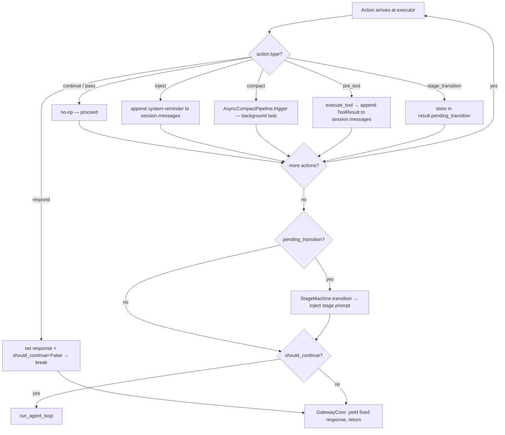

# Chapter 11 — Actions: Continue, Respond, Inject, PreTool, Compact, StageTransition

## Overview

> **Core Question:** The rule engine returns an `Action` — what is the minimal protocol
> that lets six different action types (skip LLM, augment LLM, seed before LLM,
> transition the stage machine, trigger async compaction, or proceed unchanged) all flow
> through one dispatch site?

In [[ch-10]] you learned how the `RuleEngine` evaluates checks and produces a list of
`Action` objects. This chapter answers the next question: once that list arrives at
`ActionExecutor.execute()`, what actually happens? The answer is deceptively compact:
eight action constructors (two are aliases), one two-field dataclass, one dict of
handlers, and a three-field result object. The complexity lives not in the dispatch
mechanism but in what each handler does — and crucially, in what it does *not* do.

This chapter focuses on the exact mechanism, not on when to choose each action. By the
end you should be able to: draw the full dispatch path from `RuleEngine.evaluate()` to
`run_agent_loop()` from memory; locate every handler in the source; and explain why
`StageTransition` stores its target in `ExecutionResult.pending_transition` instead of
calling `StageMachine.transition()` directly, why `Compact` is not awaited in the
executor, and why `Inject` uses `role="user"` rather than `role="system"`.

The material is split across five sub-pages for depth. This index states the universal
pattern, introduces each action type, and synthesises the design. Read the sub-pages
when you want full line-by-line walkthroughs.

---

## Key Concepts

### 1. The Universal Pattern

Every action type in the Gateway follows the same five-step protocol:

```
1. Rule check function returns Action(type=<str>, payload=<dict>)
2. RuleEngine.evaluate() filters Continue/Pass, returns list[Action]
3. ActionExecutor.execute() loops over actions:
     handler = self._handlers[action.type]   # O(1) dict lookup
     await handler(action, session, result)
     if not result.should_continue: break
4. GatewayCore reads ExecutionResult:
     if result.pending_transition → _apply_stage_transition()
     if not result.should_continue → yield result.response; return
5. If should_continue is still True → build runtime, call run_agent_loop()
```

Steps 1-2 are covered in [[ch-10]]. Steps 3-5 are this chapter.

**Why this pattern is inevitable.** The Gateway is an async generator (`handle_message`
is an `AsyncIterator`). Once a response token is yielded, it has been sent to the client
— you cannot un-yield it. This forces a strict ordering constraint: all decisions about
*whether* to call the LLM and *what context* to give it must be resolved before the
first `yield`. The Action/ExecutionResult pattern satisfies this constraint: all handlers
run synchronously (within the async loop but without yielding to the client), mutating
`session.messages` and `result` in-place, and only after the executor loop finishes does
`GatewayCore` decide to yield (fixed response) or proceed (agent loop). The two-field
dataclass is not an arbitrary design choice — it is the minimal carrier object that
separates "did any action stop the turn?" (`should_continue`) from "what to send if so?"
(`response`), while keeping the dispatch loop ignorant of how the gateway will use those
fields.

**Mental model:** Think of `ActionExecutor` as a REPL pre-processor. Before the LLM
"reads" the current message, the executor runs a sequence of pre-processing steps. Each
step can: do nothing (`Continue`), annotate the buffer (`Inject`, `PreTool`), fire a
background job (`Compact`), set a flag for a post-processor (`StageTransition`), or
halt and return a canned reply (`Respond`, `Filter`). The LLM is the "REPL evaluator"
that only runs if no step halted.

**Mermaid — full dispatch flow:**

```mermaid
sequenceDiagram
    participant R as RuleEngine
    participant AE as ActionExecutor
    participant GC as GatewayCore
    participant SM as StageMachine
    participant CP as AsyncCompactPipeline
    participant AL as run_agent_loop

    R->>AE: list[Action] (Continue/Pass filtered out)
    loop for each action
        AE->>AE: handler = handlers[action.type]
        alt type == "continue"
            AE->>AE: no-op
        else type == "respond"
            AE->>AE: result.response=text, should_continue=False; break
        else type == "inject"
            AE->>AE: session.messages.append(<system-reminder>)
        else type == "compact"
            AE->>CP: trigger(session) [not awaited — schedules task]
        else type == "pre_tool"
            AE->>AE: execute_tool(); session.messages.append(result)
        else type == "stage_transition"
            AE->>AE: result.pending_transition = target
        end
    end
    AE->>GC: ExecutionResult(should_continue, response, pending_transition)
    alt pending_transition set
        GC->>SM: transition(from, to)
        SM->>GC: result.new_stage (or failure)
        GC->>GC: inject stage prompt into session.messages
    end
    alt not should_continue
        GC-->>Client: yield result.response
    else
        GC->>AL: run_agent_loop(runtime, content)
        AL-->>Client: stream text chunks
    end
```



---

### 2. Action Types — `gateway/schemas/actions.py`

See [[excerpts/action-types]] for a full line-by-line walkthrough.

The action vocabulary is defined in `gateway/schemas/actions.py`. **All eight
constructors return the same `Action(type, payload)` dataclass** — there are no
subclasses, no generics, no protocols beyond that two-field shape.

```python
# boson-agent/packages/gateway/gateway/schemas/actions.py, lines 23-28

@dataclass
class Action:
    """A single action produced by a rule check."""

    type: ActionType
    payload: dict = field(default_factory=dict)
```

The `type` field is a `Literal` string (not an enum). `payload` is a plain `dict`.
Nothing else. The eight constructors are factory functions, not subclasses:

```python
# boson-agent/packages/gateway/gateway/schemas/actions.py, lines 33-76

def Continue() -> Action:   return Action(type="continue")
def Pass()     -> Action:   return Action(type="pass")
def Filter(reason="") -> Action:
    return Action(type="filter", payload={"reason": reason})
def Respond(text: str) -> Action:
    return Action(type="respond", payload={"text": text})
def Inject(content: str) -> Action:
    return Action(type="inject", payload={"content": content})
def Compact() -> Action:    return Action(type="compact")
def PreTool(tool_name: str, arguments: dict | None = None) -> Action:
    return Action(type="pre_tool",
                  payload={"tool_name": tool_name, "arguments": arguments or {}})
def StageTransition(target_stage: str) -> Action:
    return Action(type="stage_transition", payload={"target_stage": target_stage})
```

**Notice:** `Continue` and `Pass` are identical at the dataclass level — same type
string, same empty payload. They exist as two names because `Continue` reads as "I have
no opinion, proceed" while `Pass` reads as "I am explicitly forwarding this unchanged".
The `RuleEngine` treats them identically, filtering both with `a.type not in
("continue", "pass")`.

The `LayerPipeline` defines an explicit priority table for conflict resolution across
layers:

```python
# boson-agent/packages/gateway/gateway/layers/pipeline.py, lines 32-41

ACTION_PRIORITY = {
    "filter": 0,       # highest — drop always wins
    "respond": 1,
    "inject": 2,
    "stage_transition": 3,
    "compact": 3,
    "pre_tool": 3,
    "pass": 4,
    "continue": 4,     # lowest — only wins when nothing else fires
}
```

---

### 3. Respond and Inject — `router/executor.py` + `core.py`

See [[excerpts/respond-inject]] for the full walkthrough including the `LayerPipeline`
staged-inject variant and the Lina production `Inject` example.

`Respond` and `Inject` are the two actions that directly control LLM participation.

**Respond** sets `result.should_continue = False`:

```python
# boson-agent/packages/gateway/gateway/router/executor.py, lines 78-83

async def _handle_respond(
    self, action: Action, session: SessionState, result: ExecutionResult
) -> None:
    """RESPOND — return fixed text to client, stop pipeline."""
    result.response = action.payload.get("text", "")
    result.should_continue = False
```

`GatewayCore` tests this flag at line 165 of `core.py`:

```python
# boson-agent/packages/gateway/gateway/core.py, lines 166-168

if not result.should_continue:
    yield result.response or ""
    return
```

The LLM is never instantiated. No `AgentRuntime` is built.

**Inject** leaves `should_continue` untouched and writes directly to `session.messages`:

```python
# boson-agent/packages/gateway/gateway/router/executor.py, lines 85-94

async def _handle_inject(
    self, action: Action, session: SessionState, result: ExecutionResult
) -> None:
    """INJECT — prepend system reminder to conversation history."""
    content = action.payload.get("content", "")
    session.messages.append(
        Message(
            role="user",
            content=f"<system-reminder>{content}</system-reminder>",
        )
    )
```

**Notice:** Injected messages use `role="user"`, not `role="system"`. The static system
prompt (loaded from `BOSON.md`) uses the system role. Injections use the user role so
they appear as in-conversation context at the correct turn position, not as a
pre-conversation preamble. This mirrors the `inject_system_reminder` pattern from
[[ch-05]], where the same `<system-reminder>` wrapper is used to deliver just-in-time
context within the flow of messages.

**Real example — greeting auto-response (`Respond`):**

```python
# boson-agent/agents/demo-gateway/layers/01-guard/rules/spam_filter.py, lines 22-28

@check("greeting_responder", mode="sequential", priority=20)
def greeting_responder(messages, user_message, session):
    lower = user_message.strip().lower()
    if lower in GREETING_WORDS and len(messages) == 0:
        return Respond(text="Hello! I'm a demo assistant. ...")
    return Pass()
```

**Real example — escalation hold (`Inject`) in Lina:**

```python
# boson-agent/agents/test-lina-gateway/layers/03-orchestrator/rules/transition_detector.py, lines 367-373

    if session.escalate_count < 2:
        return Inject(
            content="[Customer requested human agent (%d/2). "
            "Acknowledge the request, but try to help them first. ...]"
            % session.escalate_count
        )
```

The Lina rule uses `Inject` to steer the LLM's next response without hard-coding that
response. The LLM reads the bracketed note and decides how to phrase the
acknowledgement. Two requests later, `StageTransition("escalate_to_human")` fires.

---

### 4. PreTool — `router/executor.py`

See [[excerpts/pretool]] for the full walkthrough including the latency argument,
comparison with stage preloads, and the LayerPipeline variant.

`PreTool` executes a named tool before the LLM call and appends the result to history:

```python
# boson-agent/packages/gateway/gateway/router/executor.py, lines 107-121

async def _handle_pre_tool(
    self, action: Action, session: SessionState, result: ExecutionResult
) -> None:
    """PRE_TOOL — execute a tool and append the result to history."""
    if self._tool_registry is None:
        logger.warning("pre_tool action received but no tool_registry configured")
        return

    tool_name = action.payload.get("tool_name", "")
    arguments = action.payload.get("arguments", {})

    tool_result = await execute_tool(self._tool_registry, tool_name, arguments)
    session.messages.append(
        Message(role="user", content=[tool_result])
    )
```

The tool result lands in history as a `role="user"` message with list content
(`content=[tool_result]`), preserving the structured `ToolResult` type for correct API
rendering. There is no corresponding assistant tool-use block — unlike the normal
think-act-observe cycle, `PreTool` does not fabricate an assistant decision. The result
appears as background context, not as a model-requested tool call.

**Notice:** `execute_tool` is the same function used by the agent loop during its
tool-execution phase. `PreTool` reuses the identical execution path — no special
pre-tool executor, no separate tool runner. The only difference is that `PreTool`
appends the result before the LLM call, while the agent loop appends it mid-turn.

The latency benefit: if the agent would always call a given tool on the first message,
`PreTool` collapses two LLM roundtrips into one by seeding the result deterministically.

---

### 5. Compact and StageTransition — `router/executor.py` + `core.py`

See [[excerpts/compact-stage]] for the full walkthrough including the
`AsyncCompactPipeline` background task lifecycle, the two-turn apply pattern, and both
demo and Lina production examples.

**Compact** fires a background asyncio task and returns immediately:

```python
# boson-agent/packages/gateway/gateway/router/executor.py, lines 97-105

async def _handle_compact(
    self, action: Action, session: SessionState, result: ExecutionResult
) -> None:
    """COMPACT — trigger async compaction if pipeline is available."""
    if self._compact_pipeline is not None:
        try:
            self._compact_pipeline.trigger(session)
        except Exception as exc:
            logger.warning("compact_pipeline.trigger raised: %s", exc)
```

`trigger` is not awaited. It schedules `asyncio.create_task(_compact_task)` and returns.
The compaction LLM call runs in the background; `session.pending_compact` is written
when it finishes. On the *next* turn, `apply_pending()` swaps old messages for the
summary before anything else runs.

**Notice:** `trigger` sets `session.compact_in_progress = True` before starting the
task. This prevents duplicate compaction tasks when `Compact()` fires on consecutive
turns. The flag is cleared in the `finally` block of `_compact_task`, so it resets even
if the LLM summarisation fails.

**StageTransition** stores the target in `result.pending_transition`:

```python
# boson-agent/packages/gateway/gateway/router/executor.py, lines 123-132

async def _handle_stage_transition(
    self, action: Action, session: SessionState, result: ExecutionResult
) -> None:
    """STAGE_TRANSITION — store target for core to execute after actions."""
    target = action.payload.get("target_stage", "")
    if not target:
        logger.warning("stage_transition: missing target_stage")
        return
    result.pending_transition = target
```

The executor deliberately does not call `StageMachine.transition()`. That call happens
in `GatewayCore._apply_stage_transition()`, after all actions have been processed and
after the execute loop returns. This ordering guarantees that a `Compact` action and a
`StageTransition` action from the same rule set do not interfere with each other during
dispatch.

**Real example — turn-count compact trigger:**

```python
# boson-agent/agents/demo-gateway/layers/03-orchestrator/rules/stage_manager.py, lines 42-49

@check("compact_trigger", mode="sequential", priority=20)
def trigger_compact(messages, user_message, session):
    if len(messages) > 30:
        return Compact()
    return Continue()
```

**Real example — LLM-driven stage transition (Lina):**

```python
# boson-agent/agents/test-lina-gateway/layers/03-orchestrator/rules/transition_detector.py, lines 376-380

    if target:
        logger.info("Deterministic transition: %s -> %s", stage, target)
        session.checklist_state = {}
        return StageTransition(target)
```

Lina's `detect_stage_transition` rule (decorated `@check("stage_transition",
mode="parallel", priority=20)`) tries keyword matching first, then a lightweight
`claude-haiku` LLM call if keywords don't match. The result is always either
`StageTransition(target)` or `Continue()`. See [[ch-12]] for how `StageMachine` and the
compact pipeline respond once the transition or compact is committed.

---

### 6. The Dispatch Ladder — `ActionExecutor` and `GatewayCore`

See [[excerpts/dispatch-ladder]] for the complete sequence trace, `ExecutionResult`
field-by-field breakdown, and the `LayerPipeline` comparison.

The executor's central mechanism is a dict-of-handlers:

```python
# boson-agent/packages/gateway/gateway/router/executor.py, lines 36-45

self._handlers: dict = {
    "continue": self._handle_continue,
    "respond": self._handle_respond,
    "inject": self._handle_inject,
    "compact": self._handle_compact,
    "pre_tool": self._handle_pre_tool,
    "stage_transition": self._handle_stage_transition,
}
```

No `match` statement, no `isinstance` chain, no visitor. A plain dict lookup, registered
at `__init__` time. Note that `"filter"` and `"pass"` are absent — `filter` is handled
by `LayerPipeline` before reaching the executor; `pass` is filtered by `RuleEngine`.

The full `GatewayCore.handle_message` flow (steps 5-7):

```python
# boson-agent/packages/gateway/gateway/core.py, lines 149-168

# 5. Run rule engine
if self._rule_engine is not None:
    actions = await self._rule_engine.evaluate(
        session.messages, content, session
    )
else:
    actions = [Continue()]

# 6. Execute actions
result = await self._action_executor.execute(actions, session)

# v0.4: Execute pending stage transition from rules
if result.pending_transition:
    skill_fillers = await self._apply_stage_transition(session, result.pending_transition)
    for sf in skill_fillers:
        yield f"\n{sf}\n"

# 7. Fixed response — skip agent
if not result.should_continue:
    yield result.response or ""
    return
```

**Notice:** When no rule engine is configured (line 154), the default is `[Continue()]`
— the agent always runs. This is the fail-open design: a gateway with no rules degrades
to a simple pass-through, not to a broken state. The `ActionExecutor._handle_continue`
handler is a no-op (`pass`), so the executor loop immediately finishes, `should_continue`
stays `True`, and the agent loop runs. Zero configuration, correct behaviour.

---

### 7. Cross-Implementation Synthesis

| Action | LLM called? | History mutated? | `should_continue` | Deferred via `result`? | Subsystem notified? |
|---|---|---|---|---|---|
| Continue / Pass | Yes | No | True | No | None |
| Filter | No | No | N/A (pipeline returns) | No | SignalQueue (layer pipeline only) |
| Respond | No | No | False | No (`response` field) | None |
| Inject | Yes | Yes (+1 user msg) | True | No | None |
| PreTool | Yes | Yes (+1 user msg) | True | No | ToolRegistry |
| Compact | Yes | No (this turn) | True | No | AsyncCompactPipeline (background) |
| StageTransition | Yes | Indirectly (stage prompt) | True | Yes (`pending_transition`) | StageMachine |

**What is invariant (forced by the substrate):**

1. All action types must share a single dispatch site, because `handle_message` is a
   single async generator — you cannot fork it mid-execution.
2. Any action that stops the turn must set `should_continue = False` before the executor
   loop ends, because `GatewayCore` tests this flag exactly once, after `execute()`
   returns.
3. Any action that needs a subsystem with its own validation logic (`StageMachine`,
   `AsyncCompactPipeline`) cannot call that subsystem directly from the handler, because
   the executor runs inside the action loop and cannot safely yield or make ordering
   guarantees across actions. Hence the deferred `pending_transition` pattern.
4. Injections must append to `session.messages` before the agent loop starts, because
   the agent loop reads `session.messages` via `SharedHistory` and cannot see mutations
   that happen after it starts streaming.

**What is a free design choice:**

- Using a dict-of-handlers vs a `match` statement vs a visitor. All three would work;
  the dict is extensible at runtime.
- Using factory functions (`Respond(text)`) vs subclasses (`class Respond(Action)`). The
  factory approach keeps the dataclass uniform and the dispatch purely string-driven.
- The `pending_transition` deferred pattern vs calling `StageMachine` directly from the
  handler. Direct call would also work if the handler could `await` safely; the deferred
  pattern is more explicit and easier to test.
- `Compact` being not-awaited in `_handle_compact`. The executor could `await trigger()`
  without changing semantics (since `trigger` only schedules a task and returns), but
  not awaiting it signals the intent: "this fires and forgets".

---

## Questions

1. **Mechanism recall.** Walk through what happens step by step when a rule returns
   `StageTransition("closing")`. Which function stores the target stage? Which function
   validates the edge? Which function injects the new stage prompt into `session.messages`?
   At what point in `handle_message` does each step occur?

2. **Source-grounded.** In `executor.py` line 103, `self._compact_pipeline.trigger(session)`
   is called without `await`. Open `compact/pipeline.py` and look at `trigger()`. Why
   does not awaiting it still work correctly right now? What would break if `trigger()`
   were changed to do real I/O before calling `asyncio.create_task()`?

3. **Design tradeoff.** `Inject` appends a `role="user"` message rather than mutating
   the existing user message or using `role="system"`. Explain why each of the two
   alternatives would be worse. (Hint: think about what the LLM API does with `system`
   role messages and what happens if you mutate a message that has already been sent.)

4. **Contrast.** `Respond` and `Filter` both stop the pipeline. A rule author choosing
   between them should consider what? Cite the specific excerpt from §3 (respond-inject)
   that explains the difference, and give a concrete example where using `Respond`
   instead of `Filter` would be actively harmful.

5. **Composition.** A parallel rule set returns both `Compact()` and
   `StageTransition("purchase")` from the same turn. Walk through what `execute()` does
   with both actions, in order. Does the compaction run before or after the stage
   transition? Does the answer change depending on which appears first in the action
   list?

6. **Extend it.** Suppose you need a new action type `Redirect(url: str)` that sends the
   client a JSON `{"type": "redirect", "url": url}` and stops the turn. List every place
   in the codebase you would need to change, and explain why each change is necessary.
   Use the handler dict pattern and `ExecutionResult` — do not invent new mechanism.

7. **LayerPipeline vs ActionExecutor.** The `LayerPipeline` handles `inject` with staged
   commits (`proposed_injections` list), while `ActionExecutor._handle_inject` commits
   immediately. In a two-layer pipeline where Layer 1 returns `Inject("context A")` and
   Layer 2 returns `Filter("abuse")`, what does the client see, and what is in
   `session.messages`, under each approach? Which behaviour is correct and why?
