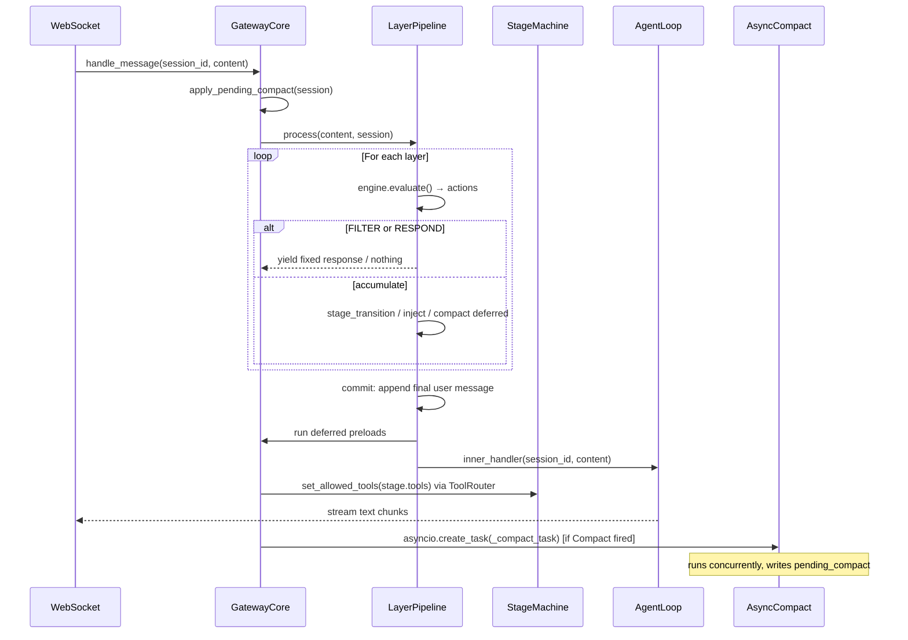
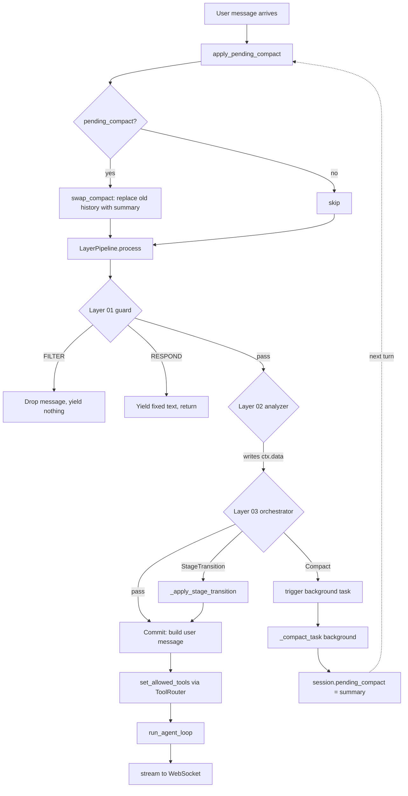
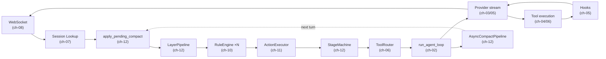

# Ch-12: Stage Machine, Layers, and Async Compaction

## Overview

> **Core Question:** A conversation is not a flat message list — it has modes
> (stages), pipelines (layers), and time (compaction). How do three coordinating
> mechanisms — stage filter, layer pipeline, and async compact — let one session
> evolve without blocking turns or losing context?

A session in the boson-agent gateway is a living object. It starts in one
behavioral mode, transitions to others as the conversation progresses, passes
every incoming message through a gauntlet of rule layers before the agent sees
it, and periodically discards old history in the background so context windows
never overflow. These three mechanisms — **stage machine**, **layer pipeline**,
and **async compaction** — are independent subsystems that coordinate through
shared session state. None of them is visible to the end user. All of them
determine what the LLM can do, what it knows, and how much of the past it
remembers.

This chapter operationalizes fields introduced in [[ch-07]]: `session.active_stage`
and `session.pending_compact` are no longer abstract schema entries — you will
see the exact lines of code that read and mutate them. It connects the
`StageTransition` and `Compact` action types you learned in [[ch-11]] to the
machinery that actually executes them. It explains why [[ch-06]]'s `ToolRouter`
is the enforcement mechanism for per-stage tool visibility, and why compaction
running in the background (covered in the concurrency chapter [[ch-09]]) is safe
to do while agent turns proceed on the same event loop.

After working through this chapter, you will be able to: draw the complete
message path from user input to LLM streaming output including all three
subsystems; explain the staged-commit guarantee the layer pipeline provides and
why it matters for correctness; describe precisely when `pending_compact` is
written and when it is applied; and configure a new multi-stage gateway agent
from scratch.

---

## Key Concepts

### 1. The Universal Pattern

Every message through a boson-agent gateway follows the same shape, regardless
of how many stages, layers, or history entries exist:

```
Turn N begins:
  1.  apply_pending_compact(session)     -- swap history if background task finished
  2.  layers.process(message, session):
      2a.  for each layer in order:
               actions = engine.evaluate(messages, message, ctx)
               if FILTER → drop, return nothing
               if RESPOND → yield fixed text, return
               accumulate: injections, stage_transitions, compact triggers
      2b.  all layers passed → commit:
               build final_user_message = content + injections + stage_injection
               session.messages.append(final_user_message)
      2c.  run deferred preloads (tool pairs + skill prompts → history)
  3.  tool_router.set_allowed_tools(current_stage.tools)
  4.  run_agent_loop(runtime, content)   -- think-act-observe
  5.  stream output to client
  6.  if Compact action fired: asyncio.create_task(_compact_task(session))
      (background — does not block turn N)
Turn N+1 begins:
  1.  apply_pending_compact(session)     -- applies task started in turn N
  ...
```

**Why this pattern is inevitable:** The substrate is an async streaming API
(WebSocket) backed by a stateful session. You cannot hold the socket open
while synchronously running an LLM summarization call — that would block the
event loop for all other sessions. So compaction must be asynchronous.
Simultaneously, you cannot let tools from stage A bleed into stage B — the
provider API sees exactly the tools you send in each request, so stage
filtering must happen at the per-turn `AgentRuntime` construction point.
And you cannot allow a single rogue rule to corrupt the message history with
an injection that is later retracted by a Filter decision — so the layer
pipeline must use staged commit. Each mechanism is a direct consequence of
the constraints imposed by the WebSocket substrate, the provider API shape,
and the need to protect session integrity across concurrent turns.

**Mental model:** Think of a staged theater production. The layer pipeline is
the stage manager's checklist run before every scene — if anything fails, the
curtain does not rise (filter) or an understudy delivers a line (respond). The
stage machine is the script that says which props (tools) are on stage for each
scene. Compaction is the stagehands quietly moving old sets to storage between
scenes — the audience never sees it happen.





---

### 2. Stage Machine — `gateway/stage/machine.py` + `context.py`

> Full walkthrough: [[excerpts/stage-machine]]

`StageMachine` is instantiated once at startup and shared across all concurrent
sessions. It is a read-only registry after startup — the only per-session state
it touches is `session.active_stage`, which it never reads directly. The caller
passes `from_stage` as a string argument.

```python
# boson-agent/packages/gateway/gateway/stage/machine.py, lines 45-68

    def transition(self, from_stage: str, to_stage: str) -> TransitionResult:
        current = self._stages.get(from_stage)
        if current is None:
            return TransitionResult(
                success=False, error=f"Stage '{from_stage}' not registered"
            )
        if to_stage not in current.transitions:
            return TransitionResult(
                success=False,
                error=f"Transition '{from_stage}' -> '{to_stage}' not allowed",
            )
        target = self._stages.get(to_stage)
        if target is None:
            return TransitionResult(
                success=False,
                error=f"Target stage '{to_stage}' not registered",
            )
        return TransitionResult(success=True, new_stage=target)
```

Three guards in order: is `from_stage` registered? is `to_stage` in the
allowlist? is `to_stage` itself registered? All three must pass or the
transition silently no-ops — the caller gets `TransitionResult(success=False)`
and `GatewayCore._apply_stage_transition()` returns an empty list without
mutating `session.active_stage`. Rules that return `StageTransition("typo")`
fail here with no crash and no state corruption.

The mutation of `session.active_stage` lives in `GatewayCore`, not in
`StageMachine`. The machine is pure validation. This separation makes it
trivially testable: you can call `machine.transition("A", "B")` in a unit
test with no session object at all.

**Connection to ToolRouter ([[ch-06]]):** After a transition (or at every turn
start if no transition occurred), `GatewayCore` reads the current stage
definition and calls `runtime.tool_router.set_allowed_tools(stage_def.tools)`.
The `ToolRouter` hides all native tools from the LLM API except those named in
the stage's `tools` list. The LLM's textual knowledge ("Available tools: X, Y")
and the router's enforcement are always in sync because both come from the same
`StageDefinition` object.

```python
# boson-agent/packages/gateway/gateway/core.py, lines 181-194

if runtime.tool_router and session.active_stage and self._stage_machine:
    stage_def = self._stage_machine.get_stage(session.active_stage)
    if stage_def and stage_def.tools is not None:
        runtime.tool_router.set_allowed_tools(stage_def.tools)
    else:
        runtime.tool_router.set_allowed_tools(None)
    exposed = set()
    if stage_def:
        if stage_def.tools:
            exposed.add("use_tool")
        if getattr(stage_def, "skills", None):
            exposed.add("use_skill")
    runtime.exposed_meta_tools = exposed
```

**Notice:** `exposed_meta_tools` controls which *meta-tools* the LLM sees. If
a stage has no tools, `use_tool` is not exposed — the LLM cannot even attempt
a tool call. If a stage has no skills, `use_skill` is not exposed. This is a
second layer of enforcement on top of the allowlist: even if `ToolRouter`
would allow a dispatch, the LLM cannot generate the call if the meta-tool is
not in the API request.

---

### 3. Stage Config Files — `stage_config.py`

> Full walkthrough: [[excerpts/stage-config]]

`stage_config.py` is pure data — no imports, no conditionals. Two exports:
`initial_stage: str` and `stages: dict[str, dict]`.

```python
# boson-agent/agents/demo-gateway/stage_config.py, lines 1-29

initial_stage = "welcome"

stages = {
    "welcome": {
        "tools": ["get_time"],
        "skills": [],
        "transitions": ["main", "closing"],
    },
    "main": {
        "tools": ["calculate", "get_weather", "search_docs", "get_time"],
        "skills": ["explain", "summarize"],
        "transitions": ["closing"],
        "preloads": [("get_time", {"timezone": "UTC"})],
        "preload_skills": ["explain"],
    },
    "closing": {
        "tools": ["get_time"],
        "skills": [],
        "transitions": [],  # terminal stage
    },
}
```

The `transitions` list is the enforcement allowlist. `StageMachine.transition()`
checks `to_stage not in current.transitions`. If you want a stage to be
reachable only from specific predecessors, you simply omit it from all other
stages' `transitions` lists — no code change required.

The Lina production config declares 8 stages across a sales funnel with
deterministic forward-only transitions. See [[excerpts/example-stage-config]]
for a full side-by-side comparison.

**Notice:** `preloads` and `preload_skills` are NOT part of `StageDefinition`.
They are read from the raw config dict by `GatewayCore` during setup:
`self._stage_preloads[name] = spec.get("preloads", [])`. `StageDefinition`
stays minimal; preload execution logic lives in `GatewayCore._run_stage_preloads()`.

---

### 4. Stage Preloads — `gateway/core.py`

> Full walkthrough: [[excerpts/stage-preloads]]

When a stage transition fires, the agent can auto-execute tool calls and inject
skill prompts into history before the LLM's first turn in the new stage. This
saves one user-visible round trip per data dependency.

```python
# boson-agent/packages/gateway/gateway/core.py, lines 340-357

for name, args in self._stage_preloads.get(target, []):
    try:
        tool_use_id = f"toolu_{uuid4().hex[:12]}"
        # Assistant message: tool call
        session.messages.append(Message(
            role="assistant",
            content=[ToolUseBlock(id=tool_use_id, name=name, input=args)],
        ))
        # Execute and get result
        res = await execute_tool(self._tool_registry, name, args)
        res.tool_use_id = tool_use_id
        # User message: tool result
        session.messages.append(Message(role="user", content=[res]))
    except Exception as e:
        logger.warning("Tool preload %s: %s", name, e)
```

The synthesized history is structurally identical to a real tool call exchange:
one `[assistant]` message with a `ToolUseBlock`, one `[user]` message with a
`ToolResultBlock` whose `tool_use_id` matches. The Anthropic API validates that
every `tool_result` references a prior `tool_use` by ID — the `uuid4().hex[:12]`
fake ID satisfies this constraint.

The critical timing issue: if a `StageTransition` fires *inside the layer
pipeline* (while the pipeline is still assembling the user message), preloads
cannot run immediately — the user message is not yet in history. The solution
is `session._pending_preload_stage`: a transient sentinel that the pipeline
checks and resolves after appending the user message:

```python
# boson-agent/packages/gateway/gateway/layers/pipeline.py, lines 170-175

pending_preload = getattr(session, "_pending_preload_stage", None)
if pending_preload and self._on_run_preloads:
    preload_fillers = await self._on_run_preloads(session, pending_preload)
    skill_fillers.extend(preload_fillers)
    session._pending_preload_stage = None
```

**Notice:** The timing pattern used by preloads (`_pending_preload_stage`),
stage injections (`_pending_stage_injection`), and pipeline coordination
(`_in_pipeline`, `_pipeline_appended`) is the same in all cases: set a
transient flag on the session object, check it at the next safe point, clear
it immediately after use. These flags are never persisted — they live only
for the duration of one `handle_message()` call.

---

### 5. Layer Pipeline — `gateway/layers/pipeline.py` + `context.py`

> Full walkthrough: [[excerpts/layer-pipeline]]

The `LayerPipeline` chains N named rule engines in numeric-prefix order. Each
engine returns a list of `Action` objects. The pipeline resolves them into a
single flow-control decision per layer using a priority table:

```python
# boson-agent/packages/gateway/gateway/layers/pipeline.py, lines 32-41

ACTION_PRIORITY = {
    "filter": 0,      # drop message entirely
    "respond": 1,     # short-circuit with fixed text
    "inject": 2,      # add context to user message
    "stage_transition": 3,
    "compact": 3,
    "pre_tool": 3,
    "pass": 4,
    "continue": 4,
}
```

This table is the complete specification of what "winning" means when a layer
returns multiple actions. `Filter` always wins. `Respond` beats `Inject`. The
three orchestration actions share priority 3 and are all processed (they do not
exclude each other).

The staged-commit guarantee: proposed injections are accumulated in
`proposed_injections: list[str]`. If any later layer returns `Filter`, the
list is discarded without being applied. Only when all layers pass does the
pipeline assemble and append the final user message:

```python
# boson-agent/packages/gateway/gateway/layers/pipeline.py, lines 139-167

# All layers passed — build user message with injections + stage
parts: list[str] = []
final_content = stripped if stripped is not None else content
parts.append(final_content)

for inj in proposed_injections:
    parts.append(f"<system-reminder>{inj}</system-reminder>")

pending = getattr(session, "_pending_stage_injection", None)
if pending:
    parts.append("---")
    parts.append(f"<system-reminder>{pending}</system-reminder>")
    parts.append("---")
    parts.append("The conversation has moved to a new stage. "
                 "Follow the updated instructions above and respond "
                 "to the customer accordingly.")
    session._pending_stage_injection = None

session.messages.append(
    Message(role="user", content="\n".join(parts))
)
session._pipeline_appended = True
```

All three components — user content, layer injections, stage injection — land
in a single `[user]` message. Anthropic's API requires alternating user/assistant
turns; merging into one message is mandatory for correctness.

**`ctx.data` for inter-layer communication:** `SharedLayerContext` carries a
`data: dict` field. Layer 02 can write `ctx.data["intent"] = "closing"`;
Layer 03 reads `session.data.get("intent")` (where `session` is actually the
`SharedLayerContext` and `data` is the same dict). This is the blackboard
pattern — layers share information without importing each other.

```python
# boson-agent/packages/gateway/gateway/layers/context.py, lines 16-32

@dataclass
class SharedLayerContext:
    session: Any
    messages: list
    user_message: str
    signal_queue: Any
    get_agent_status: Callable[[], Any]
    layer_name: str | None = None
    data: dict = field(default_factory=dict)  # v0.6: inter-layer data passing
```

`ctx.data` is ephemeral — created fresh every `process()` call, not stored on
`SessionState`. For data that must survive across turns (e.g., turn count,
checklist state), rules write to the `SessionState` directly via attribute
assignment (`session.turn_count += 1`), which proxies through
`SharedLayerContext.__getattr__` to the underlying session.

**Connection to rule engine ([[ch-10]]):** Each layer *is* a `RuleEngine`
instance. `LayerPipeline` does not reimplement rule evaluation — it calls
`engine.evaluate()` per layer. The layer adds the concept of ordered execution,
staged commit, and deferred actions. The rule engine adds check discovery,
priority ordering, sequential/parallel modes, and fail-open exception handling.

---

### 6. Async Compact Pipeline — `gateway/compact/pipeline.py`

> Full walkthrough: [[excerpts/async-compact]]

`AsyncCompactPipeline` manages a two-turn cycle: fire-and-forget in turn N,
apply in turn N+1.

```python
# boson-agent/packages/gateway/gateway/compact/pipeline.py, lines 51-65

async def trigger(self, session: SessionState) -> bool:
    if session.compact_in_progress:
        return False
    if not self.should_compact(session):
        return False

    session.compact_in_progress = True
    asyncio.create_task(self._compact_task(session))
    return True
```

`compact_in_progress = True` is set *before* `create_task()`. This prevents
a second turn from launching a second compaction task before the first task
even starts running on the event loop. `asyncio.create_task()` schedules
the coroutine but does not run it immediately — a second `trigger()` call
during the same synchronous block would see `compact_in_progress = True` and
return `False`.

The background task writes its result to `session.pending_compact`:

```python
# boson-agent/packages/gateway/gateway/compact/pipeline.py, lines 67-87

async def _compact_task(self, session: SessionState) -> None:
    try:
        keep = self._config.keep_recent
        messages_to_compact = (
            list(session.messages[:-keep]) if keep
            else list(session.messages)
        )
        summary = await self.strategy.summarize(
            messages_to_compact, session.system_prompt,
        )
        session.pending_compact = {
            "summary": summary,
            "keep_recent": keep,
        }
    except Exception as exc:
        logger.error("compact_task failed: %s", exc)
        session.pending_compact = None
    finally:
        session.compact_in_progress = False
```

The `list(session.messages[:-keep])` snapshot at line 72 is the key
concurrency safety measure. It takes a shallow copy of the message list at
the moment the task starts. Subsequent turns append to `session.messages`
without affecting the snapshot — the compaction task summarizes a fixed window
of history even as new messages arrive.

The pending result is applied at the very start of the *next* turn:

```python
# boson-agent/packages/gateway/gateway/core.py, lines 119-121

# 3. Apply any pending compact from previous turn
if self._compact_pipeline is not None:
    self._compact_pipeline.apply_pending(session, shared_history)
```

```python
# boson-agent/packages/gateway/gateway/compact/pipeline.py, lines 89-102

def apply_pending(self, session, shared_history) -> bool:
    if not session.pending_compact:
        return False
    summary = session.pending_compact["summary"]
    keep_recent = session.pending_compact.get(
        "keep_recent", self._config.keep_recent
    )
    shared_history.swap_compact(summary, keep_recent=keep_recent)
    return True
```

**This is the `pending_compact` operationalization promised from [[ch-07]].**
`SessionState.pending_compact` was introduced as a schema field in ch-07. Here
you see the exact lines that write it (`session.pending_compact = {...}` in
`_compact_task`) and the exact lines that consume and act on it
(`apply_pending()` calling `shared_history.swap_compact()`).

`swap_compact()` replaces `session.messages[:-keep_recent]` with a single
synthesized summary message. After the swap, the history is compact again.
The new turn's user message is appended to this shorter history, keeping the
LLM context window bounded.

**Notice:** The `finally` block in `_compact_task` always releases
`compact_in_progress = False`, whether the summarization succeeded or failed.
A failed compaction is silent (just logged) — the conversation continues
normally with a longer-than-ideal history. This is the correct trade-off:
losing a compaction is recoverable; crashing the session is not.

**Connection to concurrency ([[ch-09]]):** The background task runs on the
same asyncio event loop as every other session's turns. It cooperatively
yields at each `await` point inside `strategy.summarize()`. While the
summarization LLM streams its response, other sessions are free to run their
turns. There is no thread-level parallelism — everything is cooperative
multitasking within a single asyncio event loop.

---

### 7. Cross-Implementation Synthesis

| Mechanism | What it gates | When it fires | State mutated | Where state lives |
|-----------|--------------|---------------|---------------|-------------------|
| Stage machine | Which tools the LLM can call | Every turn (ToolRouter) + on StageTransition action | `session.active_stage` | `SessionState` (per-session) |
| Layer pipeline | Whether message reaches agent at all | Every turn, before agent loop | `session.messages` (appended), transient `_in_pipeline` / `_pipeline_appended` flags | `SessionState` (turn-scoped flags) |
| Async compact | How much history the LLM sees | Triggered by Compact action; applied next turn | `session.pending_compact`, `session.compact_in_progress`, `session.messages` (swap) | `SessionState` (persistent fields) |

**What is invariant (forced by the substrate):**

1. Tool filtering must happen per turn at `AgentRuntime` construction time —
   there is no way to retroactively hide a tool from an already-submitted API
   request. So `set_allowed_tools()` must be called before `run_agent_loop()`.

2. The user message must be a single `[user]` turn — the Anthropic API forbids
   consecutive same-role messages. So all injections (layer injections, stage
   injection) must be merged into one message before appending.

3. Compaction must be async — summarizing via LLM takes hundreds of milliseconds
   and cannot block the WebSocket event loop. So the result must be stored and
   applied on the next turn.

**What is variant (free design choices):**

- The number of layers, their names, their order.
- The transition detection strategy (keyword, LLM, checklist, heuristic).
- Whether preloads use tool pairs, skill prompts, or both.
- The compaction threshold, `keep_recent` window, and summarization model.
- Whether a stage transition injects the new stage's prompt immediately or
  waits for the next user message (the `_pending_stage_injection` mechanism).

All three mechanisms share one architectural property: **they communicate
through `SessionState`, not through direct method calls to each other**.
The stage machine does not know about the layer pipeline. The compact pipeline
does not know about stage transitions. `GatewayCore` is the only object that
holds references to all three — it orchestrates by reading session state and
calling each subsystem's well-defined interface.

---

## Synthesis Across the Course

This section traces a single user message through the complete boson-agent
system, from WebSocket frame to streaming response, citing the chapter that
introduced each component.

### The Full Request-to-Response Path

```
User types: "I'd like to hear about your products"
```

| Step | Component | Chapter | What happens |
|------|-----------|---------|-------------|
| 1 | WebSocket frame arrives | [[ch-08]] | `websockets` library receives frame; `__main__.py` calls `gateway.handle_message(session_id, content)` |
| 2 | Session lookup | [[ch-07]] | `SessionStore.get_or_create(session_id)` returns existing `SessionState` or creates one with `active_stage=None`, `messages=[]`, `pending_compact=None` |
| 3 | Apply pending compact | [[ch-12]] (this chapter) | `AsyncCompactPipeline.apply_pending()` checks `session.pending_compact`; if set, calls `shared_history.swap_compact()` to replace old history with summary |
| 4 | Layer pipeline entry | [[ch-12]] | `LayerPipeline.process()` creates `SharedLayerContext`, sets `session._in_pipeline = True` |
| 5 | Layer 01 — guard | [[ch-10]], [[ch-11]] | `RuleEngine.evaluate()` runs `@check` functions; spam → `Filter` (drop, return); greeting → `Respond` (yield fixed text, return); else → `Pass` |
| 6 | Layer 02 — analyzer | [[ch-10]], [[ch-11]] | Rule evaluates intent; writes `ctx.data["intent"] = "product_inquiry"` via `SharedLayerContext.data` |
| 7 | Layer 03 — orchestrator | [[ch-10]], [[ch-11]], [[ch-12]] | Reads `ctx.data["intent"]`; current stage is `introduction`; `StageTransition("product_focused")` returned |
| 8 | Stage transition | [[ch-12]] | `GatewayCore._apply_stage_transition()` calls `StageMachine.transition("introduction", "product_focused")`; validates allowlist; sets `session.active_stage = "product_focused"`; stores `session._pending_stage_injection = "[Stage: product_focused]\n\nAvailable tools: …"` |
| 9 | Pipeline commit | [[ch-12]] | All layers passed; pipeline assembles final user message: `content + stage_injection`; calls `session.messages.append(Message(role="user", content=…))`; sets `session._pipeline_appended = True` |
| 10 | Deferred preloads | [[ch-12]] | `_pending_preload_stage = "product_focused"`; pipeline calls `_run_stage_preloads()`; `check_product_summary({})` executes; synthetic `[assistant] ToolUseBlock + [user] ToolResultBlock` pair appended to history |
| 11 | ToolRouter filter | [[ch-06]], [[ch-12]] | `runtime.tool_router.set_allowed_tools(["check_product_detail", "check_product_summary", "lookup_faq"])`; `use_tool` added to `exposed_meta_tools`; `use_skill` excluded (no skills in this stage) |
| 12 | Agent loop entry | [[ch-02]] | `run_agent_loop(runtime, content)` begins think-act-observe cycle |
| 13 | LLM provider call | [[ch-03]], [[ch-05]] | `provider.stream(messages, system, tools)` called with filtered tool list; hooks fire `ON_TURN_START`, `PRE_LLM_CALL`; stream begins |
| 14 | Tool execution | [[ch-04]], [[ch-06]] | LLM generates `tool_use` for `check_product_detail`; `ToolRouter.dispatch("check_product_detail", args)` called; result returned; `PRE_TOOL` / `POST_TOOL` hooks fire |
| 15 | Text streaming | [[ch-03]], [[ch-08]] | `TextDelta` events flow from agent loop through `GatewayCore.handle_message()` (with initial buffering to strip `<system-reminder>` echoes) to WebSocket yield |
| 16 | Turn end | [[ch-02]], [[ch-05]] | `ON_TURN_END` hook fires; session mutations flushed |
| 17 | Compact check | [[ch-11]], [[ch-12]] | If a `Compact` action was returned by any layer, `AsyncCompactPipeline.trigger(session)` is called; if `len(session.messages) > threshold`, `asyncio.create_task(_compact_task(session))` fires in background |
| 18 | Background summarization | [[ch-09]], [[ch-12]] | `_compact_task` runs concurrently; calls `LLMCompactStrategy.summarize()`; on completion writes `session.pending_compact = {"summary": …, "keep_recent": N}` |
| 19 | Next turn start | [[ch-12]] | Step 3 above: `apply_pending()` swaps old history with summary; the session's context window is bounded again |

### One Diagram of the Whole



### What Each Chapter Contributed

| Chapter | Component | Role in the final system |
|---------|-----------|--------------------------|
| ch-01 | Project overview | Two-package architecture: basement (core) + gateway (orchestration) |
| ch-02 | `run_agent_loop` | The think-act-observe cycle; all LLM turns run through here |
| ch-03 | Provider stream | Abstracts Anthropic/OpenAI behind `TextDelta`, `ToolUseStart` events |
| ch-04 | `execute_tool` | Dispatches tool calls; returns `ToolResultBlock` |
| ch-05 | Hooks | `ON_TURN_START`, `PRE_LLM_CALL`, `PRE_TOOL`, `POST_TOOL`, `ON_TURN_END` fire around every step |
| ch-06 | `ToolRouter` | Hides native tools behind `use_tool` meta-tool; `set_allowed_tools()` is the stage filter enforcement point |
| ch-07 | `SessionState` | All per-session mutable state: `messages`, `active_stage`, `pending_compact`, `compact_in_progress` |
| ch-08 | WebSocket server | Frame ingress/egress; `handle_message()` called per frame |
| ch-09 | Concurrency | Asyncio event loop; background tasks; cooperative yielding — why compaction can be async |
| ch-10 | `RuleEngine` | Sequential/parallel check modes, priority ordering, fail-open; the evaluation core of every layer |
| ch-11 | Actions + ActionExecutor | `Filter`, `Respond`, `Inject`, `StageTransition`, `Compact`, `PreTool` — the vocabulary rules use to influence the pipeline |
| ch-12 | Stage machine, layer pipeline, async compact | The three coordinating mechanisms that let the session evolve over time without blocking turns or losing context |

The boson-agent gateway is built around a single insight: **a conversation is
a state machine, not a request-response pair**. The session object accumulates
history, progresses through stages, and contracts its own past. Every mechanism
in the system — the layer pipeline, the stage machine, the compaction cycle —
exists to manage that state correctly under the constraints of an async
streaming API. You now know all of it.

---

## Questions

1. `StageMachine.transition()` returns `TransitionResult(success=False)` for
   an illegal transition. Trace exactly what `GatewayCore._apply_stage_transition()`
   does with that return value — does `session.active_stage` change? Does
   `_inject_stage()` get called? Point to specific lines in `core.py` to support
   your answer.

2. The layer pipeline uses staged commit: `proposed_injections` is accumulated
   across all layers and only applied after all layers pass. Construct a scenario
   where this guarantee matters — what would go wrong if injections were applied
   immediately when each layer returned them, before subsequent layers ran?

3. In `_compact_task()` (pipeline.py lines 67-87), the messages snapshot is
   taken with `list(session.messages[:-keep])`. Suppose turn N+1 appends two
   new messages to `session.messages` while the background task is still
   running. Will those two messages appear in `messages_to_compact`? Will they
   appear in the history after `swap_compact()` runs? Explain both answers.

4. Look at `core.py` lines 181-194 (the ToolRouter stage filter block). What
   happens in a turn where `session.active_stage` is `None` (e.g., the very
   first message before `_set_initial_stage()` runs)? Does the `if` condition
   on line 181 protect against this? What does the agent see?

5. In `stage_manager.py` (demo-gateway Layer 03, lines 22-38), the rule reads
   `intent = getattr(session, "data", {}).get("intent")`. Why is `getattr` with
   a default used here instead of `session.data.get("intent")`? What would happen
   if Layer 02 raised an exception during its check — would `ctx.data` still
   have the `intent` key when Layer 03 runs?

6. The `apply_pending()` method does not clear `session.pending_compact` after
   applying it (pipeline.py lines 89-102). Explain why this does not cause a
   double-apply on the turn after. Then argue whether the current code is
   defensively correct or whether there is a latent bug.

7. The Lina `transition_detector.py` uses three tiers: deterministic keyword
   check → LLM checklist (cached on session) → single-turn LLM evaluation. The
   checklist result is cached in `session.checklist_state[stage]`. What is the
   correct behavior if a stage transition fires (moving the agent out of
   `product_focused`) — should `checklist_state` be preserved or cleared? Look
   at lines 373 and 380 in `transition_detector.py` to see what actually happens,
   then explain whether that is the right choice.
